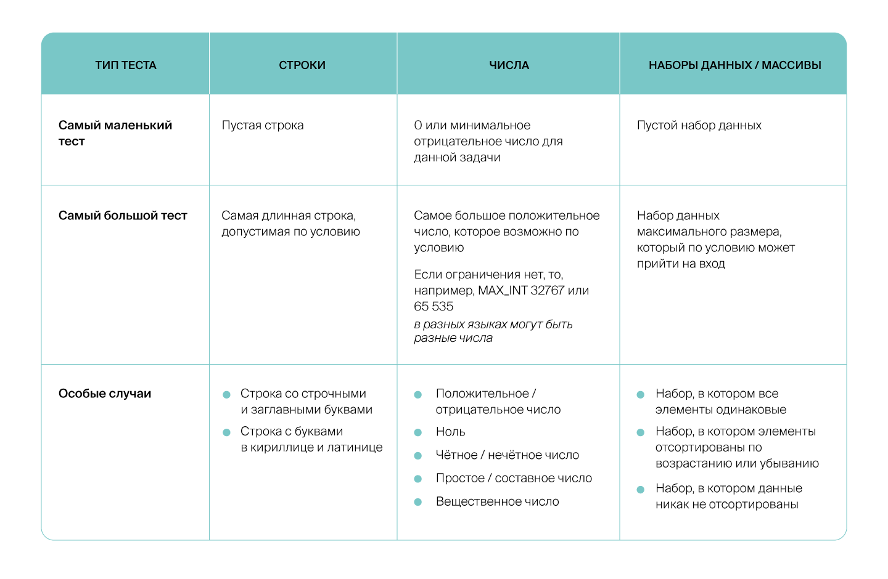

# Спринт №1 

[TOC]


# Сложность алгоритма

## Вычислительная сложность

- Вычислительная сложность алгоритма определяется с помощью O-нотации
- В O-нотации не учитываются константы и коэфициенты (они не могут принципиально изменить применимость алгоритма на практике) 


| Вид зависимости  | О-нотация   |
| ---------------- | ----------- |
| Квадратичная     | $O(x^2)$    |
| Кубическая       | $O(x^3) $   |
| Экспоненциальная | $O(2^N)$    |
| Линейная         | $O(N)$      |
| Логарифмическая  | $O(log_2N)$ |
| Константная      | $O(1)$      |

### Примеры

#### №1
> В больнице, в которую обычно ходит Гоша, работает доктор Игнатий Петрович. Он не очень общительный и весь день проводит в кабинете, а заходят к нему только пациенты.
> Нужно определить, сколько раз в день откроется дверь в кабинет Игнатия Петровича при условии, что все пациенты, уходя, закрывают её за собой. 
> Каждый посетитель кабинета откроет дверь два раза. То есть количество открытий двери будет вдвое больше, чем количество вошедших.
> Получаем линейную зависимость, которую можно задать уравнением: $y = 2*x$. Можно сказать, что количество открытий двери — это $O(x)$, где $x$ - количество пациентов.

#### №2
> Утром Тимофей встретил в лифте трёх коллег. Все поздоровались за руку. Но если людей много, так обычно не делают.
> Это заняло бы слишком много времени, ведь каждый должен пожать всем руку. 
> редположим, всего встретились $n$ человек. Каждый будет здороваться со всеми, кроме себя самого, то есть $n-1$ раз.
> Всего случится $\frac{n * (n-1)}{2} = \frac{n^2}{2} - \frac{n}{2}$ рукопожатий. Можно сказать, что будет $O(n^2)$ рукопожатий

#### №3
> Предположим, что для решения какой-то задачи нам нужно перебрать все строки длины $N$, которые состоят из нулей и единиц:
> $N = 3 : 000,001,010,011,100,101,110,111.$
> Мы должны перебрать все возможные варианты строк (длиной 3 символа) из $0, 1$. Имеем сложность: $O(2^N)$, где 2 - количствовозможных значений одного символа, N - длина строки

#### №4

> На вход подаётся целое число `n`. Нужно вычислить значение функции $42n + 15.42n+15$.
>
> ```python
> n = int(input())
> print(42 * n + 15) 
> ```
>
> 

> Вычислительная сложность данного алгоритма: $O(1)$

#### №5

> Каждый день Гоша выбирает, что надеть, запуская программу на компьютере. Алгоритм перебирает все сочетания штанов и футболок, показывает их Гоше и просит оценить сочетание по шкале от 1 до 10. После этого программа просматривает все оценки, выбирает максимальную и говорит Гоше, что надеть. У Гоши n*n* штанов и m*m* футболок. Сложность алгоритма  $O(nm)$

## Время исполнения

> У каждой задачи есть некоторый набор ограничений. Например, давайте проанализируем записи турникетов метро, чтобы найти самого активного пользователя метрополитена за последний месяц. Решить эту задачу можно линейным алгоритмом, подсчитывая число поездок каждого пассажира и сравнивая с числом поездок самого активного пассажира на текущий момент. Для этого нам понадобится просмотреть каждую запись по одному разу.
>
> ```python
> # visitors - массив номеров пассажиров.
> # Каждый пассажир проехал столько раз, сколько раз встречается его номер
> visitors = [0,2,3,2,0,4,1,1,2]
> entries_by_visitor = [0] * 5
> best_visitor = 0
> 
> for visitor in visitors:
>     entries_by_visitor[visitor] += 1
>     if entries_by_visitor[visitor] > entries_by_visitor[best_visitor]:
>         best_visitor = visitor
> 
> print(best_visitor) 
> ```
>
> Сложность этого алгоритма $O(n)$, где *n* — число поездок. Но применим ли этот метод на практике?
>
> Нужно понять, какого масштаба число *n* мы ожидаем. Например, пусть каждый житель десятимиллионного города делает по две поездки в день на протяжении месяца. Тогда получится 600 миллионов поездок в месяц. Округлим это число до миллиарда — алгоритму полезно иметь небольшой запас прочности, а нам удобнее проводить вычисления. Итак, $n≤10^9$  поездок.
>
> Предположим, что обработка каждой поездки занимает один такт процессора. Тогда для камня с 2.5 ГГц потребуется столько времени: $t=\frac{10^9\cdot1такст}{2.5\cdot10^9}=\frac{1}{2.5\cdotсекунда^-1}=0.4[c]$

### Примеры

#### №1

> Гоша пошёл покупать яблоки для Аллы и Риты. На прилавке магазина лежит *N* яблок $(2≤N≤10000)$.
>
> Нужно найти два яблока, которые максимально отличаются по размеру.Чтобы это сделать, Гоша решил сначала найти самое маленькое яблоко, затем — самое большое. Сколько времени займёт у него такой поиск? Пускай каждая проверка пары занимает 1010 операций, а каждая операция занимает 100100 тактов процессора.
>
> Число итераций цикла будет $2⋅N=2⋅10^4$ . Двойка берётся, чтобы найти минимальное и максимальное значения. Получится, что время работы приблизительно:
> $$
> \frac{2\cdot10^4\cdot10\cdot100}{2.5\cdot10^9}=8\cdot10^-3[c]
> $$
> 

## Пространственная сложность

> **Пространственной сложностью** алгоритма называется зависимость объёма потребляемой памяти от входных данных. Как и в случае с временной сложностью, нас в первую очередь интересует не точный объём памяти, а асимптотика, то есть скорость роста без учёта констант и коэффициентов.
>
> - Если переменные в программе содержат только данные фиксированного размера, например числа, то можно сказать, что программа потребляет $O(1)$, или константный объём памяти.
> - Программа, которая в какой-то момент своей работы хранит все данные, переданные ей на вход, занимает $O(n)$, или линейно зависящее от объёма входных данных n*n* количество памяти.
> - Если алгоритм принимает на вход n*n* объектов, а потом создаёт, например, таблицу попарных расстояний между объектами, то такая программа займёт уже $O(n^2)$ памяти — квадратичный объём.

#### Взаимосвязь временной и пространственной сложности алгоритма

> Спираль ДНК состоит из двух соединённых цепочек этих оснований. Соединяются цепочки водородными связями между основаниями и только попарно: аденин всегда только с тимином (A-T связь), а цитозин — только с гуанином (C-G связь). При этом аденин с тимином соединяются двойной водородной связью, а цитозин с гуанином — тройной. Поэтому, чем больше в спирали C-G связей, тем сложнее разорвать спираль и тем прочнее будет молекула ДНК.
>
> В компьютере последовательность генома записана как очень длинная строка, состоящая из букв A, C, G, T: `AGTAGATCAACTGTGTCGTGAGAG...` и так далее. Вторую цепь не записывают, ведь напротив A всегда стоит T, а  напротив C — G.
>
> Алла и Рита хотят проверить разные участки ДНК на прочность. Чтобы узнать, насколько какой-нибудь участок ДНК прочный, нужно подсчитать число букв C и G на нём: чем их больше, тем участок генома прочнее. 
>
> Подруги договорились, что Алла будет задавать границы исследуемого участка, а Рита — подсчитывать число нужных букв.
>
> Сначала Рита решила действовать так: она завела счётчик и стала перебирать все буквы в полуинтервале, увеличивая счётчик, если встретилась C или G.
>
> ```python
> cg_count = 0
> for position in range(left, right):
>     if (sequence[position] == 'C') or (sequence[position] == 'G'):
>         cg_count += 1
> 
> print(cg_count) 
> ```
>
> На то, чтобы подсчитать количество нужных букв, она потратила $O(n)$ времени, где n — длина полуинтервала. Но вспомогательная память ей понадобилась всего для трёх переменных: позиции в тексте, счётчика, а также для объекта `range`. Эти три переменные занимают фиксированный объём памяти, не зависящий от длины интервала, поэтому можно сказать, что Рите потребовалось  $O(1)$ дополнительной памяти.

> Почему дополнительной? Потому что последовательность генома в любом случае придётся хранить в памяти. А то, сколько программе потребуется памяти сверх этого, зависит от выбранного алгоритма — это и есть дополнительная память.
>
> Потом Рита устала пересчитывать одни и те же буквы и придумала новый способ решения. Напротив каждой позиции она написала число — сколько раз нужная буква (C или G) встретилась от начала строки и до текущей позиции (не включая её саму) — это называется «накопительная сумма» (*англ.* cumulative sum).
>
> ```
> C C A T G A T C
> 0 1 2 2 2 3 3 3 4 
> ```
>
> Чтобы посчитать количество CG-букв на каком-то полуинтервале, достаточно вычесть из накопительной суммы на правом конце (вернее, на позиции `right`) аналогичную сумму на левом конце:
>
> ```python
> cumulative_sums = [0]
> cg_count = 0
> for position in range(0, len(sequence)):
>     if (sequence[position] == 'C') or (sequence[position] == 'G'):
>         cg_count += 1
>     cumulative_sums.append(cg_count)
> 
> print(cumulative_sums[right] - cumulative_sums[left]) 
> ```
>
> Теперь Рита может очень быстро отвечать на вопросы Аллы о прочности конкретных участков генома. Ей потребовалось один раз провести предподсчёт сумм за $O(N)$, а для нахождения суммы на интервале достаточно выполнить простое вычитание, что занимает константное время, то есть $O(1)$.
>
> А вот памяти Рита потратила $O(N)$: она напротив каждой буквы написала по числу.

> [!IMPORTANT]
>
> Во многих случаях не требуется даже изменять алгоритм, достаточно лишь сохранять результаты промежуточных вычислений. Эта техника называется «кеширование». В первую очередь следует кешировать результаты, которые долго вычисляются и часто используются.

# Принципы решения алгоритмических задач


## Последовательность решения

### Последовательность решения алгоритмических задач

1. Внимательно прочитайте условие задачи:

- зафиксируйте, что нужно найти;
- отметьте все особенности входных данных;
- ознакомьтесь с лимитами по времени и памяти.

Бóльшая часть деталей в условиях задач даны не просто так — они важны для решения, на что-то влияют, как-то помогают. Исключения бывают, но встречаются редко.

2. Придумайте примеры входных данных и зарисуйте, если это возможно. В задачах нашего курса всегда будет пара примеров для понимания условия. Допишите ещё и ответьте на вопрос: «Достаточно ли примеров получилось?» О том, как придумывать хорошие тесты, поговорим подробнее в одном из следующих уроков.

3. На примерах разберите, как вы находили бы ответ на заданный вопрос, если бы вам потом не надо было писать код. Подумайте, какой результат работы своей программы вы ожидаете при обработке каждого набора входных данных. Запишите, как именно находите ответ, какие формулы используете для промежуточных вычислений. Возможно, вы делите входные данные друг на друга, сортируете массив или вычисляете какие-то вспомогательные данные?

Алгоритм, который первым приходит на ум, называется *наивным*. Во многих случаях он будет неоптимальным. Не пропускайте формулирование наивного алгоритма, даже если вы понимаете, что он работает очень медленно. Подумайте, чем конкретно плох алгоритм. Он работает медленно? Ему требуется много дополнительной памяти?

4. Оцените сложность, с которой работает ваш наивный алгоритм. Проверьте, это достаточно хорошая сложность с учётом известных ограничений на входные данные или лимиты не покорятся? Попробуйте обосновать, какая асимптотика вашего алгоритма.

5. Оптимизируйте! Подумайте, как можно улучшить свой алгоритм. Есть несколько способов:

- *Bottleneck или Бутылочные горлышко*. Как мы уже говорили, так называют самое узкое место программы. Это та часть, которая работает дольше всего. Если у вас есть часть кода, которая работает за квадратичное время, а весь остальной код — за линейное, ищите, можно ли ускорить квадратичную часть. Ведь небольшие изменения в линейной части не дадут асимптотических преимуществ и в большинстве случаев ускорят программу незначительно.

- *Повторяющаяся работа*. Например, вам надо ответить на один и тот же вопрос для 10 разных элементов массива. Вы знаете, что ответ можно быстро найти на отсортированном массиве. Лучше отсортировать массив один раз в начале, чем делать это каждый раз для каждого из 10 элементов. Чтобы заметить повторяющиеся действия, ищите одинаковые куски кода и внимательно посмотрите все инструкции, которые выполняются в теле каждого цикла вашей программы. Может быть, некоторые инструкции стоит вынести за пределы цикла.

- *Ненужные действия*. Иногда сортировать не нужно. Например, программе на вход подаются числа и надо найти наименьшее число. Можно массив отсортировать и выдать первый элемент, а можно в процессе считывания перевыбирать минимум. Или вам надо сложить числа в двоичной системе счисления — тогда ни к чему переводить числа в десятичную систему счисления, а потом сумму обратно в двоичную. Проверьте, нет ли у вас лишних действий.

- *Оптимальные структуры данных*. Ответьте на вопрос, какие операции с данными предстоит осуществлять? Какая структура данных позволит сделать это быстро, без лишних издержек? Может быть, вы хотите быстро узнавать, есть ли элемент в вашем наборе данных, но используете для этого массив?

- Подумайте, всю ли информацию из условия задачи вы уже применили. Может, есть ограничение, которое вы проигнорировали в наивном решении. Перечитайте условие ещё раз.

- Ищите компромисс между памятью и временем. В задачах контеста у вас будет два типа ограничений: на дополнительную память и на время выполнения программы. Иногда мы можем ускорить программу, сохранив промежуточную информацию. В других случаях, как в задаче про счастливые билеты, лучше сэкономить память.

  6. Напишите аккуратный код.

  - Следите за именами переменных. Хорошее имя переменной описывает, что за объект в ней лежит, даже если эта переменная — просто счётчик цикла.
  - Следите за именами функций. Хорошие имена функций складываются как раз в тот алгоритм, который вы озвучили бы пятикласснику.

  - Вынесите в функции все действия, которые повторяются и выполняют логически одну часть работы. Такой подход позволит отдельно тестировать сложные места и проще определять место ошибки в коде.
  - Не забывайте про стандарты стиля в языке программирования. Борьба с разными отступами и слишком длинными строками не должна отвлекать вас и ревьюера от самой сути решения.

  7. Внимательно перечитайте написанный код. Особое внимание уделите:

  - условным выражениям; иногда можно перепутать знаки `<` и `>` или неаккуратно объединить несколько логических условий, забыв о порядке применения отрицания, логического `И` и `ИЛИ`.
  - условиям выхода из циклов или функций; правильно ли обрабатывается первый и последний элемент? Есть ли ситуации, когда мы выходим из цикла досрочно?
  - константам; Вы точно помните, зачем каждая из них нужна? Всегда ли это значение одинаковое?

  8. Протестируйте свой код.

## Если с наскока не получилось

- Предположите, какие дополнительные ограничения бы вам помогли. Если в задаче дана последовательность произвольных чисел, попробуйте решить задачу, например, для последовательности только из целых чисел, а потом переходите к вещественным числам.
- Попробуйте решить задачу для входных данных небольшого размера. Например, 3 числа в последовательности вместо 200.
- Подумайте, можете ли вы разбить задачу на подзадачи меньшего размера.  Например, если у вас есть массив длины n*n* и требуется найти максимальный элемент, что будет, если поделить массив на две равные части? Зная ответ для каждой половины, можно ли получить ответ для целого массива? А если просто убрать один элемент? Аналогично можно работать и с числами, и со строками, обрезать и делить их, находить решение для меньшей задачи, после чего пытаться перейти от решения на меньшем объёме входных данных к решению на большем объёме.
- Предположите, какие из известных вам алгоритмов и структур данных могут помочь в решении задачи. Пока мы будем учиться, задачи будут соответствовать темам из спринта. Чтобы после обучения было удобно пользоваться этим методом, заведите список пройденных тем. Собственный конспект — лучшая подсказка.
- Возьмите какое-то решение, пусть даже вы не уверены в его правильности. Проверьте его на примерах, которые вы придумали. В каких ситуациях ваш алгоритм даст неправильные ответы? Проанализировав неправильное решение, можно найти и исправить ошибки.

# Тестирование программы

Код, разделённый на функции, удобно тестировать. Для тестирования отдельных функций пишут юнит-тесты.

## Юнит-тестирование

> Например, нужно решить такую задачу: в наборе строк найти палиндромы (строки, которые слева направо читаются так же, как и справа налево) и вывести их на экран в алфавитном порядке. Задача явно делится на две части. Сначала мы из набора строк оставляем только те, которые читаются одинаково в каждом направлении. Потом мы сортируем строки в алфавитном порядке. Эти пункты независимы. То есть мы можем проверить правильность каждой функции отдельно. Это помогает снизить вероятность появления ошибок в программе.

Нужно понять, является ли каждая строка палиндромом. Выделим случаи, которые нужно проверить:

Нужно понять, является ли каждая строка палиндромом. Выделим случаи, которые нужно проверить:

- самый маленький пример: читается ли пустая строка одинаково справа налево;
- положительный пример: возьмём любой известный нам палиндром. Проверим слово «шалаш»;
- отрицательный пример: возьмём любую строку, которая палиндромом не является. Проверим слово «мама»;
- примеры, которые проверяют особенности задачи. Должны ли мы при чтении учитывать пробелы и знаки препинания, а заглавные и строчные буквы считать одинаковыми буквами? Фраза «*А роза упала на лапу Азора!»* в зависимости от условий задачи может как считаться, так и не считаться палиндромом.
- примеры, которые хочется безосновательно проверить. Ведь лучше написать больше тестов, чем меньше. Ненужные тесты всегда можно удалить. В этой задаче можно проверить результат для символов, которые одинаково пишутся в русской и английской раскладках. Пример такой строки — «*TOТ».*
- большой пример: возьмём первую страницу романа «Война и мир» и проверим, является ли она палиндромом. Такой тест покажет скорость работы и потребление памяти. В некоторых случаях вы сможете заметить, как программа «задумалась» — тогда алгоритм точно надо оптимизировать.



# Ввод-вывод

При решении алгоритмических задач приходится учитывать многие детали, ведь каждая из них может влиять на эффективность программы.

Вы уже знаете, что у программы могут быть ограничения разного рода. У некоторых программ основное ограничение — скорость вычислений. Такие алгоритмы называют “CPU-bound” алгоритмами. Например, у задач в контесте время выполнения строго лимитировано, поэтому они должны работать быстро.

В контесте задачи ограничены не только по времени, но и по объёму памяти, доступному программе. Про алгоритмы, которые испытывают больше проблем из-за недостатка памяти, чем из-за скорости, говорят, что они “memory-bound”.

Но есть ещё один важный аспект работы программ: скорость ввода-вывода. Некоторые алгоритмы так быстро и эффективно работают, что большую часть времени программа просто ждёт, пока получит входные данные. А иногда случается так, что программа смогла всё быстро посчитать, но затем вынуждена потратить много времени на вывод. Этот тип ограничений называют “I/O(input/output)-bound”.

## Эффективный ввод-вывод в Python

### Задача

> В первой строке записано число $n(n≤10^6)$. В следующих n*n* строках записаны пары чисел. Посчитайте и выведите суммы чисел для каждой из *n* строк.

Пример ввода:

```
3
1 2
10 20
100 200 
```

Пример вывода:

```
3
30
300 
```

В системе Яндекс Контест чтение из файла `input.txt` и из стандартного потока ввода мало отличаются. Мы будем использовать чтение из стандартного ввода как более простой способ. Если при тестировании программы вам нужно считать данные не с клавиатуры, а из файла, переписывать программу необязательно. Достаточно при запуске программы перенаправить содержимое файла с тестом в стандартный поток ввода программы. В командной строке это можно сделать, например, так: `python solution.py < input.txt`.

В некоторых задачах число строк, которые нужно считать, меняется от теста к тесту. Перед таким набором строк в тестах указывается, сколько именно строк предстоит считать. Обязательно используйте эту информацию, когда считываете данные. Например, вы можете использовать цикл с фиксированным количеством итераций.

Во многих языках есть возможность считать все входные данные за раз и разбить их на строки. Не стоит пользоваться этим подходом, так как он чреват ошибками, которые трудно обнаружить. Например, в конце файла может как стоять символ новой строки, так и отсутствовать. Из-за этого иногда программа может считать на одну строку больше, чем нужно. Кажется, что проблемы можно избежать, просто отбросив последнюю строку, если она пустая. Но иногда пустая строка — это корректные входные данные для программы. Гораздо надёжнее будет прямо следовать формату, указанному в тексте задачи.

Ещё одна проблема с переносами строки может возникнуть из-за того, что некоторые функции считывают строку вместе с символом перевода на новую строку, а некоторые функции его автоматически отбрасывают. Тщательно следите за тем, какие данные вы считали и как их обработали.

Также обратите внимание, что в файлах, созданных в Linux и macOS, строки разделяются символом `'\n'`, а в Windows строки разделяются сразу парой символов: `"\r\n"`. 

Эффективное решение на Python:

```python
import sys

def main():
    num_lines = int(input())
    output_numbers = []
    for i in range(num_lines):
        line = sys.stdin.readline().rstrip()
        value_1, value_2 = line.split()
        value_1 = int(value_1)
        value_2 = int(value_2)
        result = value_1 + value_2
        output_numbers.append(str(result))
    print('\n'.join(output_numbers))

if __name__ == '__main__':
    main() 
```

Здесь мы тоже воспользовались буфером для выходных данных. Но хранить мы будем не одну строку, а массив строк. Склеим эти строки в один большой текст мы в последний момент, поскольку в Python нет эффективного способа добавить одну строку к другой, подобного `StringBuilder` в Java.

Весь код программы заключён в функцию `main`. Это нужно, чтобы код программы работал не с глобальными, а с локальными переменными функции `main`. Обращение к локальным переменным оказывается эффективнее.

Для чтения данных подходит функция `input`. Но если требуется считать много данных, `sys.stdin.readline()` будет существенно эффективнее. Обратите внимание, что к полученной строке мы применили метод `rstrip`, чтобы отбросить символ перевода строки. Функция `input` это делает автоматически.

Чтобы преобразовать данные к целым числам, можно было бы воспользоваться этой конструкцией:

```python
value_1, value_2 = [int(x) for x in line.split()] 
```

Или этой:

```python
value_1, value_2 = map(int, line.split()) 
```

> [!IMPORTANT]
>
> Но такие конструкции менее эффективны: при подобной обработке данных программа тратит время и ресурсы на создание вспомогательных объектов — массива или объекта map, которые не потребуются в дальнейшей работе.

## Работа с Make в Яндекс Контексте

### Make

Make — компьютерная программа, автоматизирующая процесс сборки исходного кода. В нашем курсе мы используем Make в некоторой части задач для того, чтобы обеспечить иммутабельность (англ. *immutable*), то есть неизменяемость части кода. Например, при работе над задачей про разворот списка студент не сможет изменить определение узла связного списка с односвязного на двусвязный. 

Так как для решения задач нужно понимать, какие структуры данных будут использоваться в проверке, мы размещаем ссылку на шаблон решения в тексте задачи. В таком шаблоне содержатся предопределённые структуры данных.

Когда при работе с Make-задачами возникают ошибки, Яндекс Контест может выдать два варианта исключения: **RE** (от англ. **R**untime **E**rror — **«**ошибка выполнения**»**) или **CE** (от англ. **C**ompilation **E**rror — **«**ошибка компиляции**»**). Перечислим частые причины возникновения этих ошибок и расскажем, как их исправить:

1. **Файл с решением назван некорректно.** Возможно, название вашего файла совпадает с название внутреннего файла для тестирования. Такое иногда случается. Попробуйте переименовать файл. Например, назовите его `solution`. С таким названием в коде точно не возникнет проблем.
2. **У файла некорректное расширение.** Проверьте расширение, оно должно соответствовать одному из перечисленных ниже: 
   - C++: **`.cpp`**
   - Python: **`.py`**
   - Java: **`.java`**
   - Go: **`.go`**
   - JavaScript: **`.js`**
   - C#: **`.cs`**
   - Kotlin: **`.kt`**
   - Swift: **`.swift`.**
3. **Метод с точкой входа назван неправильно.** Проверьте имя метода — оно должно быть как в шаблоне.
4. **Выбран неправильный компилятор**. Убедитесь, что выбранный вами компилятор соответсвует языку, на котором вы сдаете задачу. Например, для swift - `(make) Swift`, для kotlin - `(make) Kotlin` и т.д.
5. **Указан неправильный пакет для Go.** Если вы пишете на Go, укажите пакет `package main` для вашего решения
6. **Код шаблона структуры был изменен.** Проверьте, что вы случайно не поменяли код шаблона структуры. Если вы пишете на Go, Java или Kotlin, то дополнительно проверьте, что шаблон структуры окружен строками `// <template>`
7. **Вызов решения помещен в пользовательский неймспейс.** Старайтесь избегать указания собственного названия пакета или неймспейса в коде. Это может привести к ошибке компиляции, так как тестовая система не сможет найти точку входа в ваше решение.

### Шаблоны

Разберем работу с шаблонами на примере задачи «Список дел» из второго спринта. Перед тем, как начать решение задачи, скопируйте код шаблона с GitHub к себе на локальную машину. Ссылки на шаблоны вы найдёте в описании самих задач. 

```python
import os

LOCAL = os.environ.get('REMOTE_JUDGE', 'false') != 'true'

if LOCAL:
    class Node:
        def __init__(self, value, next_item=None):
            self.value = value
            self.next_item = next_item

def solution(node):
    # Your code
    # ヽ(´▽`)/
    pass

def test():
    node3 = Node("node3", None)
    node2 = Node("node2", node3)
    node1 = Node("node1", node2)
    node0 = Node("node0", node1)
    solution(node0)
    # Output is:
    # node0
    # node1
    # node2
    # node3

if __name__ == '__main__':
    test()
 
```

#### 1. Блок с шаблоном структуры

Этот код создаёт **«Шаблон структуры»,** или структуру Node. Именно её будем использовать при решении задачи.

```python
LOCAL = os.environ.get('REMOTE_JUDGE', 'false') != 'true'

if LOCAL:
    class Node:
        def __init__(self, value, next_item=None):
            self.value = value
            self.next_item = next_item 
```


#### 2. Блок с местом для решения задачи

Это место в коде, где должно быть размещено ваше решение задачи. Можно вводить дополнительные методы за пределами этого кода. Но точкой входа для вашего кода будет именно этот метод. 

Перед сдачей своего решения проверьте имя метода. Он должен называться так же, как и в шаблоне. А ещё у метода должна быть такая же сигнатура. Иначе вы столкнётесь с ошибками при запуске.

```python
def solution(node):
    # Your code
    # ヽ(´▽`)/
    pass 
```


#### 3. Блок для локальных тестов

Этот блок предназначен для локального тестирования вашего решения. Он не влияет на прохождение тестов на контесте. Но если вы захотите протестировать ваше решение, сделайте это здесь.

```python
def test():
        node3 = Node("node3", None)
        node2 = Node("node2", node3)
        node1 = Node("node1", node2)
        node0 = Node("node0", node1)
        solution(node0)
        # Output is:
        # node0
        # node1
        # node2
        # node3
    
    if __name__ == '__main__':
        test() 
```


#### 