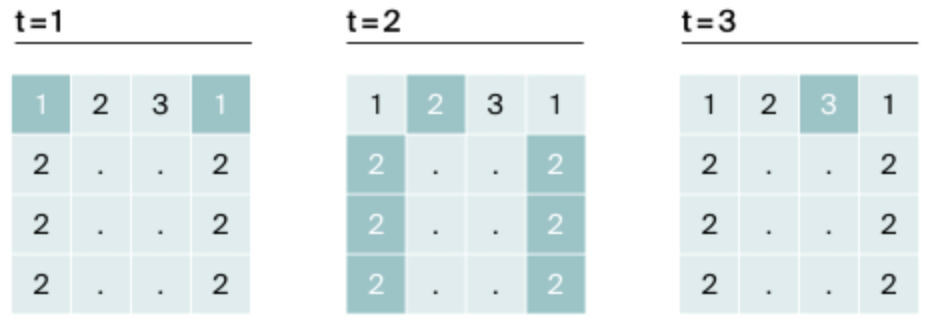

# Ловкость рук

## Условия задачи

Игра "Тренажёр для скоростной печати" представляет собой поле `4x4` из клавиш, на которых либо изображена точка `(.)`, либо цифра от `1` до `9`. Суть игры следующая:

> Каждый раунд на поле появляется комбинация цифр и точек. В момент времени `t` игрок должен одновременно нажать на
> все клавиши, где есть цифра `t`. Если в момент `t` нажаты все нужные клавиши, игроки получают один балл. Если клавиш
> с цифрой `t` на поле нет, победное очко не начисляется.
> Два игрока в один момент могут нажать на `k` клавиш каждый. Найдите число баллов, которое смогут заработать Гоша и
> Тимофей, если они будут нажимать на клавиши вдвоем.
>
>
### Пример k=3

#### t=1

Пусть `t=1`. В таком случае один игрок должен нажать на две кнопки с цифрой `1`. Чтобы узнать,
сколько нажмут клавиш два игрока, воспользуемся формулой `k*2`. Получается, что вместе мальчики
нажмут на `6` клавиш и получат победное очко

#### t=2

Когда `t=2`, двум игрокам необходимо нажать на `7` кнопок одновременно. Но это не под силу ребятам:
каждый сможет нажать лишь по `3` кнопки. Очко не начисляется

#### t=3

При `t=3`, каждому нужно нажать на одну кнопку. Успех! У Гоши и Тимофея два очка

> Других цифр на поле нет, поэтому в следующих раундах, где $t=4..t=9$, победные очки начисляться
> не будут. Итог - 2 балла
>
>

## Формат ввода
В первой строке дано число $k(1 \leq k \leq 5)$. В четырех следующих строках задан вид тренажера — по 4 символа в каждой строке. Каждый символ либо `(.)`, либо от `1` до `9`. Символы одной строки идут подряд и не разделены пробелами.

## Формат вывода
Выведите единственное число - максимальное количество баллов, которое смогут набрать Гоша и Тимофей.
