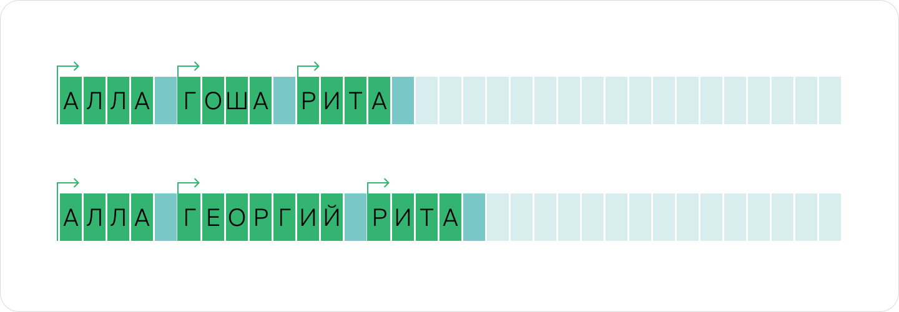
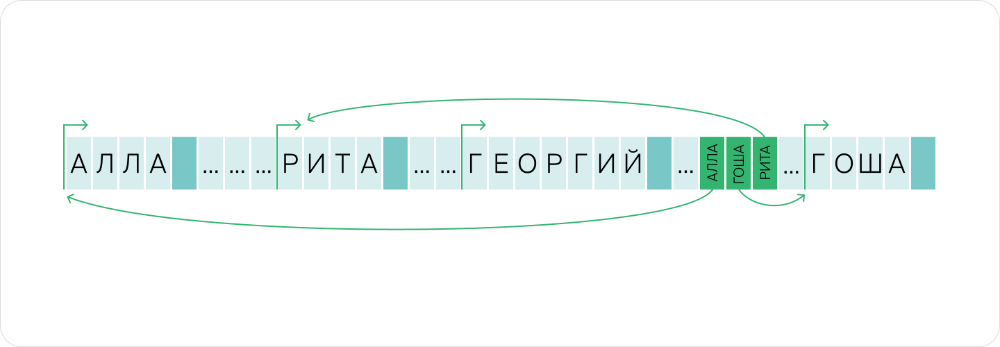
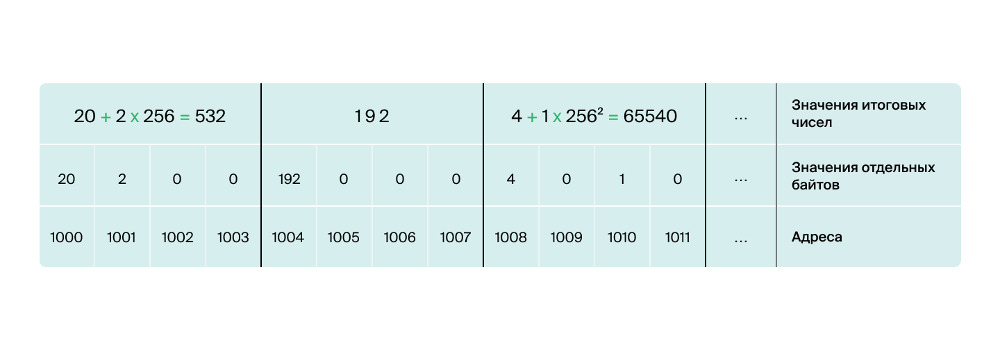
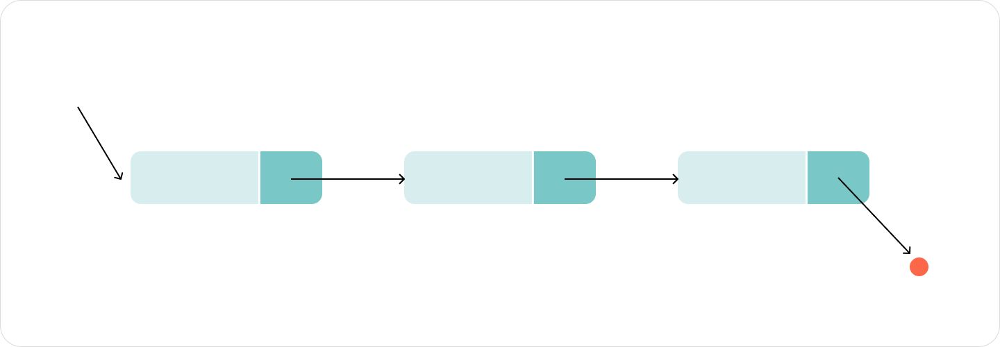

# Спринт №2

[TOC]


## 1. Оперативная память и представление данных

> Оперативная память разбита на ячейки размером в 1 байт. У каждой ячейки есть свой порядковый номер, который называется «адрес» (отдельные биты внутри ячейки адресов не имеют). Процессор взаимодействует с оперативной памятью напрямую и использует адреса, чтобы обращаться к данным, — почти как программа обращается к переменным по имени.

### 1.1 Представление базовых типов в RAM

> Размер наименьшей адресуемой ячейки - `1 байт = 8 бит`. Каждый бит может принимать одно из двух значений: либо `0`, либо `1`. Восемь бит позволяют закодировать всего $2^8=256$ вариантов значений. Получается, что в такую ячейку можно записать, например, целое число в промежутке от 0 до 255. Если считать эти числа номерами символов, то в 1 байт можно уместить 1 символ текста (тип `char`): все буквы латиницы и кириллицы, цифры и основные символы вполне умещаются в 256 вариантов.

Самый распространённый тип целых чисел `int` занимает 4 байта и позволяет закодировать числа от `–2_147_483_648` до `2_ 147_483_647`.  Эти границы можно вычислить: в `4 байтах` содержится `32 бита`. Один бит тратится на то, чтобы закодировать знак. Оставшийся 31 бит позволяет закодировать `231=2147483648` чисел. Число «ноль» тоже нужно закодировать, поэтому положительных чисел остаётся на одно меньше, чем отрицательных. Если ваши числа не превышают по модулю два миллиарда, можно пользоваться этим типом чисел. Обратите внимание, что всего чисел около четырёх миллиардов, но половина из них отрицательные. Если точно известно, что переменная не может быть отрицательной, можно воспользоваться типом беззнаковых целых`unsigned int`, он позволяет хранить числа от 0 до 4 294 967 295.

> [!NOTE]
>
> Будьте внимательны: если в ходе вычислений получается число за пределами диапазона допустимых значений, то происходит переполнение (*англ.* overflow) типа, и результат вычисления может быть некорректным. Например, для типа `int`:
>
> $2147483647+1=−21474836482147483647+1=−2147483648$
>
> $2147483647×3=21474836452147483647×3=2147483645$
>
>  Это не относится к языкам с неограниченным размером целых чисел — таких как, например, **Python**.

Вещественные (то есть дробные) числа чаще всего кодируются типом `double` — это «числа с плавающей точкой», которые занимают 8 байт. Они могут кодировать как очень большие числа, такие как $±10^{308})$, так и близкие к нулю, например $±10^{−308}$

> [!NOTE]
>
> Вычисления с вещественными числами чаще всего неточные и накапливают ошибку. Это может приводить к необычным эффектам. Например, из-за того, что числа хранятся в форме двоичных, а не десятичных дробей, оказывается, что $0.1×3≠0.3$. Поэтому все сравнения вещественных чисел делают с учётом погрешности. Равенство из нашего примера следовало бы переписать в виде: `abs(0.1 * 3 - 0.3) < EPS`, где `EPS` — допустимая погрешность.

### 1.2 Составные типы данных

Теперь посчитаем, сколько памяти потребуется для хранения массива из 10 строк по 20 символов каждая.

Во-первых, потребуется хранить сам текст. Это займёт:

$10строк×(20\frac{символов}{байт})×(1\frac{байт}{символ})=200байт$

Этого было бы достаточно, если бы строки располагались в памяти друг за другом. Но производить с ними какие-либо операции будет сложно. Например, чтобы добавить символ в первую строку, нам пришлось бы сначала сдвинуть все остальные строки — как на картинке.



Поэтому в массивы (и в другие составные структуры) зачастую помещаются не сами объекты, а только указатели на них — адреса, по которым они хранятся в ячейках оперативной памяти.



В нашем примере строки располагаются в произвольных местах памяти, а массив из десяти строк содержит лишь десять адресов, как в нижней части картинки. Получается, что массив строк занимает `200 байт` на само содержимое строк $+ 10 адресов * 8 \frac{байт}{адрес} = 280 байт$.

Во многих других языках каждый объект в программе записан в специальную «обёртку», которая, помимо данных, содержит вспомогательную информацию. Из-за этого, например, в языке Python даже короткие целые числа могут занимать не 4 байта, а почти 30 байт. Для хранения строки требуется около 40 байт вспомогательной информации, для хранения массива — ещё больше. Обычно объекты в таких языках ведут себя подобно строкам из предыдущего примера: они могут находиться в произвольном месте памяти, и любое обращение к ним происходит по сохранённому адресу.

```python
import sys
sys.getsizeof(42)  # => 28 байт занимает короткое целое число
sys.getsizeof([])  # => 56 байт занимает пустой массив
sys.getsizeof([42])  # => 64 = (56 + 8) байт занимает массив с одним элементом.
sys.getsizeof([1,2,3,... 10])  # => 136 = (56 + 8*10) байт занимает массив
                               #          с десятью элементами.
                               # сами данные хранятся отдельно
                               # и добавляют 280 = (28 * 10) байт
```

Получается, мы тратим `56 байт` на то, чтобы создать массив, а дальше по `8 байт` на каждый новый объект в массиве — это адреса элементов. Но это ещё не всё. Ведь каждому числу нужно ещё по `28 байт`. Итого массив из десяти чисел в Python занимает суммарно $56 + (8 + 28) * 10 байт = 416 байт$. Сравните это с 40 байтами в языке C++.

### 1.3 Освобождение памяти

Важно понимать, что если вы перестали пользоваться объектом, это ещё не значит, что он освободил занимаемую память. В языке C++ приходится следить за тем, чтобы выделенная память освобождалась. Встроенные контейнеры, такие как `std::vector`, упрощают задачу: они автоматически выделяют необходимую память при создании контейнера и освобождают её при выходе переменной контейнера из области видимости.

В большинстве других языков за освобождение памяти отвечает сборщик мусора, который время от времени проверяет, может ли объект ещё быть использован. Если оказывается, что на него больше не ссылается никакая переменная и никакой другой объект, то этот объект уничтожается.

Но сборка мусора — трудоёмкая операция, поэтому некоторые языки откладывают её до тех пор, пока свободное пространство не подойдёт к концу. Например, программы на Java (если их специально не ограничить при запуске) часто сталкиваются с проблемой высокого потребления памяти из-за хранения множества старых и уже неиспользуемых объектов.

## 2. Массивы постоянного размера

> Структура данных — это способ организации информации в памяти, который позволяет проводить с ней определённый набор операций. Например, быстро искать или изменять данные.

> Массив — одна из базовых структур данных. Самый простой тип массивов имеет фиксированный размер и может хранить элементы одного и того же типа. Например, если мы создадим массив из десяти целых чисел, в него нельзя будет добавить ещё один элемент или записать объект неподходящего типа. Такие массивы вы можете встретить, например, в языке C — `int numbers[10]`, или в С++ — `std::array<int, 10> numbers`.

С массивами фиксированного размера можно выполнить только две операции:

- узнать значение элемента по индексу - $O(1)$,
- перезаписать значение по индексу- $O(1)$.

### 2.1 Внутреннее устройство

**Массив** — это набор однотипных данных, расположенных в памяти друг за другом. Поэтому он всегда занимает один непрерывный участок памяти. Точное местоположение этого участка операционная система сообщает программе в момент создания массива.

В начале выделенного участка памяти находится нулевой элемент, сразу за ним — первый и далее по порядку. Они идут друг за другом, без пропусков. Зная положение элемента в памяти — его адрес, мы можем этот элемент прочитать или записать. Теперь посмотрим, как узнать адрес элемента.

> [!IMPORTANT]
>
> Пусть у нас есть массив `numbers` из 10 *беззнаковых* целых чисел. Адрес нулевого элемента нам известен — это `1000`. Чтобы узнать положение следующего элемента, нам нужно прибавить к адресу начала размер элемента в байтах. Каждое число занимает по `4 байта,` так что первый (нулевой) элемент займёт байты `1000, 1001, 1002, 1003`. Значит, элемент с индексом `1` будет записан по адресу `1004`.



### 2.2 Способ сохранения массива в файл

Когда программе требуется сохранить данные в файл, возникает важный вопрос: как записать информацию, чтобы её возможно было впоследствии прочитать однозначным образом. Если мы записываем и считываем данные заранее известного объёма, серьёзных проблем не возникает.

Однако бывает так, что объём данных меняется от задачи к задаче. Например, программе требуется записать и считать массив. Для хранения массива в файле часто используется следующий формат: сначала записывается длина `N` массива, а в следующих `N` блоках данных идёт набор значений этого массива.

Благодаря такому кодированию можно компактно записать сразу несколько массивов (постоянной длины) друг за другом. Например, в последовательности элементов `[3, 'a', 'b', 'c', 2, 'y', 'z', ...]` закодировано два массива. Сначала идёт массив длины 3, в котором записаны первые три буквы алфавита. Затем — массив длины 2, в котором записаны последние две буквы. А дальше могут идти ещё какие-нибудь данные.

Вы уже встречали такую форму записи во входных данных некоторых задач системы Яндекс Контест. А ещё эта идея часто используется в бинарных форматах данных. Например, данные в PNG-файлах разбиты на несколько блоков, и в начале каждого указана его длина. Благодаря этому можно определить, где закончился один блок и начался другой.

## 3. Динамические массивы

Бывают ситуации, когда невозможно сказать точно, какая длина массива может понадобиться. Поэтому так важно иметь возможность добавлять элементы в массив прямо во время выполнения программы. Разберём пару примеров.

### 3.1 Сложность вставки

Гоша составил перечень фильмов, которые он уже посмотрел, и вдруг вспомнил, что хотел записать ещё один:

```python
films_wish_list = ["Джон Уик 3", "Аватар 2", "Форсаж 9", "Индиана Джонс 5", "Бэтмен"]
films_wish_list.append('Чёрная Вдова')
```

Чтобы это сделать, достаточно узнать номер последней использованной ячейки массива и записать элемент в следующую за ней ячейку. У Гоши уйдёт на это $O(1)$ времени.

А вот у Риты ситуация посложнее. Она записала дела на день, чтобы ничего не забыть, в том порядке, в каком собирается ими заниматься. Вот планы на сегодня:

```python
list_of_tasks = ["Полить цветы", "Приготовить завтрак", "Пойти на работу", "Сходить в магазин", "Позвонить бабушке"]
```

Но тут ей позвонила Алла и попросила срочно помочь разобраться с багом в коде. Рита, конечно, решила не бросать подругу в беде.

Теперь у Риты новое дело — помочь Алле. И оно должно стоять в начале перечня дел.

Представьте, что Рита записывает дела на листе бумаги. В конец легко добавить новый пункт, а вот в начале места уже нет. Значит, чтобы создать перечень с новым первым пунктом, придётся всё переписывать. Так же и компьютеру нужно переместить каждый из уже существующих элементов на одну ячейку вправо. Поэтому сложность вставки элемента в начало массива составляет $O(n)$, где *n* — количество элементов в массиве.

А что если нужно вставить элемент в произвольное место массива? Конечно, вставка в начало и в конец — частные случаи этой задачи. Вставка элемента в начало — **худший случай**. Сложность этой операции $O(n)$. Добавление элемента в конец — **лучший случай**. И его сложность $O(1).$

> [!NOTE]
>
> При оценке эффективности алгоритма не следует ориентироваться на сложность в лучшем случае. Сложность в среднем и сложность в худшем случае честнее покажут, насколько долго будет работать ваша программа в типичной ситуации либо при максимально неудачном стечении обстоятельств.

### 3.2 Сложность удаления

При удалении, как и при вставке в массив, требуется сдвинуть все элементы правее ячейки, в которой происходит операция. При добавлении в массив элементы сдвигаются на один вправо. А при удалении — на один влево.


### 3.3 Реаллокация

В прошлом уроке мы говорили о динамических массивах и том, как в них можно добавлять новые элементы, а ещё разобрали несколько важных случаев. Как вы помните, добавление элемента в конец массива эффективнее вставки в начало или в середину, поскольку для его реализации не приходится сдвигать элементы.

Но массив нельзя просто расширить — ведь за его пределами в памяти уже записаны другие данные. При расширении массива они перезапишутся, что может привести к ошибке выполнения программы.

Поэтому, как правило, при расширении массива программе приходится произвести  `«реаллокацию»` — выделить новый участок памяти и скопировать туда старое содержимое.

Выделение памяти — долгая операция, но копирование — это ещё большая проблема, ведь оно требует прохода по всем элементам, затратив $O(n)$ операций. Как же мы тогда можем утверждать, что добавление в конец массива стоит $O(1)$?

Напишем программу, которая добавляет в массив тысячу элементов — по одному за раз:

```python
values = []
for i in range(1000):
    values.append(i)
```

Операция `append()` может быть представлена как две операции: реаллокация и присваивание значения элементу массива. Для простоты мы не будем учитывать операции присваивания. Их число равно количеству добавляемых элементов; эта часть оптимизации не требует (и не может быть оптимизирована). А вот время, затрачиваемое на реаллокации, может существенно отличаться — в зависимости от выбранного подхода.

Если бы рассматриваемой программе приходилось при каждом добавлении элемента производить реаллокацию, итоговая сложность алгоритма была бы квадратичной. Теперь попробуем сократить число реаллокаций.

Во-первых, чтобы не приходилось на каждом шаге выделять дополнительную память, нужно держать запас свободного места в массиве. Например, если мы решим увеличить размер доступного массиву места сразу на 100 элементов, программа будет выделять память в `100 раз` реже. Но программа всё ещё будет работать за $O(n^2)$, хотя и с небольшой константой при квадратичном члене.

Теперь у нас есть два разных размера массива: `size` (количество элементов) и `capacity` (ёмкость), причём `size ≤ capacity`.

Во-вторых, чтобы сделать сложность алгоритма линейной, нужно увеличивать размер не на фиксированное количество элементов (арифметическая прогрессия), а в фиксированное число раз (геометрическая прогрессия).

Пусть изначальная ёмкость массива равна 1, а при каждой реаллокации она удваивается. Тогда на первой реаллокации копируется `1 элемент, на второй — 2, на третьей — 4, затем — 8, 16, 32, 64, 128, 256, 512`. После этих действий ёмкость массива равна `1024`.

Посчитаем, сколько операций копирования нам нужно будет произвести к моменту добавления `1000-го` элемента. Общее число копирований:

$ S=1+2+4+⋯+512=1024−1$

В общем случае, если нужно добавить $n$ элементов (где $2^k<n≤2^{k+1}$), последнее копирование затронет $2k$ элементов. Напишем сумму такой геометрической прогрессии:

$S=\sum_{i=0}^{k}2^i=2^{k+1}-1=2\cdot2^k-1\leq2\cdot n$

Итак, у нас получилось добиться того, что общее `количество копирований при реаллокации будет линейно зависеть от числа элементов`.

> [!NOTE]
>
> Многие алгоритмы используют добавление элементов в массив в качестве вспомогательного этапа. Квадратичная сложность многократного выполнения этой операции сделала бы все эти алгоритмы очень неэффективными. Поэтому описанный алгоритм реаллокации при добавлении элемента уже реализован в динамических массивах большинства языков программирования.

## 4. Связные списки

> Элементы массива в памяти компьютера расположены последовательно. Чтобы вставить или удалить элемент из начала массива, нужно $O(n)$ операций. Потому что придётся передвинуть каждый последующий элемент.

### 4.1 Внутреннее устройство

В связном списке у каждого элемента, помимо его значения, есть ссылка на следующий элемент списка. За исключением последнего — он ссылается в никуда. В зависимости от языка программирования ссылка в никуда может представлять собой объект `None`, нулевой указатель или аналогичную сущность. Кроме того, у связного списка принято определять точку старта — её называют «головой списка».



### 4.2 Достоинства и недостатки

Обратите внимание, что капсулы в нашем примере с квестом, хотя и были связаны чёткой системой ссылок, находились при этом в абсолютно разных локациях. Так же устроены и связные списки: их элементы расположены в памяти компьютера в произвольных местах, а не по порядку, как в массиве. Это бывает очень удобно, если элементов много и расположить их единым блоком не представляется возможным. Но всё ли так хорошо?

- Нельзя получить доступ к элементу за $O(1)$ по индексу, так как элементы хранятся в памяти непоследовательно.

- Если дополнительно не позаботиться о хранении длины списка, то вычисление длины будет происходить за $O(n)$

Представить эту структуру данных можно с помощью классов. Вот как выглядят классы для элементов связного списка в Python и в С++. Обратите особое внимание на поле `next`.

```python
class Node:
    def __init__(self, value=None, next=None):
        self.value = value
        self.next = next

def print_linked_list(vertex):
        while vertex:
                print(vertex.value, end=" -> ")
                vertex = vertex.next
        print("None")

>>> n3 = Node('third')
>>> n2 = Node('second', n3)
>>> n1 = Node('first', n2)
>>> print_linked_list(n1)
first -> second -> third -> None
>>> print_linked_list(n2)
second -> third -> None
```

Создадим три элемента. Получится связный список из трёх элементов. Первый ссылается на второй, второй ссылается на третий, а третий — на `None`:

```bash
>>> n3 = Node('third')
>>> n2 = Node('second', n3)
>>> n1 = Node('first', n2)
>>> print_linked_list(n1)
first -> second -> third -> None
```

При этом мы можем переставить начало списка на вершину `n2` и распечатать обрезанный связный список:

```bash
>>> print_linked_list(n2)
second -> third -> None
```


## 5. Стек

## 6. Очередь и дека

## 7. Стек вызовов

## 8. Рекурсия

## 9. Задача про гистограмму
