# Спринт №3 "Рекурсия и сортировки"

[TOC]

------


## 1. Введение. Примеры задач на рекурсию

> Представь, что хочешь найти файл `Kormen.pdf` у себя в папке `C:\books\`. Как это сделать без использования автоматического поиска? Рассмотрим два варианта.

### 1.1 Алгоритм без рекурсии

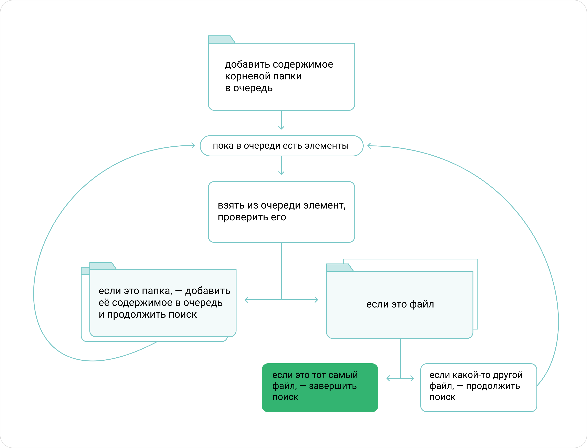

```python
import queue

def find_file(folder, file_to_find):
    q = queue.Queue()
    q.put(folder)
    while not q.empty():
        path = q.get()
        if os.path.isdir(path):
            for item in os.listdir(path):
                q.put(os.path.join(path, item))
        else:
            if os.path.basename(path) == file_to_find:
                return path
    return None
```

### 1.2 Рекурсивный алгоритм

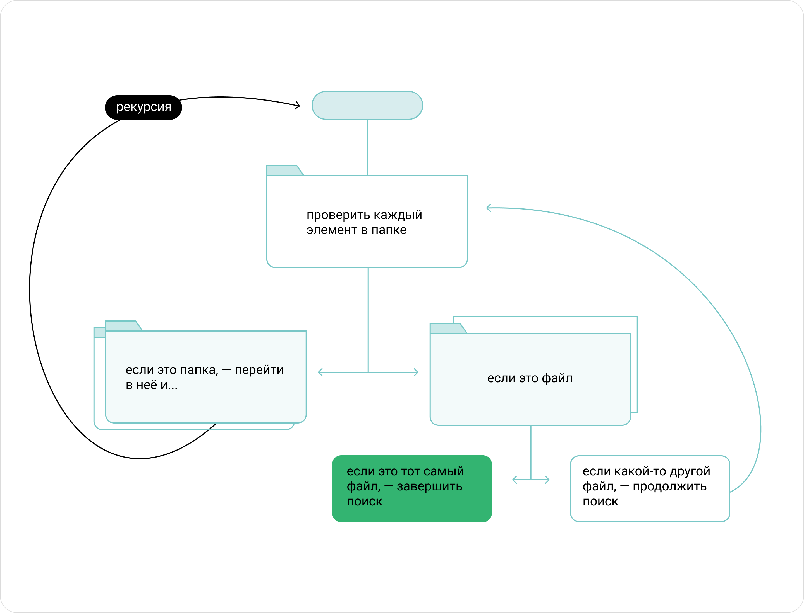

```python
функция find_file(folder, file_to_find):
    for path in содержимое папки folder
        if path является папкой:
                        # рекурсивно запустить поиск в подпапке
            file = find_file(path, file_to_find)
            if file != None:  # если файл нашёлся, передать его дальше
                return file   # по цепочке рекурсивных вызовов
        else:  # path — обычный файл
            if имя_файла(path) == file_to_find:
                        # если нашли нужный файл, то вернуть результат
                return path
    return None
```

На каждом уровне погружения рекурсия добавляет блок в стек вызовов. Найдя нужный файл, функция останавливает рекурсию и начинает по цепочке — от одного уровня к другому — возвращать результат вызвавшей её программе. 

Сначала инструкция `return` передаёт исполнение и результат работы функции на предыдущий уровень рекурсии. При этом со стека вызовов снимается один блок. Когда на этом уровне рекурсии исполнение функции дойдёт до `return`, результат будет передан дальше, а со стека снимется ещё один блок. Раз за разом функция получает результат от предыдущего рекурсивного вызова и передаёт его следующему:

```python
функция find_file(folder, file_to_find):
    ...
    file = find_file(path, file_to_find)
    ...
    return file
```

Так будет происходить до тех пор, пока функция не дойдёт до первого уровня рекурсии. Именно из него вызывающая программа и получит результат.

Рассмотрим рекурсивную функцию, которая создаёт матрёшку размера `size` с $n−1$ матрёшкой внутри:

```python
функция build_matryoshka(size, n):
    if n >= 1:
        print("Создаём низ матрёшки размера {size}.")
        build_matryoshka(size - 1, n - 1)
        print("Создаём верх матрешки размера {size}.")
    else:
        return 
```

Создадим матрёшку размера 4, внутри которой будет ещё 2 матрёшки. То есть всего получится 3 матрёшки:

```python
build_matryoshka(4, 3)

# Получим вывод:
Создаём низ матрёшки размера 4.
Создаём низ матрёшки размера 3.
Создаём низ матрёшки размера 2.
Создаём верх матрёшки размера 2.
Создаём верх матрёшки размера 3.
Создаём верх матрёшки размера 4. 
```

Ура, матрёшки сделаны! Теперь давайте пошагово разберём механизм их создания, а точнее работу рекурсии.

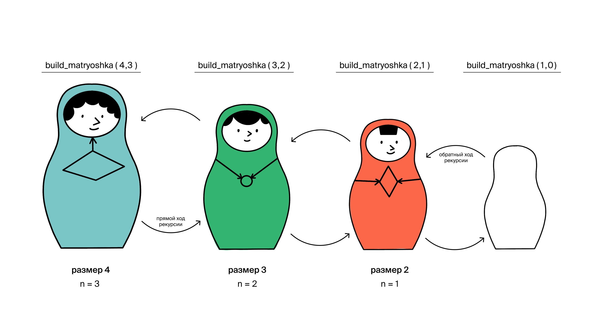

Итак, вот что происходит во время исполнения рекурсивной функции `build_matryoshka()`:

```markdown
Сначала в функции `build_matryoshka()` с параметрами `size = 4` и `n = 3` проверяется выполнение условия `n ≥ 1` и создаётся низ матрёшки размера 4.

↓

Затем происходит рекурсивный вызов: функция `build_matryoshka()` вызывает саму себя, но уже с другими параметрами (`size = 3` и `n = 2`). С этого момента начинается **прямой ход рекурсии**, её *углубление*. Проверяется выполнение условия `n ≥ 1` и создаётся низ матрёшки размера 3.

↓

Внутри функции `build_matryoshka()` с параметрами `size = 3` и `n = 2` происходит рекурсивный вызов. Вызывается `build_matryoshka()` со значениями `size = 2`, `n = 1`, проверяется выполнение условия `n ≥ 1` и создаётся низ матрёшки размера 2.

↓

Внутри функции `build_matryoshka()` с параметрами `size = 2` и `n = 1` происходит рекурсивный вызов. Вызывается `build_matryoshka()` со значениями `size = 1`, `n = 0`. Проверяется выполнение условия `n ≥ 1`. На этом уровне рекурсии параметр `n` равен нулю, поэтому функция `build_matryoshka()` со значениями `size = 1`, `n = 0` останавливается и перемещается в ветку `else`.

↓

Отсюда начинается **обратный ход рекурсии**. Сначала происходит возврат на уровень выше — в функцию `build_matryoshka()` со значениями `size = 2`, `n = 1`. Создаётся верх матрёшки размера 2.

↓

Далее происходит возврат в `build_matryoshka()` с параметрами `size = 3`, `n = 2`. Создаётся верх матрёшки размера 3.

↓

И наконец мы возвращаемся в функцию `build_matryoshka()` со значениями параметров `size = 4`, `n = 3`. Эта функция вызывалась первой. Создаётся верх самой большой матрёшки.

↓

Ура! Мы сделали матрёшку из трёх матрёшек!
```

> [!CAUTION]
>
> Кстати, если говорить о скорости, то рекурсия не ускоряет работу программы, а наоборот, может её замедлить. Более того, алгоритмы, реализованные с применением циклов, часто исполняются быстрее. Зато рекурсия экономит время программиста, потому что код получается компактный и понятный, в нём труднее сделать ошибку. А ещё в такой код проще вносить изменения.

## 2 Рекурсивный и базовый случаи

Любая корректно работающая рекурсия состоит из двух обязательных частей:

- **рекурсивного случая**, благодаря которому начинается прямой ход рекурсии и происходит её углубление;
- и **базового случая**, который в нужный момент останавливает это углубление и запускает обратный ход рекурсии.

### 2.1 Рекурсивный случай

- Представь, что ты хочешь построить лестницу из n*n* ступеней. Как бы ты написал функцию `stairs_builder()`, которая с применением рекурсии реализует алгоритм постройки твоей лестницы?

- Если строить ступеньку за ступенькой, то, кажется, код такой функции может выглядеть так:

  ```python
  def stairs_builder(n):
      # build 1 step
      print("Осталось построить {} ступеней.".format(n))
      stairs_builder(n - 1) 
  ```

- Обрати внимание на момент, когда функция вызывает саму себя с изменёнными параметрами: `stairs_builder(n - 1)` — это и есть рекурсивный случай. Его ты написал верно. И всё же, если мы запустим эту программу, компьютер зависнет. 
- Потому что наша рекурсия уйдёт в бесконечный цикл. На каждом следующем уровне рекурсии число ʜeпостроенных ступеней `n` уменьшается на 1. Но после `n = 0` функция не остановит работу, а вызовется со значением −1, потом с −2 и так далее. Если бы у компьютера были неограниченные ресурсы, твоя лестница строилась бы вечно и имела бесконечное количество ступеней.
- И предотвратить это падение в кроличью нору рекурсивных случаев нам помогает обязательный элемент любой рекурсивной функции — **базовый случай**.

### 2.2 Базовый случай

При написании любой рекурсивной функции нужно указывать базовый случай —  условие, при котором цепочка рекурсивных вызовов останавливается. При этом важно уметь определять, что именно должно происходить в базовом случае.

Чтобы функция `stairs_builder()` работала корректно, рекурсия должна остановиться в тот момент, когда будет построено нужное количество ступеней. То есть когда счётчик `n = 0`. Это и будет базовый случай! Попробую добавить условие `if n == 0` :

```python
def stairs_builder(n):
  	# Базовый случай
  	if n == 0:
      return

    print("Осталось построить {} ступеней.".format(n))
    stairs_builder(n - 1) 
```

#### 2.2.1 Рекурсивная функция для вычисления двоичной записи любого целого числа

```python
def as_binary_string(n):
    if n < 0:
        return "-" + as_binary_string(-n)
    if n == 0 or n == 1:
        return str(n)
    last_digit = n % 2
    return as_binary_string(n // 2) + str(last_digit) 
```

### 2.3 Правила создания рекурсии

Чтобы решить задачу рекурсивным методом, нужно определить **базовый и рекурсивный случаи**.

Рекурсивный случай сводит задачу для большого набора данных к задаче с меньшим набором данных. Или для большого значения аргумента к задаче с меньшим значением аргумента.

А **базовый случай** определяет ситуацию, при которой рекурсию нужно остановить. Результат выполнения функции для базового случая следует вычислить явно, не прибегая к рекурсивным вызовам.

Ошибка, которую часто допускают, применяя рекурсию, — **зацикливание**. Обычно это происходит, если забыть указать базовый случай. Другая частая причина ухода в бесконечный цикл — это неверное изменение параметров в рекурсивном случае.

Например, если функция в какой-то ситуации вызывает саму себя, но значение параметра при этом не меняется. Тогда даже если базовый случай, который должен был бы прервать рекурсию, определён, функция может до него не дойти. При написании рекурсии мы должны убедиться, что для любого набора параметров функция рано или поздно сведётся к одному из базовых случаев.

> В большинстве случаев программа, упавшая в кроличью нору бесконечной рекурсии, не будет работать вечно, а завершится с ошибкой переполнения стека вызовов или с ошибкой сегментации (*англ*. segmentation fault). Это происходит из-за ограниченности ресурсов компьютера, ведь каждый рекурсивный вызов расходует память на стеке. Однако в некоторых случаях рекурсия сведётся к бесконечному циклу, вместо того, чтобы завершиться. Именно с такой ситуацией столкнулся Гоша. Как именно программа себя  поведёт — зависит и от самого алгоритма, и от используемого компилятора. Подробнее об этом можно почитать в статье про [оптимизацию хвостовой рекурсии](https://ru.wikipedia.org/wiki/Хвостовая_рекурсия) (*англ*. tail call optimization).


### 2.4 Бинарный поиск

Мы уже рассматривали задачу поиска элемента в массиве, когда говорили о временной сложности алгоритмов. Простейший способ её решения — линейный последовательный поиск, при котором функция перебирает все элементы, пока не встретит подходящий. А если данные отсортированы, можно выполнить эту задачу намного быстрее, воспользовавшись алгоритмом бинарного поиска. С его помощью найти слово в справочнике можно за $O(log⁡n)$.

Напомним алгоритм. Сначала открываем книгу на середине. Если слово находится там, поиск окончен. Если слово, которое мы ищем, по алфавитному порядку идёт раньше, выполняем те же действия для левой половины справочника, иначе — для правой половины.

На каждом шаге мы сводим исходную задачу к подзадачам того же типа, но меньшего объёма. Исходная задача — поиск в отсортированном массиве. Каждая подзадача — это тоже поиск в отсортированном массиве, поэтому алгоритм легко описать рекурсивно.

Итак, нам требуется найти в массиве элемент и вернуть его индекс. Если элемент не найден, вернуть –1. Гарантируется, что массив отсортирован по возрастанию. Для простоты предположим, что в массиве нет дубликатов.

#### 2.4.1 Принципы поиска

В алгоритме бинарного поиска мы будем проверять центральный элемент отсортированного массива. Если центральный элемент:

- равен искомому, то вернём его индекс;
- больше искомого, то продолжим рекурсивный поиск в левой половине массива;
- меньше искомого, то продолжим рекурсивный поиск в правой половине массива.

#### 2.4.2 Параметры функции

Наша функция будет принимать 4 параметра:

- массив;
- искомый элемент;
- индексы левой и правой границ интервала, на котором производится поиск.

#### 2.4.3 Границы интервалов

Удобно считать, что левая граница в интервал включается, а правая — не включается. Такие интервалы называют полуоткрытыми. Для границ, которые включаются в интервал, принято использовать квадратные скобки, а иначе — круглые. Наш интервал можно записать в виде `[left, right)`.

Его можно разделить на два смежных непересекающихся интервала аналогичного вида: `[left, mid)` и `[mid, right)`. Благодаря полуоткрытости интервалов, точка `mid` будет принадлежать только второму интервалу. Первый же интервал оканчивается индексом `mid – 1`.

#### 2.4.4 Вычисление индекса середины массива

Чтобы узнать индекс середины массива, воспользуемся формулой:

```python
mid = (left + right) // 2 
```

Применяем операцию целочисленного деления, так как вычисляемый индекс должен быть целым числом.

#### 2.4.5 Выбор нужной половины

Проверяем, равен ли центральный элемент искомому. Если равен, возвращаем индекс.

```python
if arr[mid] == x:
    return mid
```

Если искомый элемент меньше центрального, рекурсивно ищем элемент в промежутке `[left, mid)`.

```python
elif x < arr[mid]:
    return binarySearch(arr, x, left, mid) 
```

Если центральный элемент меньше искомого, ищем в правой половине `[mid, right)`. Элемент `mid` можно не включать в интервал, ведь мы его уже проверили, поэтому поиск запустим на промежутке `[mid + 1, right)`.

```python
else:
    return binarySearch(arr, x, mid + 1, right) 
```

#### 2.4.6 Базовый случай

На каждом шаге сужается диапазон поиска. Правая граница сдвигается влево, либо левая — вправо. При реализации обязательно нужно удостовериться, что границы действительно уменьшаются при любом наборе параметров, иначе рекурсия может уйти в бесконечный цикл:

- в нашем случае всегда `mid < right`, поэтому `[left, mid)` меньше по длине, чем `[left, right)`;
- кроме того, `left < mid + 1` (хотя `mid` может оказаться равным `left`), поэтому `[mid + 1, right)` меньше по длине, чем `[left, right)`.

В какой-то момент левая граница может стать равной правой, такой полуоткрытый интервал не содержит элементов. Можно сделать вывод, что искомого элемента в массиве нет и вернуть –1. Это будет базовым случаем рекурсии.

Второй базовый случай реализуется, если элемент на позиции mid оказался искомым. Этот случай мы обсудили ранее.

#### 2.4.7 Код алгоритма

```python
def binarySearch(arr, x, left, right):
    if right <= left: # промежуток пуст
        return -1
    # промежуток не пуст
    mid = (left + right) // 2
    if arr[mid] == x:  # центральный элемент — искомый
        return mid
    elif x < arr[mid]: # искомый элемент меньше центрального значит следует искать в левой половине
        return binarySearch(arr, x, left, mid)
    else: # иначе следует искать в правой половине
        return binarySearch(arr, x, mid + 1, right)

# изначально мы запускаем двоичный поиск на всей длине массива
index = binarySearch(arr, x, left = 0, right = len(arr)) 
```


#### 2.4.8 А если массив отсортирован по убыванию?

Этот алгоритм можно легко модифицировать для поиска в массиве, отсортированном по убыванию. В этом случае, если центральный элемент меньше искомого, нужно продолжать поиск в левой части. А если больше — в правой.

```python
def binarySearchDescending(arr, x, left, right):
    if right <= left:
        return -1
    # промежуток не пуст
    mid = (left + right) // 2
    if arr[mid] == x:  # центральный элемент — искомый
        return mid
    elif arr[mid] < x: # искомый элемент больше центрального на этот раз все элементы больше центрального располагаются в левой половине
        return binarySearchDescending(arr, x, left, mid)
    else: # иначе следует искать в правой половине
        return binarySearchDescending(arr, x, mid + 1, right)

# изначально мы запускаем двоичный поиск на всей длине массива
index = binarySearch(arr, x, left = 0, right = len(arr)) 
```

#### 2.4.9 Вещественный бинарный поиск

Представь, что у тебя есть уравнение и ты хочешь найти его действительные корни, как ты поступишь?

Классический вариант хорош для уравнений 1-4 степеней, а вот для степеней $\geq5$ уже не подходит.

$x = \frac{-b\plusmn\sqrt{D}}{2a}$

Задачи подобного класса решаются численными методами с некоторой заранее заданой погрешностью. Для простоты будем считать, чтозадан какой-то диапазон вещественной прямой, например $[-2,2]$, где мы хотим искать корни и непрерывная функция, например $f(a)=x^{3}-2$

Для того, чтобы убедится, что в заданном промежутке есть хотя бы один корень, необходимо проверить **что функция имеет разный знак на границе диапазона**. Например если вначале диапазона функция меньше нуля, а в конце больше, то как минимум один раз она должна пересекать ось абсцисс, то есть должна иметь хотя бы один корень в данном диапазоне.

Убедимся что у нашей функции корень в заданном диапазоне есть: $(-2)^{3}-2=10<0;2^{3}-2=6>0$ . Теперь нам надо решить с какой точностью нам искать ответ. Например точность $10^{-4}$ означает, что абсолютная разность найденного нами корня и реального корня функции будет меньше чем $0.0001$, назовём эту точность константой `EPS`.

Наконец мы готовы к реализации вещественного бинарного поиска.

Поставим указатель `left` на левый край диапазона, указатель `right`на правый край диапазона и посмотрим чему равно значение в функции в середине текущего отрезка $\frac{right+left}{2}$. Далее мы будем поддерживать следующий **инвариант, если изначально значение функции у левого края диапазона было меньше нуля, то оно должно оставаться меньше нуля, а справа больше нуля, или наоборот в обратном случае.** То есть мы будем постепенно подходить к нашему корню слева и справа указателями `left` & `right`.

Проверим на нашем примере $-2+2=0,f(0)=0^{3}-2=-2<0$, но у нас и до этого слева значение функции было меньше нуля, то есть мы должны сдвинуть левый указатель. Проделаем еще несколько итераций. В данный момент $left=0,right=2,\frac{right+left}{2}=1,f(1)=1^{3}-2=-1$,, то есть нам снова нужно сдвинуть левый указатель. Теперь:

$left=1,right=2,\frac{right+left}{2}=1.5,f(1)=1.5^{3}-2=1.375$, то есть нам впервые нужно сдвинуть правый указатель.Основной вопрос сейчас, а когда нам остановиться? Тут стоит вспомнить нашу константу `EPS`: если условие $right−left<EPS$ выполняется, то мы уже можем выйти из нашего цикла. Ответ можно взять как в` right,` так и в `left `оба они будут в пределах выбранной погрешности. Теперь напишем наш код целиком:

```python
def f(x):
  return x*x*x-2

left = -2
right = 2
EPS = 0.0001
while right-left >= EPS:
  mid = (right+left)/2
  if f(mid) < 0:
    left = mid
  elif:
    right = mid

print right
```

#### 2.4.10 Бинарный поиск по ответу

Пускай у нас есть такая задача: даны `N` веревок целой положительной длины, из этих кусков нужно нарезать `k` кусков максимальной длины, требуется найти эту максимальную длину. Например, пусть длины веревок будут `1` и `3`и `k=4`, тогда ответ будет `1`: мы просто первую веревку возьмем как есть, а вторую поделим на три части.

>
> Допустим, «функция проверки ответа» принимает массив верёвок, `k` и желаемую длину верёвки — `L`. Возвращает `true` — когда массив можно поделить на k*k* отрезков так, чтобы длина каждого была не меньше `L`. В противном случае возвращает `false`.
>
> Если не можем получить нужное количество верёвок длины с `L`, то c `L+1`, `L+2` и вообще любым числом больше `L` не получится. Аналогично работает и в меньшую сторону: если для длины `L` функция вернула `true`, то и для другого числа меньше `L` она тоже вернёт `true`.

Сначала определимся с диапазоном возможных решений. В нашем случае для левой границы можем взять `0`— мы всегда сможем получить длину верёвки больше нуля, а точный минимум знать и не нужно. Главное — чтобы левая граница была не больше возможного ответа.

Для правой границы можем взять сумму длин всех верёвок. Это крайне грубая оценка — но даже с ней алгоритм достаточно быстр. А вот если верхнюю границу выбрать неправильно, алгоритм может вернуть неверный ответ — лучше не экономить без крайней необходимости.

Второй шаг — понять, как сдвигаются указатели. Нужно поддерживать инвариант: ответ всегда лежит или в left*l**e**f**t*, или в `right`. Инвариант в задачах может быть разным — в нашем случае удобно хранить в `left`ту длину, на которую гарантированно можно поделить верёвки. Для нуля этот инвариант выполняется — мы всегда можем нарезать k*k* верёвок нулевой длины. Если функция возвращает `true` — сдвигаем левый указатель, иначе — правый. Так что ответ всегда будет в левом указателе.

Ответа может и не быть — функция ни разу не вернёт `true`, и `left`не изменится. Тогда важно взять `left`меньше минимального возможного ответа. После бинарного цикла мы легко определим, что задача не имеет верного ответа на предоставленных данных.

Несколько слов о функции проверки решений. Мы будем применять «жадный» алгоритм — подробно мы его разберём в следующих уроках. Однако зачастую додуматься до реализации такой функции не так и сложно.

Пришло время применить вещественный поиск:

```python
lengths = [1, 3]  # длины веревок
k = 2  # желаемое число кусков

def f(lengths, k, l):
    sum = 0
    for length in lengths:
        sum += length // l
    return sum >= k

sum = 0
for length in lengths:
    sum += length

left = 0
right = sum
EPS = 0.0001

while right - left >= EPS:
    mid = (right + left) / 2
    if f(lengths, k, mid):
        left = mid
    else:
        right = mid

print(left)
```

**Итоговая оценка алгоритма**: функция проверки $O(|lengths|)$ и она вызывается всего $O(log(sum(lengths)))$ раз, а итоговая сложность такого алгоритма $O(|lengths|*log(sum(lengths)))$.

> [!TIP]
>
> Подытожим. Для бинарного поиска необязательно иметь реальный массив в памяти. Мы рассматривали поиск от нуля до суммы всего массива — это легко может не поместится в память. Но и применить бинарный поиск мы можем не всегда, а только когда одной проверкой отсекаем половину возможных ответов. 

### 2.5 Разбор задач. Рекурсивный перебор вариантов

#### 2.5.1 Генерация последовательностей из 0 и 1

Рассмотрим пример генерации всех возможных последовательностей длины `n` из нулей и единиц.

Функция принимает в качестве параметра число `n` и строку `prefix`. Вызываем функцию с параметром `n` и значением `prefix`, равным пустой строке. Далее будем добавлять в эту строку 0 и 1. В каждом рекурсивном вызове `n` означает, сколько ещё символов нужно добавить в строку. Рекурсия останавливается, когда `n = 0`, то есть символы добавлять больше не требуется. Это базовый случай рекурсии.

В рекурсивном случае функция вызывает себя дважды, но с разными параметрами. В первый раз она добавляет в строку `prefix` цифру 0, а во второй раз — 1. При этом значение `n` каждый раз уменьшается на 1, а `prefix` удлиняется на один символ. Таким образом, рекурсия уходит на `n` уровней в глубину.

Теперь запишем это так:

```python
def gen_binary(n, prefix):
    if n == 0:
        print(prefix)
    else:
        gen_binary(n - 1, prefix + '0')
        gen_binary(n - 1, prefix + '1') 
```

Решение этой задачи удобно представлять в виде бинарного дерева. Начинаем с пустой строки. Если идём влево, добавляем 0, если вправо — 1.

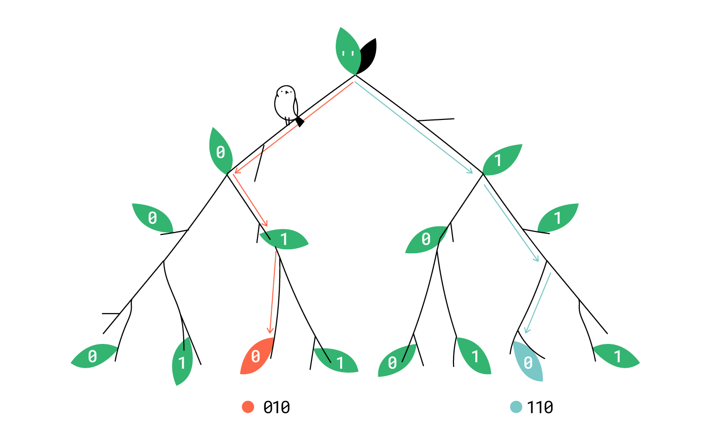

Если пройти от корня по всем веткам, получим все возможные последовательности из 0 и 1 длины 3.


#### 2.5.2 Вычисление количества последовательностей

У нас есть $n$ позиций. На каждой из них может стоять $0$ или $1$, то есть возможны $2$ варианта. Последовательностей длины один — $2$, длины два — в 2 раза больше, длины три — ещё в 2 раза больше. Итого получим произведение  $n$ двоек, то есть $2^n$

Если посчитать количество путей в нашем дереве от корня до листа, получится действительно $2^{3}=8$.

> [!IMPORTANT]
>
> Рекурсия часто используется для перебора вариантов. Например, у нас есть n различных предметов. Каждый из предметов может быть взят или отложен в сторону. Тогда есть  $2^n$ вариантов того, как взять набор предметов. Пронумеруем предметы числами от $1$ до $n$. Каждый предмет может быть взят (обозначим цифрой 1) или отложен в сторону (обозначим как 0). Так мы фактически свели задачу перебора вариантов к задаче генерации последовательностей из нулей и единиц.


## 3. Алгоритмы сортировки

Упорядоченность данных очень важна в повседневной жизни.

Например, в вашем смартфоне контакты отсортированы по алфавиту. А расписание автобусов составляется по времени их отправления. Поисковая система выдаёт ранжированный список ответов — по степени их релевантности запросу.

Сортировать данные можно по разным критериям. Товары в интернет-магазине раскладывают по возрастанию цены или по популярности. Список дел на день записывают в порядке, в котором планируют ими заниматься, или в порядке, в котором их вспомнили.

Многие компьютерные программы используют алгоритмы сортировки. Попробуйте зайти в консоль и вывести список всех файлов в текущей директории. Это можно сделать с помощью команды `ls` для Unix/macOS или `dir` для Windows. Результат будет отсортирован по алфавиту.

### 3.1 Роль сортировок в решении задач

Во многих задачах работать с отсортированными данными удобнее, чем с неупорядоченными. Например:

- найти элемент в массиве быстрее чем за  $O(n)$, воспользовавшись бинарным поиском, получится только на отсортированных данных;
- составить таблицу «10 лучших студентов курса» будет удобнее, если список студентов отсортирован не в алфавитном порядке, а по среднему баллу.

Нередко именно сортировка становится бутылочным горлышком и замедляет решение задачи. Поэтому важно знать, каким образом в каждом отдельном случае можно отсортировать массив наиболее эффективно.

### 3.2 Выбор алгоритма сортировки

Между тем Гоша решил набираться опыта на реальных проектах. Он нашёл себе стажировку в стартапе, занимающемся городским благоустройством. Городов в стране много, а задач, связанных с их улучшением, ещё больше. Прежде чем проводить аналитику, руководитель поручил Гоше расположить города по возрастанию уровня удовлетворённости жизнью горожан. Показатель удовлетворённости жителей города представляет собой натуральное число.

Рассмотрим два алгоритма сортировки:

- один работает быстро, но требует $O(n)$ дополнительной памяти;
- другой алгоритм медленнее, но ему нужно лишь $O(1)$ дополнительной памяти.

Сейчас в компании, где стажируется Гоша, старые сервера, на них совсем не осталось свободной памяти. На одном из них лежат все данные об удовлетворенности жизнью в разных городах страны. Для ежемесячного отчёта необходимо отсортировать данные и предоставить названия 100 городов с самыми довольными жителями. Отчёт Гоша должен сдать через неделю.

> Для этой задачи больше подходит второй алгоритм. Нет ничего страшного в том, что он работает медленнее, чем первый, потому что скорость в этой ситуации не играет большой роли. Гораздо важнее имеющееся ограничение по памяти. Для работы первого алгоритма просто не хватит ресурсов.

Теперь команде Гоши поручили сделать стенд, на котором отображаются данные об удовлетворённости жителей страны в реальном времени. Под эту задачу был куплен новый мощный сервер. Каждую секунду на вход программы поступает обновлённый массив с текущими значениями индекса удовлетворённости по всем городам. Гошин алгоритм должен составить «Топ-5 самых довольных городов» и обновлять этот список в режиме реального времени.

> В этом случае нельзя использовать медленный алгоритм, ведь данные должны обновляться ежесекундно. При этом есть возможность использовать дополнительную память. Так что правильно будет выбрать первый алгоритм.

Таким образом, при решении задачи важно верно оценить имеющиеся ресурсы. В этом вам могут помочь следующие вопросы:

> [!IMPORTANT]
>
> - Как быстро необходим ответ? Если результат сортировки нужен не срочно, то можно реализовать менее быстрый алгоритм, зато не использовать дополнительную память.
> - С каким объёмом данных будет работать алгоритм? Если у вас в массиве всего 1000 элементов, то любой алгоритм сортировки упорядочит их так быстро, что вы и не заметите. Если же у вас в наличии 5 000 000 элементов, разница может быть уже существенной.
> - Сколько памяти доступно? Если вам хватит свободного места на то, чтобы записать массив второй раз, можно упростить себе задачу и собирать отсортированный массив в дополнительной памяти, а не переставлять элементы в исходном массиве.

### 3.3 Устойчивость сортировок

Если после применения сортировки первоначальный порядок элементов с равным значением сравниваемого признака сохраняется, такая сортировка называется устойчивой (*англ.* stable sort). В противном случае, если элементы с равным значением поменялись местами, — неустойчивой.

> [!TIP]
>
> Обычно, когда говорят про устойчивость сортировки, употребляют словосочетание «относительный порядок элементов $x_1$ и $x_2$сохранился». Это значит, что если в исходном массиве элемент $x_1$ стоял до элемента $x_2$, то после перестановки элементов в массиве  $x_1$ всё ещё стоит перед $x_2$. При этом оба элемента могли быть переставлены на другие позиции, между ними могло добавиться или убраться сколько-то элементов, но главное, что они сохранили свой порядок друг относительно друга.

- Это свойство сортировок мне не понятно. Представь, что мы сортируем массив `[5,3,7,5]`. Какая разница, будут ли в отсортированном массиве `[3,5,5,7]` пятёрки идти в исходном порядке или в обратном? Всё равно же эти значения равны.
- Ты абсолютно права, в данном случае нет никакой разницы. Но ведь нам приходится сортировать не просто числа, а города. У нескольких городов может быть одинаковая степень удовлетворённости жителей. Но при этом сами города можно расположить в различном порядке.

Например, вот как два разных алгоритма, применённые Гошей, отсортировали города по индексу удовлетворённости их жителей:

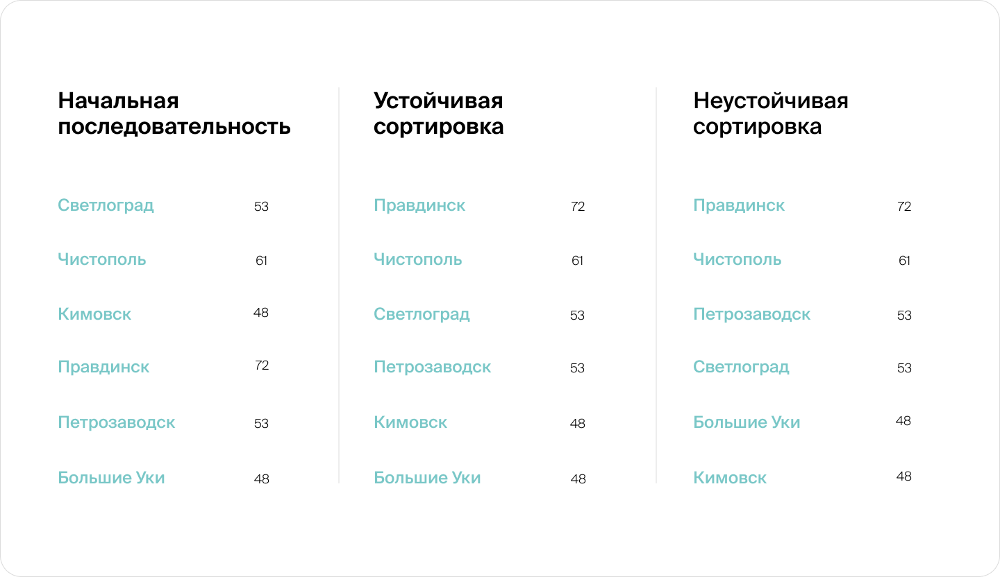

В Светлограде и Петрозаводске одинаковое значение индекса удовлетворённости жизнью. Первый алгоритм сортировки сохранил их относительный порядок, а после использования второго алгоритма порядок изменился. То же самое случилось с Кимовском и Большими Уками. Если хотя бы одна пара равных элементов поменялась местами, то алгоритм неустойчивый. 

> [!IMPORTANT]
>
> Если в массиве есть элементы с равными значениями, то существует несколько правильных вариантов последовательностей отсортированного по невозрастанию массива. Однако если необходимо отсортировать массив именно устойчиво, то существует ровно одна правильная последовательность.

Представим, что на твоём компьютере запущены две взаимосвязанные программы. Каждая из программ пишет отладочную информацию в формате `<время>: <сообщение>` в своём журнале событий (*англ.* log file).

```bash
program_A.log:
12:34:56 — program A started
13:00:11 — program A got request
13:00:11 — program A failed

program_B.log:
08:00:00 — program B started
13:00:11 — program B sent request
13:00:11 — program B failed
```

Когда в программе произошла ошибка, тебе понадобилось объединить информацию из двух файлов в одном. Для этого ты склеил два файла и отсортировал строки по времени. Поскольку время было указано с точностью до секунды, оказалось, что несколько записей имеют одну и ту же временную метку, а потому неизвестно, как их расположить.

Если взять неустойчивую сортировку, такие записи могут оказаться перемешанными. Например, запись о том, что программа завершила работу, может оказаться перед записью о том, что программа начала обработку запроса.

Устойчивая сортировка такой ошибки сделать не может, потому что в исходных логах запись о завершении работы программы идёт после записи о начале обработки.

```bash
joined_unstable.log:
08:00:00 — program B started
12:34:56 — program A started
13:00:11 — program B sent request
13:00:11 — program A failed
13:00:11 — program B failed
13:00:11 — program A got request
```

```bash
joined_stable.log:
08:00:00 — program B started
12:34:56 — program A started
13:00:11 — program A got request
13:00:11 — program A failed
13:00:11 — program B sent request
13:00:11 — program B failed
```

> [!CAUTION]
>
> Если на каком-то примере входных данных все одинаковые элементы сохранили свой относительный порядок после сортировки, мы не можем утверждать, что алгоритм устойчивый. Возможно, существует другой набор входных данных, при котором некоторые равные элементы поменяют свой порядок. На практике перебрать все наборы входных данных невозможно. Поэтому, чтобы доказать, что сортировка устойчивая, необходимо проанализировать сам алгоритм. В уроках этого спринта мы будем пояснять, почему та или иная сортировка является устойчивой или неустойчивой.

### 3.4 Сортировка вставками

Как мы уже говорили, в обычной жизни люди часто сортируют разные объекты. Вот пример сортировки, которую обнаружил Гоша, когда вечером пришёл к друзьям поиграть в настольную игру «Умник». 

Всем игрокам выдаются пронумерованные карточки. Что с ними делать — пока не так важно, правила игры мы расскажем в следующих уроках. А пока что Гоша решил разложить карточки в удобном для себя порядке: по возрастанию нумерации.

После того как Гоша отсортировал свои карты, он взял из колоды ещё несколько и разместил их справа от уже отсортированных. Получилось, что для каждой из карточек в левой части веера верно, что цифра на ней больше, чем на всех отсортированных картах левее неё. А в правой части веера карточки расположены в случайном порядке.


Итак, сейчас у Гоши отсортированы три карты: 2, 9, 11.  

Но карточки, находящиеся справа, не отсортированы. К счастью, Гоша знает, что с этим делать.

Он берёт первую из неотсортированных карточек и ищет для неё такое место, чтобы после перестановки туда этой карточки массив слева всё ещё был отсортирован и его длина при этом увеличилась бы на 1. А длина неотсортированной части массива, наоборот, уменьшилась бы на 1.


На текущий момент Гоша будет тратить $O(n)$ времени для вставки элемента в середину или в начало массива.


#### 3.4.1 Реализация алгоритма

При сортировке массива вставками нужно добавлять элементы по одному так, чтобы после каждой вставки массив оставался отсортированным. Поэтому сначала мы сдвигаем все карточки, которые по числовому значению больше добавляемой, на одну позицию вправо, и уже после этого на освободившееся место вставляем новую карту. 

Чтобы реализовать алгоритм этой сортировки, нужно элемент, который мы собираемся переставить, извлечь из массива в отдельную переменную. После этого мы будем поочерёдно сдвигать элементы массива на освободившееся место (таким образом, свободное место будет перемещаться влево) до тех пор, пока элемент правее свободного места не будет строго больше нашей переменной, а элемент левее свободного места — меньше или равен ей.

```python
def insertion_sort(array):
  for i in range(1, len(array)):
    item_to_insert = array[i]
    j = i
    while j > 0 and item_to_insert < array[j-1]:
      array[j] = array[j-1]
      j -= 1
    array[j] = item_to_insert
    print('step {}, sorted {} elements: {}'.format(i, i+1, array))

>>> insertion_sort([11, 2, 9, 7, 1])
step 1, sorted 2 elements: [2, 11, 9, 7, 1]
step 2, sorted 3 elements: [2, 9, 11, 7, 1]
step 3, sorted 4 elements: [2, 7, 9, 11, 1]
step 4, sorted 5 elements: [1, 2, 7, 9, 11]
```

Сложность такой сортировки $O(n^{2})$

> [!IMPORTANT]
>
> Сортировка вставками устойчивая. Это так, потому что мы не сдвигаем элемент, если он равен элементу, который мы упорядочиваем. Соответственно, одинаковые элементы останутся в массиве в том же порядке, в котором они были до сортировки.

### 3.5 Сортировка по ключу

Гоша с Аллой и Ритой играют в игру «Умник». Главное правило игры очень простое: на ход противника нужно быстро ответить карточкой, на которой написано б*о*льшее число. Тот, у кого нет достаточно большой карточки, или тот, кому не удалось найти нужную карту за отведённое время, проигрывает.

Благодаря отсортированным карточкам и применению алгоритма бинарного поиска Гоша стал слишком часто выигрывать. Другие игроки либо не успевали найти карточку, либо находили слишком большую карту и тратили её. Гоша же всегда находил оптимальный ход.

Алла не знала секрета его побед, но предположила, что если изменить правила игры, Гоше будет сложнее выигрывать. По новым правилам ответить на ход противника можно только карточкой, числовое значение которой записывается более длинным словом. Например, карточка «один» теперь больше, чем карточка «три».


#### 3.5.1 Ключ сортировки

Как же Гоше научиться выигрывать по этим новым правилам? Заметим, что он выигрывал за счёт того, что все карты в его руке были отсортированы. Это значит, что если выбрать любую карту, то:

- слева будут находиться карты слабее выбранной,
- а справа — сильнее.

Именно поэтому работал двоичный поиск.

Чтобы в новой игре разложить карты в виде, пригодном для быстрого поиска, достаточно отсортировать их по длине слова. 

Признак, по которому элементы сравниваются, называют «ключом сортировки». Мы уже сортировали элементы по ключу, когда нам требовалось упорядочить города по их индексу удовлетворённости.

Итак, с точки зрения алгоритма сортировки меняется только один этап — операция сравнения элементов.

Обычно функция сортировки принимает в качестве вспомогательного аргумента функцию, описывающую, в каком порядке идут элементы. Есть два распространённых способа это сделать:

- В одном варианте алгоритму сортировки передаётся в качестве параметра функция одного аргумента `key(object)`. Эта функция будет применена к каждому сравниваемому объекту, чтобы получить значение ключа для этого элемента. Все объекты попарно будут сравниваться между собой по этому ключу

```python
digit_lengths = [4, 4, 3, 3, 6, 4, 5, 4, 6, 6] # длины слов «ноль», «один»,...

def card_strength(card): # ключ сравнения
    return digit_lengths[card]

# воспользуемся уже знакомой сортировкой вставками
def insertion_sort_by_key(array, key):
  for i in range(1, len(array)):
    item_to_insert = array[i]
    j = i
    # заменим сравнение item_to_insert < array[j-1] на сравнение ключей
    while j > 0 and key(item_to_insert) < key(array[j-1]):
      array[j] = array[j-1]
      j -= 1
    array[j] = item_to_insert

cards = [3, 7, 9, 2, 3]
insertion_sort_by_key(cards, card_strength) 
```

- В другом варианте в алгоритм сортировки передаётся функция с двумя аргументами `less(object_1, object_2)`, которая сравнивает два объекта и возвращает `true`, если первый объект должен быть расположен раньше второго, и `false` в противном случае. Такую функцию называют «компаратор» (*англ.* compare, «сравнивать»).

```python
digit_lengths = [4, 4, 3, 3, 6, 4, 5, 4, 6, 6]  # длины слов «ноль», «один»,...

def is_first_card_weaker(card_1, card_2):  # функция-компаратор
    return digit_lengths[card_1] < digit_lengths[card_2]

# воспользуемся уже знакомой сортировкой вставками
def insertion_sort_by_comparator(array, less):
  for i in range(1, len(array)):
    item_to_insert = array[i]
    j = i
    # заменим сравнение item_to_insert < array[j-1] на компаратор less
    while j > 0 and less(item_to_insert, array[j-1]):
      array[j] = array[j-1]
      j -= 1
    array[j] = item_to_insert

cards = [3, 7, 9, 2, 3]
insertion_sort_by_comparator(cards, is_first_card_weaker) 
```

Сравнение элементов при помощи компаратора позволяет более гибко задавать порядок элементов, чем сравнение по ключу. Например, сортировку по любому ключу легко переписать в виде сортировки с таким компаратором:

```python
функция less(object_1, object_2):
    return key(object_1) < key(object_2) 
```

А вот, например, сконструировать индекс по компаратору не всегда возможно. И, как мы ещё увидим, не все компараторы работают корректно. Поэтому обычно намного проще использовать функцию вычисления ключа сортировки.

> [!IMPORTANT]
>
> Обязательно изучите документацию функции сортировки вашего любимого языка, чтобы научиться передавать в алгоритм сортировки компаратор либо функцию вычисления ключа.

Важно отметить, что объекты не всегда можно сравнить между собой вне контекста. Например, у обычных игральных карт порядок зависит от правил игры и той масти, которая стала козырем: шестёрку бубен можно расположить как до, так и после семёрки треф. 

Но если мы скажем, что хотим отсортировать их по достоинству (то есть по числовому значению на карте), то семёрка будет идти раньше шестёрки. В этом примере ключом сортировки будет достоинство карты.

Ключ, по которому будут отсортированы элементы, мы должны придумать, опираясь на смысл задачи. При этом у него должно быть одно очень важное свойство: возможность сравнивать ключ одного объекта с ключом другого объекта. Значит, ключи должны принадлежать типу, допускающему сравнение. В большинстве языков такими типами являются числа, строки и массивы. 

### 3.6 Сравнение элементов

Большинство алгоритмов сортировки опираются на результаты попарных сравнений элементов. Однако операция сравнения элементов не так проста, как может показаться. Как мы упоминали, сравнивать можно не только числа, но и строки, и массивы (но, например, сравнить число со строкой не получится). В этом уроке мы разберём, как именно они сравниваются, а также немного поговорим о том, почему некоторые объекты нельзя сравнить.

#### 3.6.1 Лексикографическая сортировка

После того как Гоша обыграл Аллу, в игру вступила Рита. Она предложила ещё сильнее усложнить правила. На этот раз карточка считается лучше, если на ней написано более короткое слово. А если слова одинаковой длины — побеждает та карточка, на которой число больше. Теперь карточка «два» лучше, чем карточка «семь», но «три» лучше, чем «два».

>- Гоша, я сдаюсь, ты опять всё время выигрываешь. Объясни, как ты на этот раз расположил карточки?
>
>- Ну... сначала я сравнил все карточки по числу букв и отсортировал их по убыванию. Потом взял все карточки с одинаковым числом букв и отсортировал внутри групп по возрастанию. Когда мне требуется найти карту, я сначала запускаю двоичный поиск по длине слова, а потом ещё один двоичный поиск по достоинству карты.
>
>- Гоша, ты придумал корректный алгоритм действий, но он слишком сложный. Давайте расскажу, как сделать то же самое, только проще.
>
>  В нашем примере есть два отдельных признака, по которым мы сортируем элементы. Было бы гораздо удобнее иметь один единственный ключ сортировки. Тогда нам будет достаточно провести одну сортировку вместо двух. И двоичный поиск можно будет запускать тоже только один раз за ход.
>
>  Но чтобы это сделать, нам нужно поговорить о том, что такое лексикографический порядок.
>
>- А при чём тут лексика? Это сортировка слов?
>
>- Да, это порядок, в котором упорядочены слова в справочнике. Чтобы узнать, какое из двух слов идёт раньше, мы сравниваем их по первой букве, руководствуясь алфавитным порядком. Если первая буква оказалась одинаковой, то сравниваем по второй, затем по третьей. И так, пока не найдём букву, которая в соответствующей позиции есть только в одном из слов. Именно эта позиция будет определять, какое слово идёт раньше. Например, слово «апельсин» лексикографически меньше, чем слово «арбуз», поскольку «п» в алфавите идёт раньше, чем «р». В языках программирования строки по умолчанию так и сравниваются, поэтому мы можем проверять порядок элементов при помощи обычных операций сравнения: `"апельсин" < "арбуз"`.
>
>В строках могут встречаться буквы разного регистра, а также другие символы, не встречающиеся в алфавите. Чтобы сравнить два символа, используются их индексы в таблице кодировки (например, на языке Python код символа возвращает функция `ord()`). Символы внутри алфавита в такой таблице обычно идут в алфавитном порядке (с некоторыми исключениями, вроде буквы «ё», которая идёт после буквы «я») — благодаря этому слова упорядочиваются в привычном алфавитном порядке.
>
>Другие закономерности менее интуитивны, и полагаться на них не следует. Например, буквы в верхнем регистре идут раньше букв в нижнем регистре, а буквы кириллицы стоят после букв латиницы: `'A' < 'Z' < 'a' < 'z' < 'Я' < 'я'`. 
>
>Каждый символ имеет свой код, так что сравнить можно любую пару строк.
>
>- Такой порядок мне знаком. Но как это поможет мне сортировать карты?
>- Лексикографический порядок используется не только для сравнения строк. Массивы обычно сравнивают таким же способом: сравнивают элементы массивов по очереди, пока не встретится различие. Например, можно сказать, что `[2, "апельсин"] < [2, "арбуз"]`.
>- Ага, стало понятнее. Значит, я могу в качестве ключа для карточки взять массив `[<длина слова>, <само число>]`. Например, у карточки «семь» ключом будет пара `[4, 7]`.
>- Почти. Ты забыл, что короткие слова должны быть «больше» длинных. Но первый элемент пары предписывает сортировать слова по длине в возрастающем порядке. И потому короткие слова будут стоять ближе к началу массива, а мы предполагали, что короткие слова, наоборот, должны идти в конце.
>- Да, действительно. А может быть просто перевернуть массив? Тогда короткие слова будут идти в начале.
>- Это не поможет. Ведь числа с одинаковой длиной тогда будут идти не в порядке возрастания, а в порядке убывания. Проблема в том, что в ключе `[<длина слова>, <само число>]`, который ты сделал, по первому числу мы должны сортировать в порядке убывания, а по второму — в порядке возрастания. Чтобы воспользоваться лексикографическим порядком, надо, чтобы порядок был одинаковым.
>- А я знаю, что можно сделать. Возьмём вместо длины массива длину со знаком минус. Например, «семь» будет записано как `[-4, 7]`, а «два» превратится в `[-3, 2]`. Теперь мы можем сортировать ключи по возрастанию с использованием обычного лексикографического порядка. Давай напишу код:
>
>```python
>digit_lengths = [4, 4, 3, 3, 6, 4, 5, 4, 6, 6]  # длины слов «ноль», «один»,...
>
>функция key_for_card(card):
>    return [-digit_lengths[card], card]
>
>cards = [2, 3 ,7]
>sort(cards, key=key_for_cards)
>```
>
>- Бинго!
>
>

```python
digit_lengths = [4, 4, 3, 3, 6, 4, 5, 4, 6, 6]  # длины слов «ноль», «один»,...

def key_for_card(card):
    return [-digit_lengths[card], card]

cards = [2, 3 ,7]
cards.sort(key=key_for_card)
print(cards) 
```

Во многих языках твой код ещё и получилось бы сократить, используя лямбда-функцию (*англ.* lambda function) для вычисления ключа. Например, в Python это выглядело бы так:

```python
sorted(cards, key=lambda card: [-digit_lengths[card], card]) 
```


##### Превращение сортировки в стабильную

При помощи лексикографического порядка легко превратить любую сортировку в стабильную. Для этого мы преобразуем каждый элемент исходного массива в тройку вида `[значение ключа сортировки, позиция в исходном массиве, сам элемент]`. Затем мы отсортируем массив таких троек.

Элементы, у которых значение ключа отличается, будут расположены в соответствии с этим ключом. Элементы, одинаковые по ключу, будут упорядочены по позиции в исходном элементе. До сравнения по последнему элементу тройки дело не дойдёт, поскольку позиции у двух элементов совпасть не могут.

Например, чтобы отсортировать по длине слова `['Москва', 'Казань', 'Питер']`, сохранив порядок слов одинаковой длины, сопоставим элементам тройки: `[[6,0,'Москва'], [6,1,'Казань'], [5,2,'Питер']]`. При сортировке они будут упорядочены в порядке:

`[5,2,'Питер'], [6,0,'Москва'], [6,1,'Казань']`. Восстановить порядок самих городов теперь можно тривиально, достаточно просто отбросить из троек лишнюю информацию. В итоге получаем порядок `['Питер', 'Москва', 'Казань']`. Ключи сортировки в этих тройках сохранять не обязательно, их можно вычислять на лету. А вот исходные позиции сохранить придётся. Поэтому такой способ сделать сортировку стабильной потребует $O(n)$ дополнительной памяти.

**Как думаете, всегда ли можно отсортировать варианты ходов в игре по их силе?**

>  Далеко не всегда варианты возможно упорядочить разумным образом. Простейший пример — игра «камень-ножницы-бумага». Попробуем расположить эти три предмета по порядку. Ножницы идут после бумаги, а бумага после камня. Но тогда получается, что ножницы «лучше» камня, а это противоречит условиям игры.

Помните, мы говорили, что сортировать элементы безопаснее по ключу, а не при помощи компаратора? Вот и пример: для игры в «камень-ножницы-бумага» легко написать компаратор, который сравнит любые два исхода. Но сортировать массив, используя такой компаратор, нельзя.

Конечно, это не единственный пример множества, которое нельзя упорядочить. Чтобы некоторое множество объектов можно было отсортировать, должна существовать операция сравнения, для которой выполняются несколько условий:

- Операция сравнения должна быть определена для любых двух объектов. Если среди объектов есть, например, одновременно и числа, и строки, сортировку провести не удастся. Более сложный пример нарушения этого условия мы уже рассматривали: в колоде игральных карт мы можем сравнивать карты одной масти, но не можем сравнить карты разных мастей.
- Для любых двух элементов a и b должно выполняться ровно одно из трёх условий: либо $a<b$, либо $b<a$, либо $a=b$.
- Операция сравнения должна быть транзитивной. Это значит, что если $a<b$ и одновременно $b<c$, то обязательно $a<c$. Именно это правило нарушается в игре «камень-ножницы-бумага».

Математики называют множество, в котором все элементы можно сравнивать с соблюдением этих условий, «линейно упорядоченным».

> [!WARNING]
>
> Удивительно, что эти условия не слишком хорошо соблюдаются даже для обычных вещественных чисел в компьютерном представлении. Дело в том, что существует специальное «число» `NaN`, которое нарушает все привычные правила. Например, `NaN` не равно даже самому себе. Кроме того, это значение не больше любого другого и одновременно не меньше любого другого.
>
> Наличие подобных элементов может сломать даже сортировку обыкновенного массива чисел. Например, в нашей реализации сортировки вставками на элементе `NaN` поиск подходящего элементу места стопорится. Таким образом, массив `[12, 5, 1, 4, NaN, 9, 3, 6]` при сортировке превратится лишь в частично отсортированный массив `[1, 4, 5, 12, NaN, 3, 6, 9]`.

### 3.7 Сортировка слиянием


Сейчас у Гоши и Тимофея есть две отсортированных стопки карт. Как же им соединить их так, чтобы получилась единая колода, в которой все карты расположены по порядку?

Ребята знают, что колода состоит из 100 пронумерованных карточек, в ней нет повторов или пропусков. Поэтому в процессе сортировки им будет легко понять, чья очередь класть карту. Допустим, у верхней карты 41-й номер: если карта с номером 42 находится у Тимофея, то он должен её выложить, а если нет — подождать, когда её выложит Гоша.

Но что делать, если некоторые карты утеряны и в колоде есть повторы? В этом случае, перед тем как класть любую карту, ребятам надо сообщить друг другу числовое значение наименьшей карты из своих стопок. Благодаря тому, что карточки отсортированы, сделать это будет легко: достаточно просто посмотреть на самую первую карточку.

Если у одного из участников карт больше не осталось, второй может просто положить остаток своей колоды на отсортированную стопку карт, так как сортировка уже точно не нарушится.

> [!CAUTION]
>
> То же самое происходит и с массивами. Из двух отсортированных массивов мы можем собрать единый массив, элементы в котором будут идти в правильном порядке. Для этого  сравниваются текущие элементы двух массивов, и наименьший добавляется в массив с результатом.

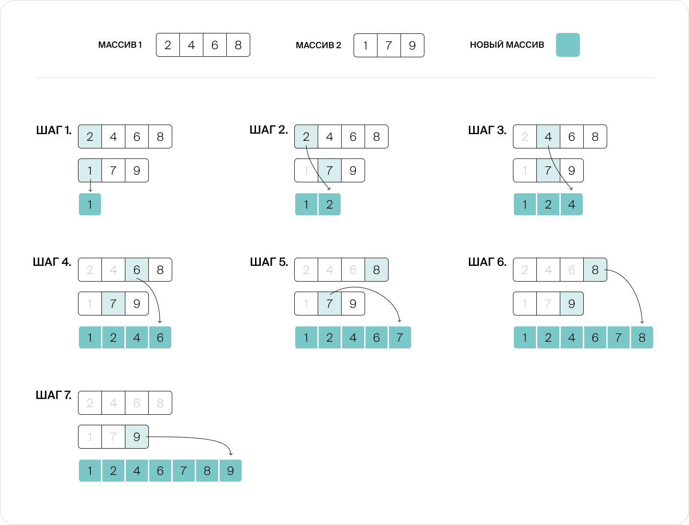

*На каждом шаге берём у каждого из двух массивов текущий первый элемент. Сравниваем их между собой и наименьший из них добавляем в массив с результатом*

На каждом шаге мы за $O(1)$ узнаём, у кого из участников наименьшая карточка, и выкладываем её в стопку. То есть, чтобы переложить в стопку все карточки, нам надо сделать $K+M$ итераций, где каждая итерация происходит за константное время.

Всего в колоде $N$карт, поделённых между Гошей и Тимофеем, $N=K+M$. Сложность объединения в отсортированную колоду составит $O(N)$

#### Разделяй и властвуй


Мы разобрались, как властвовать над подзадачами. Сейчас мы можем получить одну стопку из двух отсортированных половин, но ведь эти половины тоже как-то надо было отсортировать. Гоша и Тимофей могли сделать это как угодно, например воспользоваться сортировкой вставками. Но давайте рассмотрим способ, который будет эффективнее. Он же применяется в сортировке слиянием.

Представьте, что у Тимофея совсем нет времени, и вместо того, чтобы самостоятельно работать, он разделил свою ещё неотсортированную часть карточек пополам между двумя фрилансерами и попросил каждого из них отсортировать свою стопку. Если работники достаточно ленивы и хитры, они тоже не будут сортировать свои карты алгоритмом вставки, а перепоручат свою работу другим фрилансерам, разделив свои стопки карт пополам. Удивительно, но оказывается, что заплатить за две работы над половинами колоды потребуется меньше, чем за сортировку единой колоды, так как часть работы по объединению стопок берёт на себя «менеджер», а не итоговые исполнители.

##### Принцип работы сортировки слиянием

Мы уже разобрали все составные части алгоритма сортировки слиянием. Давайте подытожим:

1. Массив разбивается на две части примерно одинакового размера.
2. Если в каком-то из получившихся подмассивов больше одного элемента, то для него рекурсивно запускается сортировка по этому же алгоритму, начиная с пункта 1.
3. Два упорядоченных массива соединяются в один.

> [!CAUTION]
>
> Условие остановки рекурсии — массив из одного элемента. Он не нуждается в сортировке, поэтому это базовый случай.

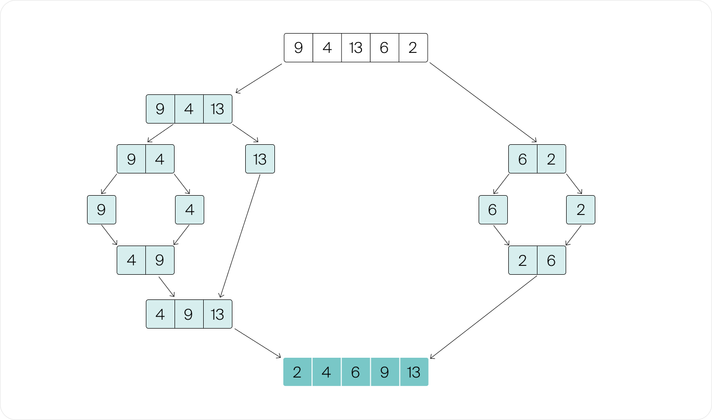

*Дерево алгоритма сортировки слиянием: массив разбивается на части примерно равной длины. Каждая часть рекурсивно сортируется. После этого отсортированные части объединяются в единый массив*

##### Реализация

```python
def merge_sort(array):
    if len(array) == 1:  # базовый случай рекурсии
        return array

    # запускаем сортировку рекурсивно на левой половине
    left = merge_sort(array[0 : len(array)//2])

    # запускаем сортировку рекурсивно на правой половине
    right = merge_sort(array[len(array)//2 : len(array)])

    # заводим массив для результата сортировки
    result = [0] * len(array)

    # сливаем результаты
    l, r, k = 0, 0, 0
    while l < len(left) and r < len(right): 
    # выбираем, из какого массива забрать минимальный элемент
        if left[l] <= right[r]: 
            result[k] = left[l]
            l += 1
        else:
            result[k] = right[r]
            r += 1
        k += 1

    # Если один массив закончился раньше, чем второй, то
    # переносим оставшиеся элементы второго массива в результирующий
    while l < len(left): 
        result[k] = left[l]   # перенеси оставшиеся элементы left в result
        l += 1
        k += 1  
    while r < len(right): 
        result[k] = right[r]  # перенеси оставшиеся элементы right в result
        r += 1
        k += 1

    return result
```

Обратите внимание на то, откуда берётся значение в случае равенства рассматриваемых элементов подмассивов.

##### Сложность алгоритма

Сортировка слиянием даже в худшем случае работает за $O(n \cdot log⁡n)$. Давайте разберёмся почему.

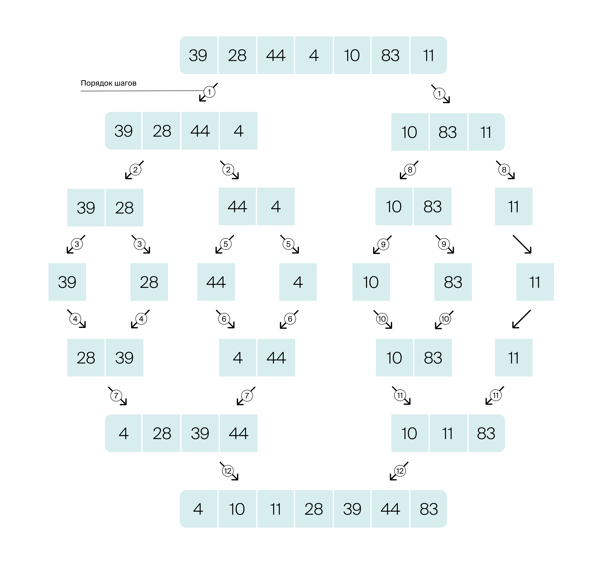

На каждом шаге прямого хода рекурсии массив разбивается на две примерно равные по размеру части. Разбиение продолжается до тех пор, пока длина массива не станет равной $1$. Таким образом, каждый элемент массива будет задействован примерно в $log⁡_{2}n$ вызовах рекурсивной функции.

> [!NOTE]
>
> Иначе можно сказать, что **глубина рекурсии** составляет $O(log⁡_{2}n)$. Глубиной рекурсии называют максимальную глубину стека вызовов, которая достигается во время рекурсии. Вспомнить об этом можно, вернувшись в предыдущий модуль «Основные структуры данных» в урок «Стек вызовов».

На каждом шаге обратного хода рекурсии выполняется операция слияния двух отсортированных массивов. Как мы уже выяснили, для этого потребуется $O(n)$ операций, ведь на каждом уровне рекурсии нужно обработать n*n* чисел.

Таким образом, общая сложность этого алгоритма $O(n⋅log⁡_{2}n)$.

##### Пространственная сложность алгоритма

Алгоритму требуется $O(n)$ дополнительной памяти. Так как мы собираем отсортированный массив на новом месте, а не меняем местами элементы в уже отсортированном массиве.

На каждом уровне рекурсии для проведения операций слияния требуется выделить $O(n)$ дополнительной памяти — в неё будут копироваться элементы объединяемых блоков в правильном порядке. Если выделять такое количество памяти на каждом уровне рекурсии, суммарно придётся затратить $O(n \cdot log⁡n)$ дополнительной памяти.

Но вспомогательный массив требуется лишь временно. После объединения блоков мы можем перенести элементы из вспомогательного массива обратно в исходный, освободив выделенную память. Таким образом, в каждый момент времени будет использоваться вспомогательное пространство лишь для одного, текущего уровня рекурсии. Значит, нам будет достаточно использовать лишь $O(n)$ дополнительной памяти.

##### Устойчивость алгоритма

Сортировка слиянием является устойчивой сортировкой. В случае равенства элементов в двух отсортированных массивах, приоритет отдаётся элементу, который находился в левой половине массива. Так происходит на каждом уровне сортировки вплоть до объединения двух массивов длины в один. Таким образом, равные элементы в отсортированном массиве будут расположены друг относительно друга так же, как и в исходном. 


### 3.8 Быстрая сортировка

В этом уроке мы рассмотрим ещё один популярный алгоритм сортировки, который называется быстрой сортировкой (*англ.* quick sort) и использует стратегию «разделяй и властвуй».

Встроенные функции сортировки во многих языках программирования используют модификации именно алгоритма быстрой сортировки, поскольку на практике она нередко работает даже быстрее сортировки слиянием. Автор этого алгоритма  — Чарльз Хоар. Поэтому в честь него quick sort иногда называют сортировкой Хоара.

#### 3.8.1 Принцип работы алгоритма

Разберёмся, как он работает. Алгоритм быстрой сортировки использует стратегию «разделяй и властвуй». Любой такой алгоритм состоит из трёх шагов: 

- разделение данных на части меньшего размера;
- рекурсивный вызов алгоритма для этих частей;
- объединение результатов.

В алгоритме `merge sort` мы:

- разделили массив пополам;
- получили отсортированные половины;
- провели слияние двух отсортированных массивов особым образом чередуя карточки. Мы брали карточки то из начала одной половины, то из начала другой половины.

Получается, что у нас был очень **простой** шаг разделения и **нетривиальный** шаг объединения данных. В алгоритме быстрой сортировки всё будет наоборот: мы сначала хитрым способом разделим данные на части, зато объединение произойдёт очень просто, нам достаточно будет дописать один отсортированный массив после другого.

> Требуется придумать такой способ разделить массив на части, чтобы любой элемент в левой части был меньше любого элемента в правой части. Это будет гарантировать, что элементы левой и правой частей никогда не придётся менять местами

- Возьмём исходный массив.


- Выберем какое-нибудь число. Все элементы, меньшие, чем это число, переложим в один массив. Все элементы, большие или равные этому числу, — в другой. Тогда элементы слева будут меньше элементов справа.


- Отсортируем каждую из частей рекурсивно.
- Склеим левую часть с правой.

Готово! Получился отсортированный массив:

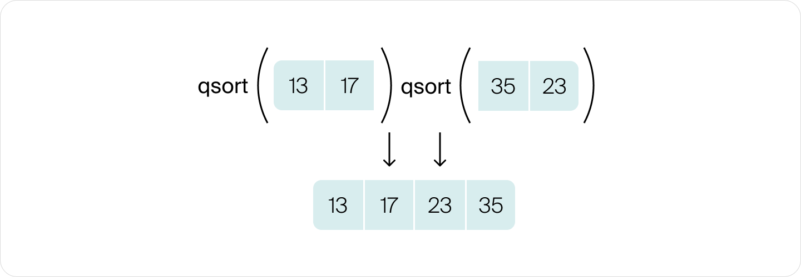

**В качестве выбранного подойдёт не любое число**. Например, если все числа в массиве располагаются от 0 до 10, то при разбиении массива по числу 42 правая половина окажется пустой, а элементы в левой части будут такие же, как в исходном массиве. В результате рекурсивный вызов сортировки левой половины уйдёт в бесконечный цикл.

Если выбирать всякий раз новое случайное число, рано или поздно мы попадём в точку, которая разделит массив на две непустые части. Но если все элементы массива отличаются очень слабо (например, `[0.303, 0.3029, 0.3031]`), то рекурсии придётся сделать очень много попыток разбиения, прежде чем найдётся точка, которая разделит массив на части.

Хороший способ разделить массив на части — выбрать один из его элементов. Чаще всего так и поступают. Но любое число, расположенное между элементами массива, тоже подойдёт.

- Я понял, нам надо выбрать любое число, которое разделит массив на части. Лучше всего было бы взять медиану, ведь тогда мы сможем разбить массив на части равного размера, так?

- Если бы нам удалось найти медиану, было бы очень здорово. Но сделать это быстрее, чем за $O(n)$ нельзя, ведь придётся просмотреть все элементы. Если мы будем при каждом разбиении массива искать медиану, это удвоит число производимых операций.

- Тогда выберем какой-нибудь элемент массива и разделим массив по нему.

- Да, так будет лучше всего. Такой разделительный элемент называют **«опорным» (англ. pivot)**.

  Например, нам нужно отсортировать массив из пяти элементов:


- Мы можем выбрать в качестве опорного любой из элементов массива. От этого будет зависеть, на какие части он разделится:

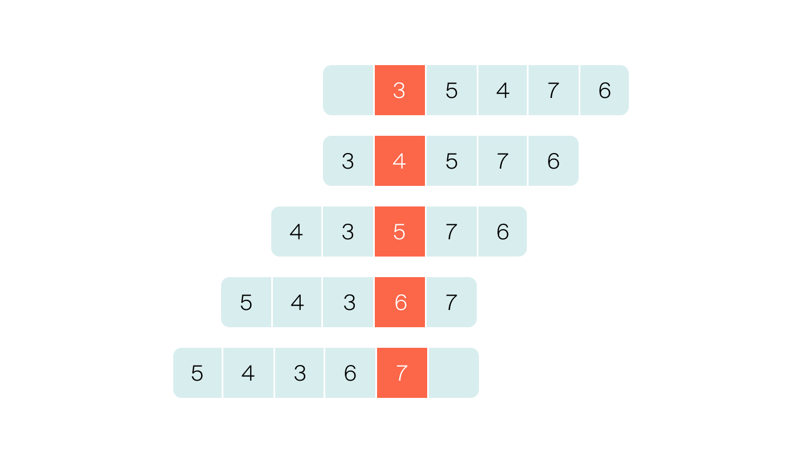

- Как мы говорили, чтобы алгоритм завершился, размер сортируемой части должен хоть немного уменьшаться на каждом шаге рекурсии. Но это выполняется автоматически, если мы будем разбивать массив не на две части, а на три. Элементы меньше опорного пойдут в левую часть, элементы больше опорного — в правую. А сам опорный — в середину. Этот элемент сортировать не требуется. Получается, что в левой и правой половине, даже в сумме, всегда на один элемент меньше, чем в исходном массиве. Значит, каждый шаг рекурсии всегда будет уменьшать размер обрабатываемой части.

  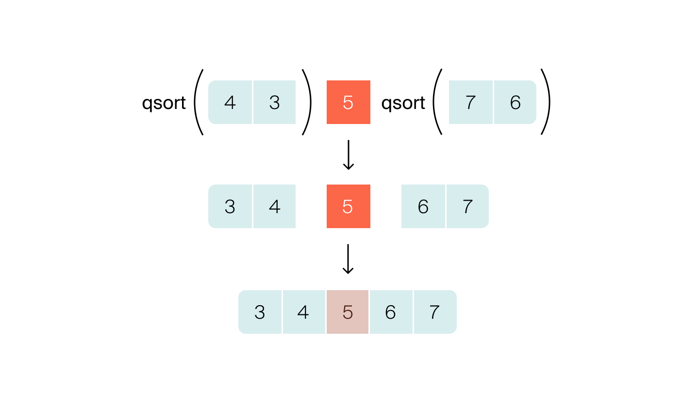

  - Так как же нам выбрать опорный элемент?
  - Есть разные варианты. Например, выбрать случайный элемент. Это позволит получать неудачные разбиения не слишком часто. Но мы ещё поговорим об этом подробнее, когда будем анализировать сложность алгоритма.
  - Мне кажется, в алгоритме всё ещё остаются дырки. Раз алгоритм рекурсивный, значит нам нужно рассмотреть базовый случай.
  - Ты прав. Но здесь всё просто. Базовых случаев два: пустой массив и массив из одного элемента. Такие массивы достаточно вернуть в неизменном виде.
  - Но есть ещё одна проблема. Представь, что в массиве много одинаковых элементов. Один из этих элементов мы возьмём в качестве опорного. Левая и правая половины получаются правильными, а вот центральный элемент останется только один:

  ```bash
                                       left:   [4, 3]
  [7, 5, 4, 5, 3, 8, 5] ——(pivot:5)——> center: [5]
                                       right:  [7, 8]
  ```

  Чтобы решить эту проблему, нужно брать в качестве центральной группы не опорный элемент, а все элементы, равные опорному. Сортировать их всё равно не нужно, ведь все они равны.

```bash
                                     left:   [4, 3]
[7, 5, 4, 5, 3, 8, 5] ——(pivot:5)——> center: [5, 5, 5]
                                     right:  [7, 8]
```

Теперь можно сформулировать алгоритм быстрой сортировки. Он работает вне зависимости от выбора опорного элемента. И последовательность действий всегда одинакова:

1. Выбираем опорный элемент.
2. Делим массив на два подмассива: слева элементы меньше опорного, справа — больше, посередине — равные опорному. Этот этап часто выделяют в отдельную функцию, которую называют `partition`.
3. Применяем быструю сортировку к двум подмассивам, левому и правому.
4. Объединяем результат.

```python
def partition(array, pivot):
    left = [x for x in array if x < pivot]
    center = [x for x in array if x == pivot]
    right = [x for x in array if x > pivot]
    return left, center, right

def quicksort(array):
    if len(array) < 2:
        return array   # массивы с 0 или 1 элементами фактически отсортированы
    else:
        pivot = random.choice(array)
        left, center, right = partition(array, pivot)
        return quicksort(left) + center + quicksort(right)
```

Будет ли быстрая сортировка устойчивой, зависит от шага `partition`. Его несложно сделать устойчивым. Для этого достаточно пройти по всем элементам массива с начала до конца, перенося элементы во вспомогательные массивы `left`, `center`, `right` ровно в том порядке, в котором элементы нам встретились. Некоторые реализации отказываются от этого свойства в пользу большей эффективности алгоритма.
