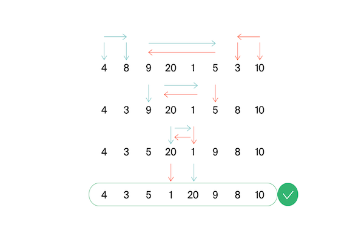

# Финальная задача №2 - "Эффективная быстрая сортировка"

Тимофей решил организовать соревнование по спортивному программированию, чтобы найти талантливых стажёров. Задачи подобраны, участники зарегистрированы, тесты написаны. Осталось придумать, как в конце соревнования будет определяться победитель.
Каждый участник имеет уникальный логин. Когда соревнование закончится, к нему будут привязаны два показателя: 
количество решенных задач $P_i$ и размер штрафа $F_i$. Штраф начисляется за неудачные попытки и время, затраченное на задачу.

> Тимофей решил сортировать таблицу результатов следующим образом: при сравнении двух участников выше будет идти тот, у которого решено больше задач. При равенстве числа решённых задач первым идёт участник с меньшим штрафом. Если же и штрафы совпадают, то первым будет тот, у которого логин идёт раньше в алфавитном (лексикографическом) порядке.

Тимофей заказал толстовки для победителей и накануне поехал за ними в магазин. В своё отсутствие он поручил вам реализовать алгоритм быстрой сортировки (англ. quick sort) для таблицы результатов. Так как Тимофей любит спортивное программирование и не любит зря расходовать оперативную память, то ваша реализация сортировки не может потреблять $O(n)$ дополнительной памяти для
промежуточных данных (такая модификация быстрой сортировки называется "in-place")

## Как работает in-place quick sort

Как и в случае обычной быстрой сортировки, которая использует дополнительную память, необходимо выбрать опорный элемент (англ. pivot), а затем переупорядочить массив. Сделаем так, чтобы сначала шли элементы, не превосходящие опорного, а затем —– большие опорного.

Затем сортировка вызывается рекурсивно для двух полученных частей. Именно на этапе разделения элементов на группы в обычном алгоритме используется дополнительная память. Теперь разберёмся, как реализовать этот шаг `in-place`.

Пусть мы как-то выбрали опорный элемент. Заведём два указателя `left` и `right`, которые изначально будут указывать на левый и
правый концы отрезка соответственно. Затем будем двигать левый указатель вправо до тех пор, пока он указывает на элемент меньше
опорного. Аналогично двигаем правый указатель влево, пока он стоит на элементе, превосходящем опорный. В итоге окажется, что левее от `left` все элементы точно принадлежат первой группе, а правее от `right` - второй. Элементы, нак оторых стоят указатели, нарушают порядок. Поменяем их местами (в большинстве ЯП используется функция `swap()`) и продвинем указатели на 
следующие элементы. Будем повторять это действие до тех пор, пока `left` и `right` не столкнутся.
На рисунке представлен пример разделения при `pivot=5`, `left` - голубой, `right` - оранжевый:

## Формат ввода

В первой строке задано число участников $n,1 \leq n \leq 100000$.
В каждой из следующих $n$ строк задана информация про одного из участников.
`i`-ый участник описывается тремя параметрами:

- уникальным логином (строкой из маленьких латинских букв длиной не более 20)
- числом решённых задач $P_i$
- штрафом $F_i$
$F_i$ и $P_i$ - целые числа, лежащие в диапазоне от $0$ до $10^9$

## Формат вывода

Для отсортированного списка участников выведите по порядку их логины по одному в строке.
