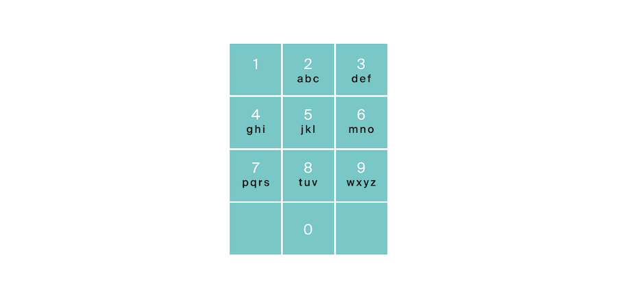

# Задача №3 - "Комбинации"

На клавиатуре старых мобильных телефонов каждой цифре соответствовало несколько букв. Примерно так:

2:’abc’,
3:’def’,
4:’ghi’,
5:’jkl’,
6:’mno’,
7:’pqrs’,
8:’tuv’,
9:’wxyz’

Вам известно в каком порядке были нажаты кнопки телефона, без учета повторов. Напечатайте все комбинации букв, которые можно набрать такой последовательностью нажатий.



## Формат ввода

На вход подается строка, состоящая из цифр 2-9 включительно. Длина строки не превосходит 1010 символов.

## Формат вывода

Выведите все возможные комбинации букв через пробел в лексикографическом (алфавитном) порядке по возрастанию.

## Идея
На каждом шаге рекурсии мы берём следующую цифру, перебираем все её буквы и уходим глубже — пока не соберём комбинацию длиной равной числу нажатых кнопок. Это классический поиск с возвратом (backtracking).

```bash
backtrack(0, "")
 ├─ backtrack(1, "a")
 │   ├─ backtrack(2, "ad") → добавить "ad"
 │   ├─ backtrack(2, "ae") → добавить "ae"
 │   └─ backtrack(2, "af") → добавить "af"
 ├─ backtrack(1, "b")
 │   ├─ ...
 Результат для  "23"  — 9 комбинаций:  'ad', 'ae', 'af', 'bd', 'be', 'bf', 'cd', 'ce', 'cf'  
```

- Временная сложность: $O(4^{n} \cdot n)$, где $n$ - количество цифр
- Пространственная сложность: $O(n)$