# Хеш-функции

[TOC]

Хеш-таблицы, как и массивы, встроены в большинство языков программирования и применяются в решениях тех задач, где нужно хранить набор произвольных объектов. Но в отличие от массивов они дают возможность быстро искать объекты по какому-либо признаку, взятому в качестве ключа. 

Мы расскажем, как устроены хеш-таблицы и почему они так удобны для создания алгоритмов эффективного поиска по тексту. А ещё мы поговорим о концепции хеширования. Но для начала давайте познакомимся с абстракцией отображения, которая лежит в основе как идеи, так и реализации хеш-таблиц.

## 1. Абстракции отображения

О массивах мы говорили в самом начале курса, и сейчас они нам очень пригодятся. Напомним, что в интерфейсе массива есть две основные операции:

- `get(index: int) -> value` — получить значение `value` из ячейки с индексом `index`;
- `set(index: int, value: ValueType)` — записать значение `value` в ячейку с индексом `index`.

Каждая из этих операций выполняется за $O(1)$. Это очень быстро! **Однако у массивов есть одно серьёзное ограничение: хотя в ячейках массива можно расположить объекты любого типа, индексы этих ячеек могут быть исключительно целыми числами.**

Но в программе часто возникает необходимость получить объект не по его порядковому номеру, то есть индексу ячейки в массиве, а по какому-то другому признаку, например по названию. Или, как говорят программисты, **получить значение (*англ.* value) по ключу (*англ.* key).**

Давайте представим, что у нас есть множество городов и множество стран. Одному городу может быть сопоставлена одна страна — та, в которой этот город находится:


*Каждому городу соответствует ровно одна страна. При этом на некоторые страны указывает несколько городов, а на другие — ни одного*

Нужно написать такую программу-справочник, которая по городу будет узнавать страну, где тот расположен. А ещё нам пригодится функция добавления новой пары «город»: «страна», если справочник будет пополняться.

В этой задаче город является ключом, а страна — значением. Каждому городу сопоставлена ровно одна страна ни больше ни меньше. А вот на страну может указывать любое количество городов.

> [!NOTE]
>
> Такое сопоставление, когда каждому объекту первого множества (множество городов) соответствует ровно один объект второго множества (множество стран), называется «отображением» (*англ.* map).

Давайте немного изменим условие этой задачи. Например, мы будем сопоставлять страны и их столицы. Поскольку у каждой страны есть один и только один столичный город, получившееся сопоставление будет отображением. 

Или можно сделать отображение стран в массивы городов, то есть каждой стране будет соответствовать ровно один массив, содержащий в себе любое количество городов (в том числе — ноль).


*Каждая страна указывает ровно на один объект — массив городов. Количество городов в массиве может быть любым*

> [!IMPORTANT]
>
> На самом деле отображение — это другое название математического термина «функция», или «функциональная зависимость». Чаще всего функции отображают числа (расположенные на оси X) в другие числа (расположенные на оси Y). Для каждого числа из области определения функции можно выписать другое число — значение функции в этой точке.

Массивы — это тоже частный случай отображения: они умеют сопоставлять целому числу любое значение. Например, массив `["яблоко", "груша", "яблоко"]` сопоставляет числам `0` и `2` строку `"яблоко"`, а числу `1` — строку `"груша"`.

Чтобы работать с отображениями, нам требуется похожая на массив структура данных, которая умеет получать и сохранять значения. Но вместо целочисленного индекса она должна допускать ключ произвольного типа:

- `get(key: KeyType) -> ValueType` — получить значение `value` по ключу `key`;
- `set(key: KeyType, value: ValueType)` — записать значение `value` по ключу `key`.

Интерфейс, описывающий две этих операции, называют `Map`. А любую структуру, которая реализует этот интерфейс, называют «ассоциативным массивом» (*англ.* associative array).

### 1.1 Ассоциативные массивы

В большинстве языков программирования ассоциативные массивы встроены в язык.

Чаще всего их называют так же, как интерфейс — `Map`, «отображение», или используют производные от слова «хеш-таблица»: `Hash`, `HashMap`, `HashTable` и даже просто `Table`. Эти названия подчёркивают, каким именно способом был реализован интерфейс отображения. Встречаются и другие наименования. Например, в Python ассоциативные массивы называют «словарями» (*англ.* dictionary).

> [!TIP]
>
> Есть два популярных способа реализовать или, как говорят программисты, имплементировать отображение. Первый способ, хеш-таблицы, мы рассмотрим в этом спринте. Другой способ основан на деревьях поиска, о которых мы будем говорить в следующем спринте. В некоторых языках встречаются сразу обе реализации. Например, в Java отображения имплементированы двумя отдельными классами: `HashMap` и `TreeMap`. В языке C++ им соответствуют классы `std::unordered_map` и `std::map`.

Ассоциативный массив — настолько полезная структура, что во многих языках есть встроенный синтаксис для её создания. К примеру, в Python отображение реализовано типом `dict`, а создать его можно следующим образом:

```python
country_by_city = {
    "Moscow": "Russia",
    "Tula": "Russia",
    "London": "UK",
    "Paris": "France",
    "Leon": "France",
    "San Francisco": "USA",
    "New York": "USA",
}
```

Синтаксис обращения к таким объектам аналогичен обращению к массиву:

```python
# присвоить значение по ключу
country_by_city["Saint Petersburg"] = "Russia"
# получить значение по ключу
country = country_by_city["Tula"]
print(f"Tula is located in {country}")
```

### 1.2 Вложенные структуры данных

Значениями в ассоциативном массиве могут быть данные любого типа: числа, строки, массивы и другие структуры данных. Значением может быть даже другой ассоциативный массив — это позволяет лаконично описывать объекты со сложной внутренней структурой. Например, такие вложенные структуры часто можно встретить в формате хранения данных JSON.

Представьте, что у вас есть несколько сайтов, и вы хотите записывать статистику по посещениям всех страниц на каждом из них. В этом случае удобно использовать такую структуру:

```jsx
pagesVisitStats = {
    "https://timofey.me": {
        "main": 2,
        "contacts": 3
    },
    "https://fruit-shop.ru": {
        "apples": 12,
        "plums": 10,
        "pears": 20,
        "contacts": 15
    }
}
```

Давайте посмотрим, как с этим объектом работать. Как, например, узнать число посещений страницы `"contacts"` на сайте `"https://timofey.me"`?

Наш ассоциативный массив хранится в переменной `pagesVisitStats`. Он даёт нам возможность отображать названия сайтов в другие ассоциативные массивы — с информацией по конкретному сайту.

Для начала нам нужно получить значение по ключу `"https://timofey.me"` и сохранить его в переменную `site_stats`:

```jsx
site_stats = pagesVisitStats["https://timofey.me"] 
```

Полученное значение является ассоциативным массивом:

```jsx
{
    "main": 2,
    "contacts": 3
}
```

В этом ассоциативном массиве ключами являются названия страниц. Поэтому, чтобы узнать интересующую нас информацию, мы можем обратиться к `site_stats["contacts"]` и получить число посещений этой страницы —  `3`.

Такие цепочки обращений часто записывают в одну строку, избегая создания промежуточных переменных: `pagesVisitStats["https://timofey.me"]["contacts"]`.

### 1.3 Подсчёт объектов

- Давайте подсчитаем какие-нибудь объекты с помощью ассоциативного массива. Например, можно узнать, сколько разных фруктов лежит у меня в холодильнике. Для этого выпишем названия всех фруктов и посмотрим, сколько раз встретилось каждое их них.

  Помните, мы делали сортировку подсчётом, когда хотели узнать, какое число сколько раз нам встретилось? Для этого мы использовали массив. Само число было индексом, а в качестве значения мы записывали количество вхождений. 

  Здесь так сделать не получится, потому что название фрукта не может быть индексом массива.

- Но мы можем заменить обычный массив на ассоциативный! Название фрукта будет ключом, а значением станет число — счётчик вхождений. Тимофей, мы ведь можем отображение обновлять?

- Да. Операция `set(key, value)` позволяет не только записать в ассоциативный массив новое соответствие, но и обновить значение по уже имеющемуся ключу.

Можно реализовать подсчёт таким образом:

```python
fruits = ["яблоко", "яблоко", "груша", "яблоко", "слива"]
fruit_count = { }  # создаём пустой ассоциативный массив
for fruit in fruits:
    if not has_key(fruit_count, fruit):  # если в отображении нет такого ключа
        fruit_count[fruit] = 0           # заводим счётчик с таким ключом
    fruit_count[fruit] += 1              # увеличиваем счётчик:
                                         #   set(key, get(key) + 1)
```

После выполнения этого кода `fruit_count` будет содержать `{"яблоко": 3, "груша": 1, "слива": 1}`.

### 1.4 Наивная реализация ассоциативного массива

В этом спринте мы будем изучать универсальные и часто используемые ассоциативные массивы, а именно хеш-таблицы. Узнаем, как они устроены и как ими пользуются разработчики.

Но сначала давайте рассмотрим простейший способ реализации ассоциативного массива. Заведём обыкновенный массив или список, в котором записаны пары `(key, value)`.

Если нужно получить элемент по ключу, достаточно пройти по всем элементам списка, выбрать пару с подходящим значением ключа и вернуть значение, записанное в этой паре. Если значение нужно записать, ищем пару с указанным ключом. Если находим, то изменяем её. А если такая пара не нашлась, создаём её и добавляем в конец массива.

```python
class Map:
    def __init__(self):
        self.pairs = []

    def get(self, key):
        for pair in self.pairs:
            if pair.key == key:
                return pair.value
        return None # Если пара не найдена, вернем null

    def set(self, key, value):
        for pair in self.pairs:
            if pair.key == key:
                pair.value = value
                return
        # Если пара с заданным ключом не найдена, добавим новую пару
        new_pair = Pair(key, value)
        self.pairs.append(new_pair)

class Pair:
    def __init__(self, key, value):
        self.key = key
        self.value = value
```

У нас получилась очень медленная реализация: на поиск элемента в таком массиве в среднем требуется $O(n)$ операций. В следующем уроке мы поговорим о том, как реализовать отображение более эффективным способом — при помощи хеш-таблиц.

## 2. Хеш-таблица и хеш-функция

Заведём массив из трёх элементов. Если встречаем яблоко — увеличиваем счётчик в ячейке `0`, если сливу — увеличиваем ячейку `1`, а груши будем считать в ячейке `2`.

Так работает хеш-таблица.

Хеш-таблица (*англ.* hash table)  — это один из способов реализовать ассоциативный массив, при котором все данные записываются и хранятся в виде пар `(key, value)` в ячейках обыкновенного массива. Эти ячейки называются корзинами (*англ.* bucket). Как и в любом массиве, ячейки-корзины пронумерованы. Индекс, или номер корзины, в которую отправляются данные, зависит от ключа.

Получается, что в нашей задаче название фрукта — это ключ `key`, а число-счётчик— это значение `value`. Итого у нас будет 11 яблок, 20 слив и 8 груш. Яблоки отправятся в нулевую корзину, сливы — в первую, груши — во вторую. Запишем массив, лежащий в основе нашей упрощённой хеш-таблицы: `[("яблоко", 11), ("слива", 20), ("груша", 8)]`.

Можно завести специальную функцию, которая по ключу будет вычислять номер корзины, в которую должен быть добавлен фрукт.

```python
# Функция bucket вычисляет номер корзины для указанного фрукта
def bucket(fruit):
    if fruit == "яблоко":
        return 0
    elif fruit == "слива":
        return 1
    elif fruit == "груша":
        return 2
    else:
        raise ValueError("Неизвестный фрукт")
```

Теперь, если требуется узнать, сколько у нас груш, можно по ключу `"груша"` вычислить номер корзины, в которой следует искать нужную информацию — это будет корзина под номером 2. В этой корзине мы находим пару `("груша", 8)` и извлекаем из неё значение — 8.

Но как сделать такую функцию? Если у нас всего три фрукта, мы можем написать несколько условных операторов, чтобы определить номер корзины. Но если фруктов много, функция разрастётся и будет медленно работать.

Эта проблема решается с помощью специальной техники, которая называется «хеширование». Для этого нам понадобится **хеш-функция**.

> [!IMPORTANT]
>
> Хеш-функция (*англ.* hash function) — функция, которая обеспечивает преобразование входных данных в целое число. Для разных типов объектов применяются разные хеш-функции. Результат вычисления хеш-функции называется «хешем» или «хеш-суммой» (англ. hash, hash code или digest).

Представим, что у каждой буквы алфавита есть свой индекс, равный её порядковому номеру. Хеш-функция может возвращать значение, равное индексу первой буквы в названии фрукта. Тогда, например, для яблока функция вернёт **33**, для груши — 4, а для сливы — **19**.

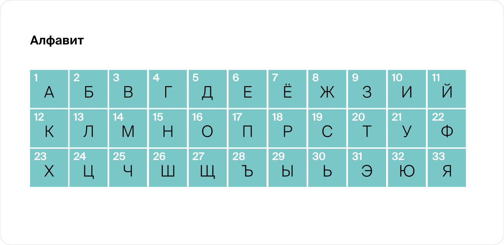

*Чтобы вычислять хеш-функции от строк, нам понадобится превратить отдельные символы в числа. Один из способов это сделать -- воспользоваться номерами символов из таблицы кодировки. У нас будет упрощённая кодировка, состоящая только из букв русского алфавита*

Так как хеш — целое число, его можно использовать как номер корзины. Например, информация про груши хранится в корзине 4. Это значит, что когда нам нужно получить или обновить информацию про число груш, достаточно заглянуть в эту ячейку. При этом нам не требуется запоминать номера ячеек, ведь при помощи хеш-функции их всегда легко вычислить.

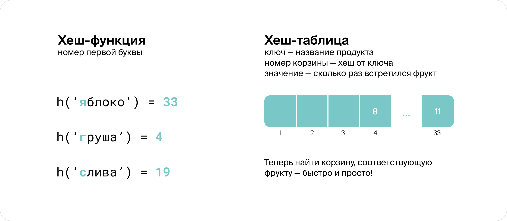

*Воспользуемся хеш-функцией, чтобы вычислить хеш, который будет номером ячейки. Затем запишем в ячейки хеш-таблицы наши ключи и значения. На иллюстрации ключи не отображены для краткости*

Другой пример хеш-функции: мы можем возвращать сумму всех номеров букв, входящих в название фрукта. Тогда для «яблоко» значение функции будет 92, для «груша» — 70, а для «слива» — 46.

- И что же, получается, яблоко нужно будет поместить в 92-ю корзину? У меня нет столько корзин!
- Тебе не понадобится 92 корзины.

Многие хеш-функции выдают огромные числа: миллионы, миллиарды, а иногда и ещё больше. Поэтому хеш редко используется напрямую как номер ячейки. Чаще всего хеш — это промежуточная стадия вычисления. **Сначала по ключу мы определяем хеш, а затем по хешу — номер корзины.**

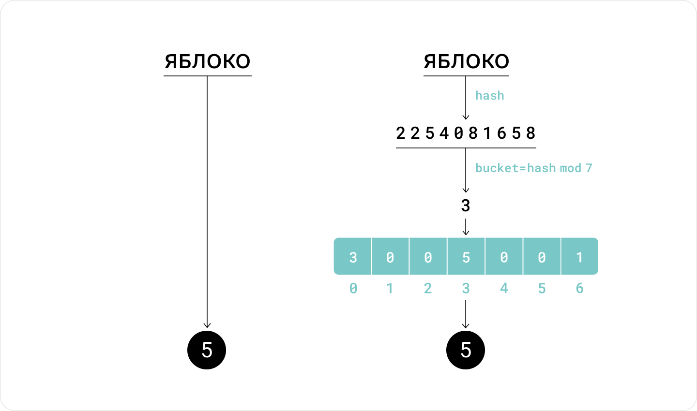

*Отображение из ключа в значение разделилось на три независимых отображения. 1. Сначала хеш-функция отображает ключ в число, то есть в хеш. 2. Затем этот хеш преобразуется в индекс корзины. 3. И, наконец, из массива корзин мы находим нужную корзину по её индексу. В ней-то и хранится значение, которое возвращается пользователю. В реальных хеш-таблицах в корзине может храниться несколько значений. Тогда возникает ещё четвёртый этап: поиск элемента в корзине с нужным ключом*

### Коллизия

Ситуация, когда хеш-функция для разных входных данных выдаёт одно и то же значение, называется «коллизией». Например, и у «арбуза», и у «абрикоса» значение хеша будет равно 1. Получается, что оба ключа указывают на одну и ту же корзину хеш-таблицы.

Коллизии могут случаться у всех без исключения хеш-функций, поэтому в реализации хеш-таблицы обязательно должна быть заложена логика их разрешения.

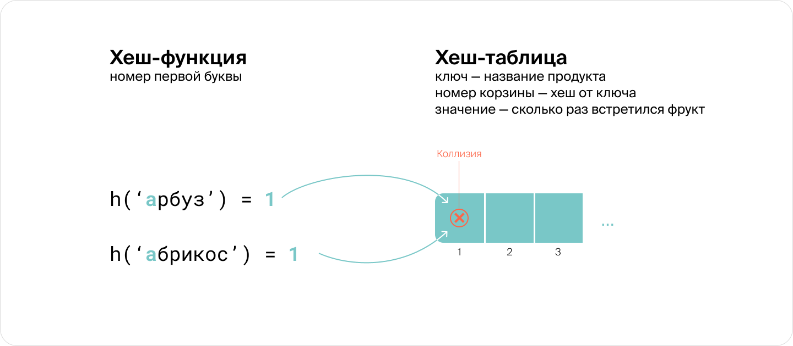

*Если хеш-функция для двух разных объектов («арбуз», «абрикос») выдаёт одинаковое значение (1), то в одну и ту же ячейку хеш-таблицы попадают сразу два ключа.*

- От чего зависит частота возникновения коллизий?
- Если коротко — от выбранной хеш-функции и количества корзин. А подробнее об этом поговорим позже.

### 2.1 Выбор размера хеш-таблицы и вычисление номера корзины

В этом уроке мы расскажем о том, как вычислять номер корзины так, чтобы уменьшить вероятность возникновения коллизий. Для разных типов ключей алгоритм будет отличаться. Сначала давайте рассмотрим вариант с целочисленными ключами.

#### 2.1.1 Хеш-таблица с целочисленными ключами

Но зачем нам вообще использовать хеш-таблицу для целочисленных ключей? Ведь в таком случае мы можем воспользоваться обыкновенным массивом и использовать ключ в качестве индекса элемента. Кажется, что массив в этой ситуации будет работать намного эффективнее: он действительно позволяет отобразить целочисленный индекс в значение. Во многих случаях массивы — правильный выбор, но не во всех.

Нам же обыкновенный массив не подойдёт, ведь нужно уметь работать с любым ключом. А как быть, если ключ — отрицательное число? У массивов не может быть ячеек с отрицательным индексом.

- А что если просто прибавить к ключу какое-нибудь большое число, чтобы отрицательных чисел не было.
- Это может сработать, только если ты точно знаешь, что отрицательные числа небольшие по модулю. Например, не меньше -10. Тогда достаточно будет прибавить 10, чтобы получить корректные индексы ячеек. Не самый универсальный метод.
- Да, действительно. А если числа будут гарантированно неотрицательные?
- С ними возникнет другая проблема. Представь, что ты управляешь очень крупным магазином. Покупатели просят тебя добавить возможность находить все товары по заданной цене. Если поступить так, как ты предлагаешь, то у нас получится массив, в котором индексами ячеек станут цены товаров, а в качестве значений в них будут храниться списки товаров с соответствующей стоимостью. Но цены в твоём магазине начинаются от 1 рубля и могут доходить до нескольких миллионов. Поэтому массив, покрывающий весь диапазон, получился бы гигантским, при этом большая часть ячеек была бы пустой.
- Не самое эффективное решение получилось. Похоже, придётся делать хеш-таблицу, отображающую цены в списки товаров. Но тогда нам надо придумать, как вычислять номер корзины, в которую товар должен попасть.
- Вот мы и вернулись к тому, с чего начали.
- А я знаю, как нам поступить! Можно в качестве номера корзины использовать последние три цифры цены. Например, `bucket(109  999)=999`.
- **Цены многих товаров оканчиваются на 000, 500, 999, 990. Это приведёт к частому возникновению коллизий.**

##### 2.1.1.1 Вычисление номера корзины методом деления

Самый простой способ получить номер корзины `bucket(k)` для целого ключа `k` — взять остаток от деления ключа `k` на число корзин `M`. Остаток от деления обозначается `k mod M`и произносится «`k` по модулю `M`». В большинстве языков программирования остаток от деления вычисляется оператором `%`. 

> [!IMPORTANT]
>
> Для разработчика важно, чтобы взятие по модулю для одного и того же числа всегда выдавало один и тот же результат. Кажется, что в этом сложного? Но на вопрос «Чему равняется `-13` по модулю `3`?» вы можете получить разные ответы в зависимости от языка программирования. Для python ответ будет `2`, а для JavaScript — `-1`. [Посмотрите](https://en.wikipedia.org/wiki/Modulo_operation), как это работает в других языках. Однако не все языки позволят вам использовать отрицательный индекс в качестве номера корзины. 

Можно предположить, что достаточно строить хеш-функцию так, чтобы она никогда не принимала отрицательное значение. Кажется, что если вы в процессе вычисления только прибавляете положительные числа и не вычитаете, значение хеш-функции будет всегда положительным. Но это утверждение не всегда выполняется. Например в Java `Integer.MAX_VALUE + 1 < 0`. Такой эффект происходит из-за переполнения целочисленного типа данных. 

Если в вашей программе может произойти переполнение или любая другая ситуация, в которой хеш-функция будет отрицательной, используйте математическое определение целых чисел. Любое целое число `k` может быть представлено в форме $k=j⋅M+r$, где все числа — целые, а $r∈[0,M)$ Число $r$ и будет остатком от деления.

Такое определение удобно, поскольку остатки от деления целого числа на $M$ могут принимать целые значения в диапазоне от $0$ до $(M−1)$(, и это ровно те же числа, которые могут служить номерами корзин в хеш-таблице длины $M$.

Посчитаем для примера, чему равно $118$ по модулю $5$. Для этого разложим $118$ на часть кратную $5$ и остаток: $118=23⋅5+3$. Получаем, что остаток $118 mod 5=3$.

По этому определению можно вычислить и остаток от деления для отрицательного значения: $−13 mod 5=2$, поскольку $−13=−3⋅5+2$.

##### 2.1.1.2 Выбор числа корзин

На первый взгляд, этот способ ничем не отличается от предыдущего. Взять последние три цифры числа — это то же самое, что взять остаток от деления на тысячу. Но это не так.

Если корзин ровно $1000$, то второй способ совпадает с первым, это правда. Но если взять другое число корзин, количество коллизий удастся уменьшить. Например, возьмём $M=137$. Тогда товар с ценой $1499$ попадёт в корзину $1499 mod 137=129$. А товар с ценой $2499$ — в корзину $2499 mod 137=33$.

> [!WARNING]
>
> Теперь поговорим о том, как выбрать число корзин. Значение $M$ нужно подбирать с учётом специфики задачи и имеющихся ресурсов. Если параметр будет слишком мал, возникнет много коллизий. Если будет слишком большой — потребуется много памяти для хранения таблицы. В качестве $M$ следует брать простое число. То есть такое, которое делится без остатка только на себя и на 1.

##### 2.1.1.3 Чем обусловлен выбор простых чисел в качестве размера хэш-таблицы

Дело в том, что ключи могут быть неравномерно распределены не только в десятичной системе счисления. Есть много других закономерностей, которым могут подчиняться ключи. 

Рассмотрим пример. Допустим, у нас есть хеш-таблица размером $M=6$ и набор ключей: $0,4,8,12,…,104$, образующих арифметическую прогрессию с шагом $4$.

А теперь посчитаем остатки от деления каждого из ключей на $6$ и обнаружим, что все они попали в корзины с номерами $0,2,4$:

- $0,12,24,36,48,60,72,84,96$ попадут в корзину с номером $0$.

- $4,16,28,40,52,64,76,88,100$ — в корзину с номером $4$.

- $8,20,32,44,56,68,80,92,104$ — в корзину с номером $2$.

Итого в каждой из этих корзин оказалось по $9$ значений.

А корзины с номерами $1,3,5$ остались пустыми. Это произошло потому, что из-за закономерности в выборе ключей алгоритм ходит по циклу из трёх корзин и не может выйти за его пределы. Если бы шаг прогресии $(4)$ и число корзин$ (6)$не имели общих делителей, ключи попадали бы во все корзины.

> [!CAUTION]
>
> Чем больше делителей у $M$, тем чаще такие закономерности будут приводить к коллизиям. И наоборот, простое значение $M$ уменьшает число коллизий, ведь у простого числа всего два делителя.

Теперь давайте уберём одну корзину (таким образом, $M=5$) и перераспределим ключи:

- $0,20,40,60,80,100$ попадают в корзину $0$
- $4,24,44,64,84,104$ — в корзину $4$
- $8,28,48,68,88$ — в корзину $3$
- $12,32,52,72,92$ — в корзину $2$
- $16,36,56,76,96$ — в корзину $1$

Несмотря на то, что в этом примере корзин стало меньше, за счёт более равномерного распределения ключей максимальная заполненность корзин уменьшилась!

- Но ведь и для новой хеш-таблицы можно взять набор ключей с шагом, равным $M:0,M,2M,3M,…$ — и мы снова будем попадать всё время в одну и ту же корзину.

- Для любого числа корзин можно придумать такую киллер-последовательность из ключей, из-за которой случится много коллизий. Но если делителей у $M$ много, велик шанс наткнуться на такую последовательность случайно. А когда $M$ — большое простое число, это маловероятно.

##### 2.1.1.4 Вычисление номера корзины по хешу

Возможно, вы заметили в наших рассуждениях проблему. Мы говорили, что следует сначала по ключу $k$ вычислить значение хеша, а потом по хешу получить номер корзины. То есть номер корзины даётся выражением `index=bucket(hash(k))`. Но когда мы получали номер корзины, хеш мы не вычисляли. Вместо этого мы посчитали номер корзины напрямую из ключа: `bucket(k)`. Как же так?

Мы, действительно, немного схитрили. 

Функция `bucket` принимает в качестве аргумента не любой ключ, а только целые числа. А задача хеш-функции заключается в том, чтобы преобразовать ключ произвольного типа в какое-то целое число.

У нас исходно было целое число, так что нам не нужно было его преобразовывать. Но мы не можем просто выкинуть из формулы операцию хеширования. Нам тогда пришлось бы писать две разные формулы: для числовых ключей и для всех прочих. Это неудобно.

Поэтому мы не будем выкидывать хеширование, а введём специальную тождественную хеш-функцию, которая будет возвращать свой аргумент неизменным: `hash(k)=k`.

Теперь всё встало на свои места. Итоговая формула для вычисления номера корзины методом деления по ключу любого типа будет такой:

$index=hash(k)modM$

- А мы можем вычислять номер корзины прямо внутри хеш-функции? Зачем нам две отдельные функции, если они всё равно всегда идут в комбинации?
- Нет, так сделать не получится. 

1. Во-первых, хеш-функция может меняться в зависимости от типа ключей, с которыми мы работаем. Для чисел будет одна хеш-функция, для строк — другая, для других типов объектов можно задавать собственные хеш-функции. А метод вычисления номера корзины не зависит от типа ключа, потому что работает уже с числами. Его логично вынести за скобки.
2. Во-вторых, значение хеш-функции зависит только от ключа. Всякий раз, когда мы считаем хеш от ключа, он будет одним и тем же. А вот номер корзины может меняться в зависимости от размера хеш-таблицы. Как и в случае с массивами, при достижении порога вместимости хеш-таблицы данные из неё придётся переложить по хеш-таблице другого размера. Поэтому хеш-функция не может выдавать сразу номер корзины.

- А какие ещё есть ограничения на поведение хеш-функции?
- Есть следствие из предыдущего пункта. Поскольку число корзин может быть очень большим, а стандартный метод получения номера корзины — это взятие значения хеша по модулю размера хеш-таблицы, то сами хеши должны давать значения в очень широком диапазоне. Чтобы ключ имел возможность попасть в корзину с номером $m$, его хеш должен быть не меньше, чем $m$ (если считать, что хеш — неотрицательное число). А значит, диапазон значений хеш-функции должен быть не меньше, чем от нуля до максимально допустимого числа корзин $M$.
- А есть какие-то ещё способы узнать номер ячейки, кроме взятия остатка от деления на число корзин?

##### 2.1.1.5 Вычисление номера корзины методом умножения

Ещё один популярный способ, применяемый для вычисления номера ячейки — метод умножения. Для вычисления нам снова потребуется целое число. На этот раз мы его сразу обозначим буквой $h$, чтобы подчеркнуть, что это хеш ключа.

Пусть количество корзин равно $M$. Также зададим константу $α∈(0,1)$.

Тогда $bucket(h)=[M⋅{h⋅α}]$, где $[x]$ — обозначает целую часть числа $x$, ${x}$— его дробную часть.

Алгоритм построения номера корзины хеш-функции с использованием метода умножения:

- Домножаем хеш ключа $h$ на выбранную константу $α$.
- Берём от результата дробную часть. Получается некоторое значение из диапазона $[0,1)$. Важно, что эти значения для разных ключей будут равномерно рассеяны.
- Домножаем полученное значение на размер таблицы $M$. Числа получаются распределёнными в диапазоне $[0,M)$
- Берём от результата целую часть. С равными вероятностями получаются числа от $0$ до $(M−1)$ — это и будут номера корзин. Корзины будут заполняться равномерно, это поможет нам уменьшить число коллизий.

- Здорово, очень интересный метод. А в нём тоже важно, каким будет число корзин?
- Нет, этот метод не зависит от выбора $M$

[Дональд Кнут](https://ru.wikipedia.org/wiki/Кнут,_Дональд_Эрвин) провёл исследования и выяснил, что хеш-функция получается хорошей, если в качестве $α$ брать число, обратное золотому сечению:

$α=ϕ^{−1}=\frac {\sqrt {5} - 1}{2}=0.6180339887...$

> [!CAUTION]
>
> Вычисление квадратного корня, действительно, достаточно долгая операция. Но её можно выполнить единожды и сохранить ответ. А вот перемножать дробные числа придётся много раз. Арифметические операции над дробными числами для компьютера намного сложнее, чем аналогичные операции с целыми числами.

> Как часто бывает, можно переделать эти вычисления так, чтобы они использовали только быструю целочисленную арифметику. Для этого число $α=ϕ^{−1}$ заменяется на схожую по значению дробь $\frac {s}{2^{32}}$, где $s=2654435769$.
>
> Благодаря тому, что все вычисления производятся по модулю числа $2^{32}$ 32, путём нескольких хитрых преобразований удаётся избавиться от знаменателя получившейся дроби.
>
> Если теперь взять число корзин, равным некоторой степени двойки, то есть $M=2^p$, можно будет переписать формулу для номера корзины в таком виде: $bucket(h)=(h \cdot s \space mod 2^{32}) >> (32 - p)$
>
> Операция $a>>b$  здесь обозначает побитовый сдвиг числа $a$ на $b$ битов вправо. Такая хеш-функция уже не будет медленной, а, напротив, является одной из самых быстрых. 

### 2.2 Свойства хеш-функций

> [!IMPORTANT]
>
> В дальнейшем функцию получения номера корзины по значению хеш-функции мы будем называть **индекс-функцией**. Это позволит нам говорить о значениях хеш-функций в контексте хеш-таблиц, ограниченных фиксированным размером. При этом не важно, получаем мы значение номера корзины через взятие модуля хеш-функции или методом умножения.
>
> 

Не любая функция подходит на роль индекс-функции. Как мы выяснили, нам нужна такая функция, которая принимает на вход данные и выдаёт число, соответствующее индексу корзины. Чтобы сформулировать основные свойства индекс-функций, давайте вспомним, зачем эти функции нужны.

При работе с разными объектами нам важно быстро находить подходящее место для них в хеш-таблице. Благодаря быстрому вычислению индекс-функции ключа мы можем эффективно обновлять информацию об объектах: искать их, добавлять или удалять. 

Например, пусть нам нужно выяснить стоимость товара в магазине. Если функция потратит на вычисление позиции элемента в таблице больше времени, чем мы затратим, если будем искать его последовательным перебором всех товаров, то смысла в применении такой функции нет.

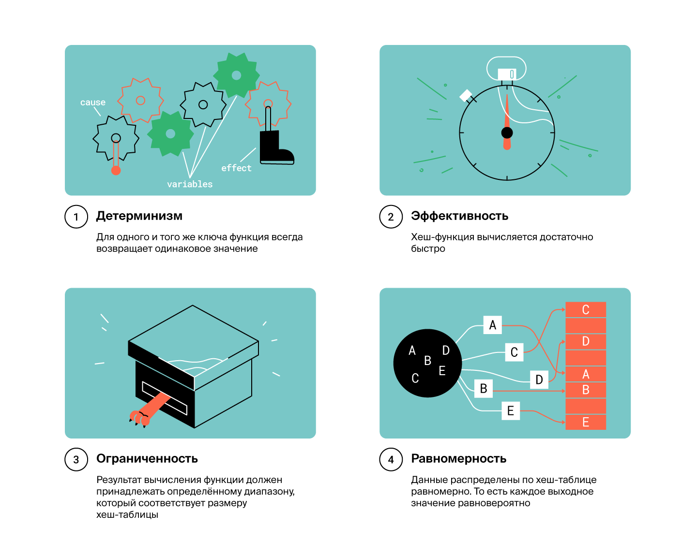

Функция, преобразующая ключ в индекс корзины в хеш-таблице, должна обладать такими свойствами:

1. **Детерминизм.** Для одного и того же ключа функция всегда должна возвращать одинаковое значение. Если в функции будет браться случайное значение, то повторное её применение может выдать новый индекс ячейки, а значит, мы не сможем получить искомые данные из хеш-таблицы. Хорошая функция при повторном вызове выполняет те же действия, что и при первичном. Например, взятие числа по модулю другого числа — детерминированная функция, так как результат всегда будет одинаковым.
2. **Эффективность.** Хеш-функция должна вычисляться достаточно быстро. Сложность операции поиска в хеш-таблице складывается из сложности вычисления хеша и вычисления номера корзины. Важно, чтобы оба процесса выполнялись эффективно. Важно понимать, что для строк эффективной считается хеш-функция, которая смотрит на каждый символ строки и обрабатывает его. Функции, которые этого не делают, на произвольном наборе данных будут неравномерными.
3. **Ограниченность.** Результат вычисления функции должен принадлежать определённому диапазону, который соответствует размеру хеш-таблицы. Поэтому обычно сначала вычисляют хеш-функцию, которая возвращает произвольное число. А потом этот результат берут по модулю $M$(размер хеш-таблицы). Таким образом, любой ключ будет находиться в интервале от $0$ до $M−1$, а значит, мы никогда не обратимся к индексу, который не соответствует ни одной из корзин.
4. **Равномерность.** Данные должны быть распределены по хеш-таблице равномерно. То есть каждое выходное значение — равновероятно.  Равновероятно — это значит, что если мы запустим функцию для каждого элемента из большого списка разных объектов, то в результате получим примерно равное число ответов функции для каждого значения от $0$ до $M−1$. В противном случае в какие-то ячейки мы будем пытаться записать значение чаще, чем в другие. И это замедлит обращение к хеш-таблице. Пример неравномерной функции — получение среднесуточной температуры по городу и дате, так как большую часть времени температура держится на одном и том же уровне, а аномальные морозы или жара случаются редко.

Мы рассмотрели 4 свойства функции, которые важны при реализации хеш-таблиц. Но хеширование используется и в других задачах. Например, для хранения паролей, проверки неизменности файла в процессе передачи, шифрования сообщений при передаче по сети. Для этих задач выделяют ещё несколько свойств, которые могут быть полезны хеш-функциям.

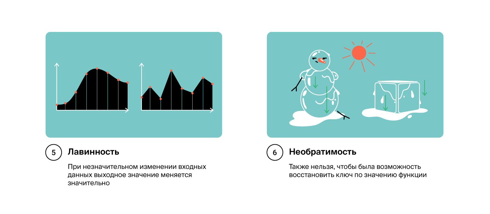

5. **Лавинность.** При незначительном изменении входных данных выходное значение должно меняться значительно. При хешировании паролей нелавинная функция проще взламывается. Если злоумышленник знает, что $h(‘‘aa")=22$, а $h(‘‘bb")=33$, то он может предположить такой $password$, что $h(password)=44$. Перебрав небольшое число вариантов, злоумышленник сможет подобрать пароль по его хешу.
6. **Необратимость.** Невозможно восстановить ключ по значению функции. Например, при регистрации на сайте пользователь вводит свой пароль, к которому применяется хеш-функция. Полученный хеш записывается в базу данных — в ячейку, соответствующую данному пользователю. Каждый раз, когда пользователь вводит пароль, к нему применяется та же функция. Так как алгоритм получения хеша от строки пароля в обоих случаях одинаковый, новый хеш совпадёт с записью в базе данных, если пользователь ввёл свой исходный пароль. Даже если злоумышленник получит доступ к данным в базе, у него не должно быть возможности восстановить пароль.

### 2.3 Коллизии

В прошлых уроках мы не раз упоминали про коллизии, которые могут возникать, если значение индекс-функции для разных ключей совпали. Наивный алгоритм вставки значения при возникновении коллизии может перезаписать новые данные вместо старых или вообще проигнорировать их запись. В этом уроке мы разберёмся, как не терять данные, даже если коллизия произошла.

#### 2.3.1 Возникновение коллизий

Рассмотрим задачу. Представьте банкетный зал на 10 столов. Намечается праздничный ужин. Хостес надо составить список гостей так, чтобы она могла на входе быстро подсказать гостю, за каким столом тот сидит.

Хостес придумала такой алгоритм: она считает количество букв в имени гостя и записывает это число в свою 12-страничную тетрадь так, что имена из четырёх букв оказываются на 4 странице, из семи — на 7 странице, из восьми — на 8 странице. 

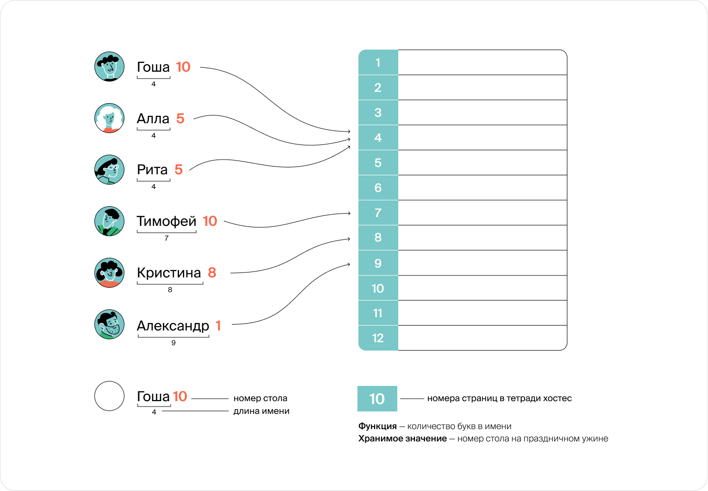

*Хостес применяет хеш-функцию, а именно подсчёт количества букв в имени гостя. Имя гостя — это ключ. Так хостес получает индексы корзин для хеш-таблицы, в роли которой выступает её тетрадь. В данном случае индекс-функция тождественна хеш-функции*

> [!WARNING]
>
> Функция из примера не подойдёт в качестве хеш-функции, так как она обладает серьёзным недостатком: она неравномерная. Если функция выдаёт значения неравновероятно, повышается риск возникновения коллизий. 
>
> Однако даже равномерная функция не может гарантировать полное отсутствие коллизий.

> Чтобы понять, часто ли коллизии встречаются на практике, рассмотрим парадокс дней рождений. Он показывает, при каком размере группы вероятность того, что какие-то два человека отмечают свои дни рождения одновременно, превысит 50%.


Вычислим вероятность $p(n)$  того, что дни рождения всех $n$ людей будут приходиться на разные даты. Для этого для каждого человека посчитаем произведение вероятностей того, что его день рождения не совпадёт ни с одним из дней рождений уже рассмотренных людей.

У первого человека такая вероятность будет равна 1. У второго человека $1- \frac {1}{365}$,так как один день уже занят. У третьего занято будет уже 2 дня. И так далее. В итоге имеем: $p(n) = \frac {365!}{365^{n}(365-n)!}$

Таким образом, мы вычислили вероятность, что ни у какой пары людей дни рождения не совпадут. А по условию нас интересует событие, обратное этому $p^{*}(n) = 1-p(n)$

Посмотрим на график зависимости вероятности, с которой хотя бы два дня рождения выпадут на один день, от количества людей:

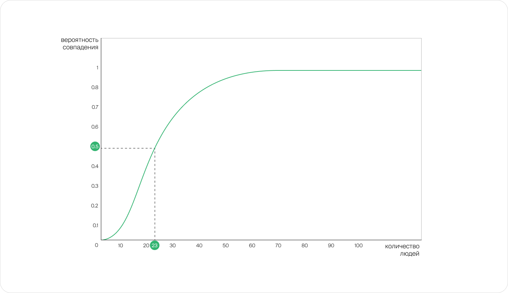

Как вы видите, вероятность совпадения достигает 50%, если в группе находится хотя бы 23 человека.

Значит, если создать хеш-таблицу из 365 корзин и расположить в ней 23 ключа — вероятность возникновения коллизии будет 50%! 

#### 2.3.2 Метод цепочек

Построить хеш-таблицу, в которой никогда не будет возникать коллизий, почти невозможно, поэтому разработчику важно понимать, как эти коллизии разрешать. В прошлых уроках мы говорили о связных списках — именно они помогают бороться с **коллизиями методом цепочек**.

Записывая в тетрадь имена и столики, за которыми сидят гости, хостес может уместить на странице сразу несколько имён. Каким будет алгоритм поиска по такой тетради? Люди привыкли читать строки сверху вниз, поэтому интуитивно хостес понимает, что если имя гостя не нашлось на первой строке страницы, нужно проверить вторую строку, потом третью. В итоге получается цепочка последовательных проверок: «Я точно знаю, что информация на этой странице. Так, на этой строке этого имени нет, значит, проверю следующую».

Но не всегда правила перехода такие простые. Например, чтобы найти в многотомном архиве все события, случившиеся 3 сентября в разные годы, надо:

- открыть первую архивную книгу,
- найти нужную страницу,
- прочитать все записи про 3 сентября,
- посмотреть номер следующей архивной книги и повторить алгоритм действий.

Осуществлять переход от одной архивной книги к другой помогает структура данных, о которой вы читали в [прошлых уроках](https://practicum.yandex.ru/learn/algorithms/courses/7f101a83-9539-4599-b6e8-8645c3f31fad/sprints/6448/topics/3fe165ac-9a25-44db-b5bf-106709d1c140/lessons/7115ec4f-fae0-4591-b8a0-b6af521436a5/) — связный список. 

Значение `value` в данном случае — это пара (имя, столик), а поле `next` указывает на следующую запись с таким же значением хеш-функции, что и у текущей. Тогда в хеш-таблице должно лежать не сопоставление столов гостям, а ссылка на `head` — голову связного списка, состоящего из имён гостей и столиков, за которыми они сидят.

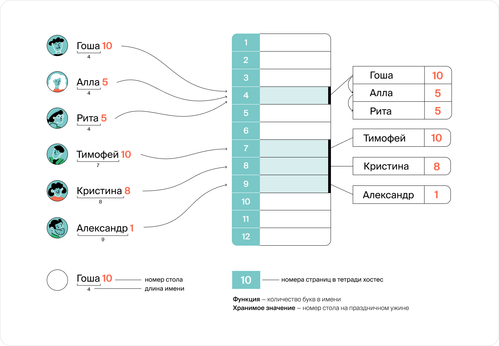

*Если гостей с именами из 4 букв много, то на 4 странице тетради будет записано не одно сопоставление гостей и столика, а целый список с распределением гостей, чьи имена состоят из 4 букв*

Допустим, нужно добавить ключ `k`, которого ещё нет в хеш-таблице:

1. Вычисляем значение хеш-функции $x=h(k)$ от добавляемого объекта.
2. По значению хеш-функции получаем индекс корзины $ i=x mod len(H)$.
3. В массиве $H$ находим $H[i]$ — ссылка на голову списка ключей.
4. Вставляем элемент в связный список.

Куда бы вы добавили заведомо новый ключ в связный список корзины хеш-таблицы?

> Лучше добавлять новый элемент в голову связного списка, так как сложность этой операции константная, то есть O(1)*O*(1), в отличие от добавления в конец или середи


При поиске или удалении объекта нужно:

1. Вычислить значение хеш-функции $x=h(k)$ от ключа.
2. По значению хеш-функции получаем индекс корзины  $i=x mod len(H)$.
3. Найти $H[i]$— ссылка на голову списка ключей.
4. Выполнить поиск ключа в связном списке и при необходимости удалить его.

Чтобы хеш-таблица работала эффективно, в ней должно быть достаточно свободного места. Определить, насколько таблица свободна, можно по коэффициенту заполнения $α$ (*англ.* fill factor или load factor):

$α=\frac {N}{M}$, $N$ -  количество элементов, добавленных в таблицу, $M$ - количество корзин в таблице

Именно коэффициент заполнения помогает определить среднюю сложность выполнения операций метода цепочек. 

Про вставку мы уже поговорили выше. Помимо времени на вычисление хеш-функции нам потребуется $O(1)$ для вычисления номера корзины и $O(1)$ для добавления этого элемента в начало цепочки. Однако эффективное использование хеш-таблиц подразумевает, что мы не храним дубли. Следовательно, прежде чем вставить элемент, необходимо проверить, есть ли он в таблице.

Сложность операций добавления, поиска и удаления будет одинаковой, так как узкое место каждой из задач — поиск элемента в цепочке.

> [!TIP]
>
> В лучшем случае удаляемый элемент находится в голове списка, поэтому сложность его удаления константная.

Если все элементы в результате вычисления номера корзины попали в один связный список, то в худшем случае мы получим линейную сложность. Потому что в процессе поиска нам, возможно, придётся просмотреть каждый элемент из этого списка. 

Мы рассмотрели лучший и худший случаи. Осталось определить среднее время исполнения операций в хеш-таблице. Оно зависит от того, как часто случаются коллизии: чем реже они происходят, тем быстрее в среднем выполняется операция.

> [!TIP]
>
> Средняя сложность операций в хеш-таблице равняется $O(1+α)$

Среднее время можно регулировать. В зависимости от объёма данных, которые предполагается хранить в хеш-таблице, можно выбирать размер таблицы так, чтобы значение $α$ не превышало определённый порог. 

#### 2.3.3 Метод открытой адресации

При создании элемента в связном списке нужно выделять дополнительную память под переменную `next` , хранящую ссылку на следующий элемент, при удалении — освобождать. На эти операции тратится время. Кроме того, данные в связном списке хранятся в памяти не последовательно, а в произвольных местах. Поэтому передвижение по цепочке происходит медленно. Если бы объекты находились рядом, как в массиве, эти операции выполнялись бы быстрее.  

В **методе открытой адресации** в корзине лежит пара `(key, value)`, а не ссылка на связный список, как в методе цепочек. Таким образом, у каждого объекта есть свой индекс в хеш-таблице.

Давайте вернёмся к задаче про хостес, встречающего гостей на банкете. Если блокнот, в котором он записывает имена и номера столиков, маленького формата, то страница для записи людей, чьи имена состоят, например, из 4 букв, закончится очень быстро. В этот момент ему надо будет решать, куда записывать и где потом искать информацию о других гостях с четырёхбуквенными именами. Самый простой вариант — перевернуть страницу и делать новые записи там. 

Но как быть, если на пятой странице уже есть записи о столике, за которым сидит некий Макар? Ответ простой — проигнорировать несовершенство мира и записать информацию о другом госте с именем из 4 букв после информации о столике Макара. 

Такой подход может показаться глупостью, ведь некоторые объекты мы заведомо кладём не на свои места. Однако в среднем поиск по такой хеш-таблице работает быстро. По хешу от ключа программа знает, откуда начинать поиск, и делает переходы к следующим корзинам до тех пор, пока не найдёт нужное место для записи или для извлечения пары `(key, value)`. Этими переходами метод открытой адресации очень похож на метод цепочек. Отличие только в том, что в методе открытой адресации программа не тратит память на адреса следующих корзин, а вычисляет их, исходя из особой стратегии.

> [!IMPORTANT]
>
> **Стратегия пробирования** — это способ выбрать следующую корзину для выполнения операции (вставки или поиска ключа) и сделать шаг в неё, если текущая корзина занята неподходящим объектом (не тем, который мы ищем, при поиске и любым — при вставке). Стратегия, которой пользуется хостес, называется *линейным пробированием* и выражается формулой: $h(k,i)=h(k)+i$
>
> Читать эту формулу следует так: индекс корзины равен сумме индекс-функции от ключа $h(k)$ и номера шага пробирования $i$. 
>
> 

Когда мы работаем с хеш-таблицей, в корзину (которая исполняет роль страницы блокнота) у нас помещается только одна пара `(key, value)`.

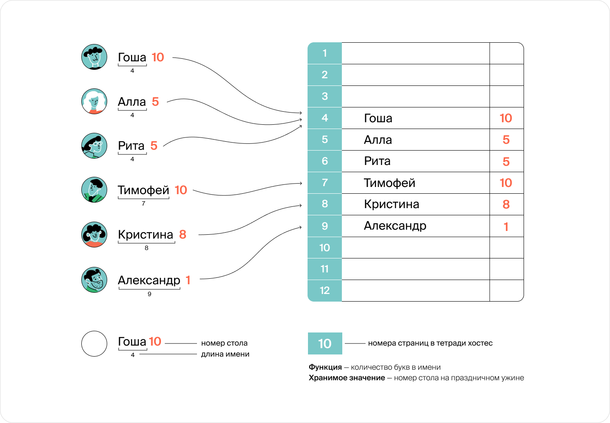

*В именах Алла и Рита 4 буквы, но им не хватило места на четвёртой странице. Хостес записал каждую из них в ближайшие по порядку свободные места тетради*

Давайте теперь обсудим, как происходят основные операции в хеш-таблице при разрешении коллизий методом открытой адресации.

Добавление ключа:

1. Вычисляем индекс корзины, используя хеш-функцию: $x=h(k) mod M$.
2. Если соответствующая ячейка $H[x]$ свободна, то записываем туда данные.
3. Иначе пробуем записать в следующую по порядку свободную корзину. Если в процессе поиска корзины мы дошли до конца хеш-таблицы, то переходим к началу таблицы.

Алгоритм поиска элемента:

1. Вычисляем индекс корзины, используя хеш-функцию: $x=h(k) mod M$.
2. Если искомый элемент — в этой корзине, то поиск успешно окончен. Если корзина пустая — поиск останавливается.
3. Иначе продолжаем искать в следующих по порядку корзинах.

Удаление ключа происходит чуть сложнее. Нельзя просто удалить данные из корзины, ведь следом может идти ключ, который попал не в свою, а в ближайшую по порядку свободную ячейку. Тогда при операции поиска алгоритм остановится, встретив пустую ячейку. И данные, которые на самом деле есть, не будут найдены.

- И что же делать?
- Корзины, из которых мы удаляем информацию, нужно помечать специальным образом. Это можно сделать, положив в каждую из них значение, которое в обычном случае не может оказаться в хеш-таблице. Например, строку `“deleted”`.
- Тогда корзины с пометкой `“deleted”` при вставке надо воспринимать как пустые, а при поиске — как занятые?
- Да, абсолютно верно.

> [!IMPORTANT]
>
> При поиске и удалении объектов будут проверяться все корзины, пока не встретится пустая корзина или не найдётся нужный объект. На каждую проверку требуется O(1). Чем больше “deleted”, тем больше холостых проверок.

- А как справиться с этой проблемой?
- Необходимо установить лимит на количество ячеек с такой пометкой. И когда он будет достигнут, нужно просто перезаписать данные в ту же хеш-таблицу, но уже без “deleted”-корзин. 

##### Проблема кластеризации

В наивной стратегии пробирования, которую мы рассмотрели, есть весомый недостаток. Если выбрана неравномерная или нелавинная индекс-функция, то значения из определённого диапазона могут встречаться чаще, чем другие. В этом случае будут возникать целые группы занятых корзин, идущих друг за другом. Такие группы называются **кластерами**. 

Предположим, что в таблице подряд записано $z$ ключей. Начиная с позиции $H[l]$и заканчивая позицией $H[l+z]$нет свободных корзин. Тогда для поиска или записи ключа $k$, такого что $h(k)=l$ нужно проделать $O(z)$ операций. Чем больше размер кластера, тем менее эффективным будет использование этой хеш-таблицы.

Предотвратить появление кластеров можно, но не с этой стратегией пробирования. Она на каждом шаге пойдёт в следующую ячейку. С какой бы корзины кластера мы не начали пробирование, новое значение мы запишем в ячейку $H[l+z]$, а $z$ увеличится на 1.

То есть $h(k,i)=h(k)+i$ — плохая стратегия.

Для неравномерной или нелавинной функции рассмотренный линейный алгоритм можно улучшить:

$h(k,i)=h(k)+c \cdot i$ 

То есть при каждом пробировании будем переходить не в следующую корзину, а в корзину, которая удалена от текущей на константу $c$.

При этом размер хеш-таблицы $M$ и константа $c$ должны быть взаимно простые, то есть не иметь общих делителей, кроме единицы. Если у $M$ и $c$ окажутся общие делители, алгоритм будет проверять одни и те же ячейки, а в некоторые из корзин хеш-таблицы вообще никогда не попадёт.

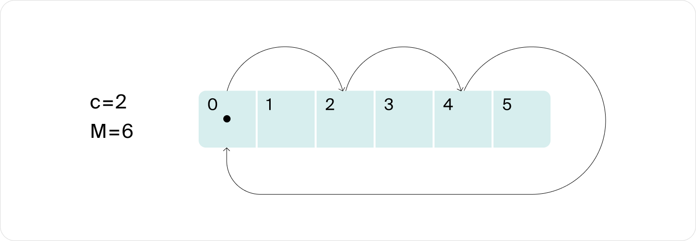

*Если c = 2, а M — чётное число, то ячейки с нечётными номерами будут пропущены*

Можно, например, брать в качестве $M$ степень двойки, а в качестве $c$— нечётное число. Степень двойки — удачный вариант: у неё есть только один простой делитель — 2, поэтому с любым нечётным числом общих делителей у неё не будет.

##### Квадратичное пробирование

В методах линейного пробирования нет разницы, попали мы в корзину $H[j]$, вычислив индекс-функцию $h(k1,0)=j$, или на какой-то итерации пробирования $h(k2,i)=j.$ В любом случае на следующем шаге алгоритм всегда пойдет в корзину $H[j+c].$ Из-за этого последовательность пробирования будет удлиняться всякий раз, когда случается коллизия. 

Решить эту проблему можно методом квадратичного пробирования. Он подразумевает наличие двух констант: $c_1$ и $c_2$:

$h(k,i)=h(k)+c_{1}i+c_{2}i^{2}$

Номер шага будет участвовать в сумме дважды. В одном слагаемом — в первой степени, в другом — в квадрате. Благодаря этому индексы следующих корзин будут различаться — в зависимости от того, на каком по номеру шаге мы попали в текущую корзину.

> [!IMPORTANT]
>
> Но и у этого метода есть недостаток: если у двух ключей совпадут начальные позиции проб, дальше они будут двигаться по одним и тем же ячейкам.

##### Пробирование методом двойного хеширования

Есть ещё один вариант решения проблемы кластеров. 

Давайте будем считать для каждого ключа $k$ результат не одной, а **двух индекс-функций**. Даже если результаты индекс-функции $h_1$ для двух ключей совпадут, то вероятность совпадения результатов ещё и $h_2$ для них очень низкая.

$h(k,i)=h_{1}(k)+h_{2}(k) \cdot i$

При этом значение функции $h_2$ будет влиять на шаг, который делает алгоритм. Таким образом, мы снизим вероятность того, что два разных элемента при коллизии перебирают одни и те же ячейки для выбора места вставки.

В формуле $h(k,i)=h(k)+c⋅i$ шаг $c$ должен быть взаимно простым с размером таблицы $M$. В методе двойного хеширования в роли $c$ выступает индекс-функция $h_{2}(k).$ Значит, чтобы алгоритм обходил все корзины, $h_2$  должна возвращать только нечётные значения.

## 3 Поисковый индекс

Напомним основной принцип хеш-таблиц: если вы знаете, куда был положен элемент, то искать его нужно там же. Это правило часто применяют для быстрого поиска по данным. 

Представьте, что вы пишете программу для чтения, и одной из её функций должен быть поиск по тексту. Пользователь вводит слово или строку, а программа находит и показывает их позиции в тексте.

Можно реализовать эту программу с помощью хеш-таблицы, в которой **ключами будут строки**, а **значениями — массивы позиций**, где эта строка встречается.

Отображение, которое каждому объекту ставит в соответствие его расположение, называют **«поисковым индексом»**. 

Если пользователь введёт любую подстроку, хеш-таблица должна найти её позиции. Значит, нужно предварительно добавить туда все возможные подстроки. А если подстроки в хеш-таблице не оказалось, получается, и в тексте её нет.

Этот способ позволит нам сразу получить нужную позицию — это, конечно,  хорошо. Но он очень неэффективный. Ведь подстрок в тексте может быть столько, сколько существует способов выбрать две границы: $N \cdot (N-1)/2$ где `N` - длина текста. Значит, в хеш-таблицу нужно добавить $O(N^{2})$ пар `(key,value)`. Поскольку ключами являются подстроки, каждая такая пара займёт в среднем $O(N)$ памяти. . Получается, что всего при такой реализации придётся потратить $O(N^{3})$ памяти.

Поэтому с большими текстами такая реализация не сработает.

- Представь, что тебе надо найти какое-нибудь предложение в бумажном учебнике по алгоритмам. Например, такое: «Ключ хеш-таблицы должен быть неизменяемым». Как бы ты его стала искать?
- Я постараюсь предположить, на каких страницах может находиться такое предложение, а потом проверю тексты всех этих страниц. 
- Ага. То есть **ты не сразу находишь нужное место, но существенно сокращаешь диапазон поиска до небольшого набора страниц.** А как бы ты нашла нужную страницу?
- Во многих учебниках есть алфавитный указатель, в котором написано, на каких страницах встречается тот или иной термин. Я бы нашла страницы, где упоминается «хеш-таблица» либо «неизменяемость».
- Отлично! Давай применим тот же принцип к поиску подстроки в строке. Чтобы упростить задачу, будем искать только строки, состоящие из нескольких полных слов.

Итак, сначала запишем позиции всех слов, которые встречаются в тексте:

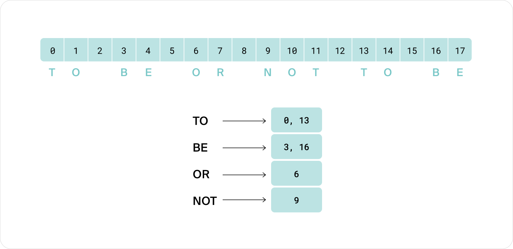

Возьмём первое слово этой подстроки и найдём все позиции, где оно встречается. Затем на каждой позиции приложим подстроку целиком и проверим, подходят ли остальные слова. 

Например, чтобы найти подстроку `"BE OR"` в строке `"TO BE OR NOT TO BE"`, найдём в хеш-таблице массив вхождений первого слова — слова `"BE"`. Это будут позиции 3 и 16. Дальше для обеих позиций посимвольно проверим, начинается ли с них подстрока `"BE OR"`. **Позиция 3 подойдёт, а вот 16 придётся отклонить.** В итоге мы проверили не все восемнадцать позиций, а только две.

> [!IMPORTANT]
>
> Это уже достаточно эффективное решение. Но что если нам не повезёт, и первое слово окажется каким-нибудь распространённым предлогом, который в тексте встречается тысячи раз?

Тогда придётся перебирать очень много вариантов. Но мы можем попытаться найти не только первое слово, но и второе, третье и другие. И когда мы наконец дойдём до редкого слова, можно будет остановиться и начать перебирать его позиции в тексте, прикладывая к ним нашу подстроку. При этом нам придётся сверять слова по обе стороны от найденного редкого слова.

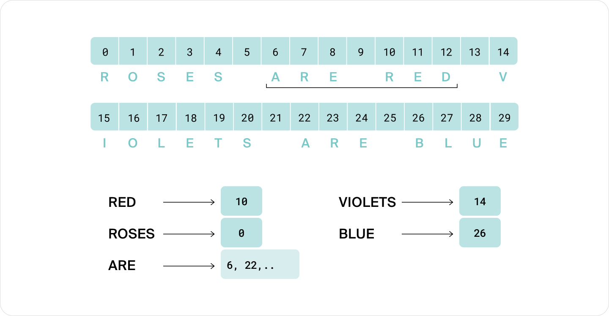

*В тексте "ROSES ARE RED VIOLETS ARE BLUE" мы ищем подстроку "ARE RED". Слово "ARE" встречается слишком часто, поиск всех его вхождений будет неэффективен. Вместо этого мы найдём единственное вхождение слова "RED" на 10-й позиции. Поскольку в искомой подстроке слово "RED" написано не в начале строки, нам придётся сдвинуть шаблон влево на 4 символа от найденной позиции. Шаблон будет приложен к позиции 6. Шаблон полностью совпадает с подстрокой, поэтому позиция 6 и будет результатом*

### 3.1 Сложность алгоритма поиска подстроки

В наихудшем случае описанный алгоритм будет работать не быстрее полного перебора всех позиций. Например, если одно и то же словосочетание повторяется много раз. Чтобы найти все его вхождения в текст, мы будем вынуждены проверить весь текст целиком.

> [!NOTE]
>
> В спринте 8 мы разберём структуру данных «бор», которая позволяет более эффективно создавать и хранить поисковый индекс не только для отдельных слов, но и для всех возможных подстрок. Это позволяет эффективно искать подстроки даже в худшем случае. Какой из подходов окажется эффективнее, зависит от задачи.

```bash
0   4   8   12  16
УРА УРА УРА УРА УРА
-------------------
УРА УРА УРА
    УРА УРА УРА
        УРА УРА УРА
            УРА УРА УРА
                УРА УРА УРА

Вхождения слова "УРА" в позициях: [0, 4, 8, 12, 16]
```

В строке `"УРА УРА УРА УРА УРА"` ищем подстроку `"УРА УРА УРА"`. Из-за того, что слово повторено многократно, нам требуется проверить **5** вхождений слова `"УРА"`. Каждая такая проверка требует проверить все символы подстроки. Если число повторений слова в строке и в подстроке обозначить за $N$ и $M$, а длину слова за $L$, то сложность алгоритма будет равна $O(N \cdot M \cdot L)$

Но на практике тексты имеют довольно мало повторяющихся слов, если не брать в расчёт предлоги, союзы, местоимения и артикли. Поэтому чаще всего такой эвристический алгоритм поиска будет работать быстро.

А теперь давайте рассмотрим, из чего складывается время работы алгоритма поиска:

- Во-первых, нам нужно вычислить хеши слов запроса и номера корзин в хеш-таблице. Сложность этого этапа зависит от выбранной хеш-функции. Чаще всего время вычисления хеш-функции линейно зависит от длины слова, поэтому время, затрачиваемое на вычисление хешей всех слов, будет равно $O(L)$, где  $L$ - суммарная длина всех слов в запросе.
- Во-вторых, в корзине хеш-таблицы надо найти само слово. Скорость этого этапа зависит от коэффициента заполнения хеш-таблицы.
- В-третьих, на время работы алгоритма влияет количество различных слов, для которых мы просматриваем позиции. А это зависит от того, насколько редкие слова используются в запросе. Чтобы слишком популярные слова не замедляли процесс и не увеличивали размер поискового индекса, их обычно выкидывают. Такие исключения называют «стоп-словами». К ним относят предлоги, союзы, артикли и местоимения.
- И, наконец, в-четвёртых, сложность алгоритма зависит от того, насколько долго выполняется проверка вхождений. Это время пропорционально числу вхождений слов запроса, а также длине строки запроса.

> [!NOTE]
>
> В наши расчёты не включено время построения поискового индекса, которое зависит от длины исходного текста. Этот индекс требуется создать единожды, до того как выполнять поиск. При каждом новом поиске пересчитывать его не нужно.  Следует отметить, что в ситуации, когда вам необходимо найти только одно предложение в тексте, быстрее всего может сработать наивный алгоритм. Но когда требуется выполнить много запросов, без поискового индекса не обойтись.

## 4 Алгоритм для фитнес-тренажёра

### 4.1 2-SUM

Задача, которую мы разберём в этом уроке, часто встречается на собеседованиях и называется **2-SUM**, или **TwoSum**. Звучит она так: дан массив целых чисел `numbers` и целое число `X`; нужно найти в массиве два элемента, сумма которых равняется `X`. Гарантируется, что такие элементы в массиве есть.

> Простой пример: Катя пришла в спортзал и хочет позаниматься на силовом тренажёре с нагрузкой в 16 килограммов. Рядом лежит груда стальных блинов. Девушка видит, что пудовых грузов в наборе нет, значит, одним блином не обойтись, а больше двух на тренажёр не установить. Кате нужно найти два блина, которые в сумме дают 16 килограммов, и при этом не потратить на поиск всё отведённое на тренировку время. Гарантируется, что это выполнимая задача и такие два блина точно есть: об этом Кате рассказал её друг, который занимался на этом же тренажёре с той же нагрузкой.

#### Наивный алгоритм

Начнём с наивного решения. Самое простое, что можно придумать, — перебрать все возможные пары блинов и для каждой из них проверить, равен ли её вес искомому.

> [!TIP]
>
> Именно с наивного алгоритма рекомендуется начинать решение любой задачи, в том числе и на собеседованиях. Если от вас захотят получить более эффективное решение — вам скажут об этом явно. 

Катя возьмёт первый блин и по очереди примерит его к остальным. Если ничего не подойдёт, вернёт первый блин на место, возьмёт следующий и повторит те же действия. Поиск будет продолжаться до тех пор, пока девушка не найдёт нужную пару блинов. 

Однако даже в таком простом варианте есть нюансы. Например, пусть исходный массив будет `[2,1,3,5,5]`, а `X=4`. В этом случае, если итерация будет происходить по индексам, алгоритм вернёт `1,3`. Если же итерироваться по значениям, то легко допустить ошибку, при которой алгоритм вернёт `2,2`, хотя второй двойки в массиве нет. 

```python
def twosum(numbers, X):
    for i in range(0,len(numbers)):
        for j in range(i+1,len(numbers)):
            if numbers[i] + numbers[j] == X:
                return numbers[i], numbers[j]
    # По условию задачи пара обязательно должна найтись.
    # Но предусмотрительность не помешает:
    # если пара не найдена - вернём None, None (или можно выкинуть exception). 
    return None, None
```

Внутренний цикл лучше начинать не с `0`, а с `i+1`: если Катя выберет два блина, и они не подойдут, то нет смысла сравнивать те же блины в другом порядке. А значит, случаи `j ≤ i` точно не содержат решений, которых мы бы не видели на ранних итерациях. Кроме того, так проще писать код, потому что не придётся отдельно обрабатывать случай, когда `i == j`.

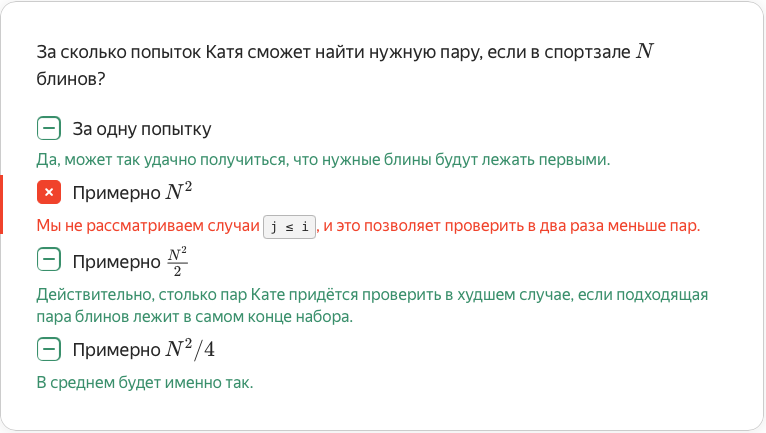

При удачном стечении обстоятельств Катя найдёт нужные блины с первой попытки. Если же искомая пара будет находиться ближе к концу, придётся сделать значительно больше операций.

#### Скорость работы наивного алгоритма

Сначала посчитаем максимально возможное количество операций.

На первой итерации Катя возьмёт первый блин и проверит, подходит ли к нему в пару какой-то из остальных. Их количество равно `N - 1`; в коде это соответствует первой итерации внешнего цикла: при `i == 0` индекс `j` проходит значения от `1` до `N - 1` включительно, в общей сложности `N - 1`. 

На каждой следующей итерации `i` увеличивается на единицу, а значит, индекс `j` проходит на одну итерацию меньше, чем на предыдущей. 

Получается, что общее число операций будет $(N-1)+(N-2)+(N-3)+ \cdots +2 + 1$.

Каждая закрашенная клетка на иллюстрации — это одна операция сравнения. Количество таких полей составляет примерно половину площади квадрата со стороной $N$. Значит, в худшем случае Кате придётся сделать примерно $\frac {N^2}{2}$ попыток.

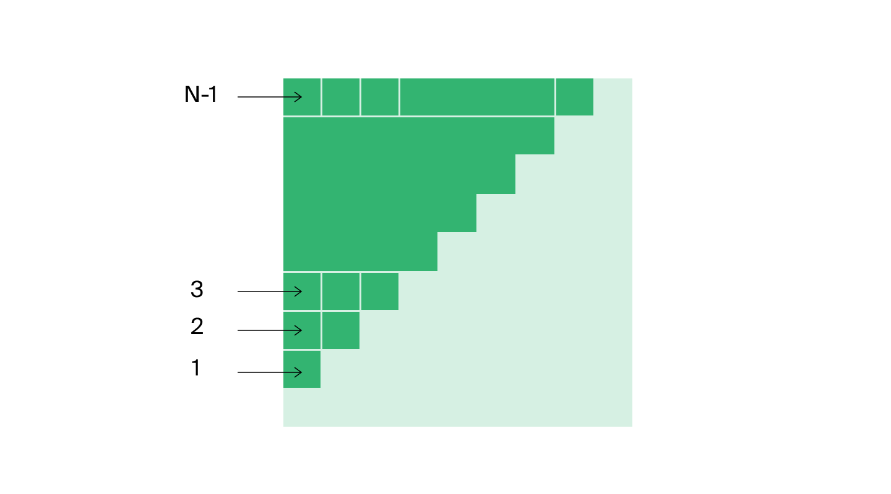

*Площадь фигуры равна N в квадрате, закрашенная область занимает примерно половину*

Если блины будут лежать как попало (говорят «в среднем случае» или просто «в среднем»), то Кате нужно будет сделать вдвое меньше сравнений, примерно$\frac {N^2}{4}$. И в среднем, и в худшем случаях зависимость числа операций от числа элементов в массиве описывается квадратичной функцией.

> [!NOTE]
>
> Квадратичная функция — это функция вида $f(x)=ax^2+bx+c$ , где $a,b,с$ - это числа.  Название функции связано с тем, что главный элемент такой суммы — это $x^2$ с некоторым коэффициентом. Главный он потому, что при больших $x$ стальные элементы окажутся сильно меньше и не сыграют заметной роли; в итоге значение функции будет приблизительно равно $ax^2$.

График зависимости времени работы функции от числа элементов — это парабола, график квадратичной функции.

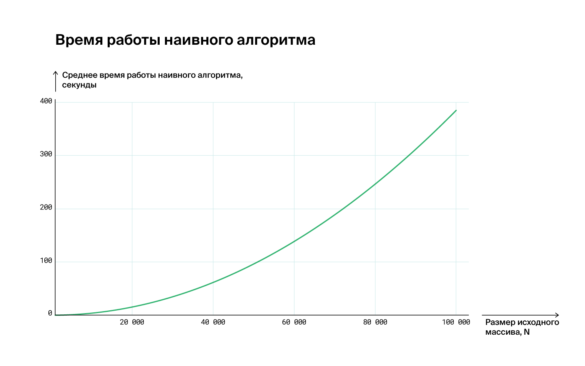

*Кривая изгибается вверх — это показатель того, что время работы растёт быстрее, чем увеличиваются входные данные*

Обратите внимание, что время работы нашей функции растёт существенно быстрее, чем размер массива. 

Это значит, что если в массиве 1000 элементов, то результат посчитается мгновенно, 10 000 элементов обработаются за пару секунд, 100 000 элементов — за несколько минут, а результат для массива размера 1 000 000 мы будем ждать 10 часов. 

Можно найти решение получше. В следующем уроке мы разберём несколько вариантов оптимизации.

### Более эффективные алгоритмы решения задачи 2-SUM

#### Первые варианты оптимизации

Предположим, что аккуратный тренер разложил все имеющиеся блины в порядке увеличения веса слева направо.


Катя посмотрела на ряд блинов, подумала — и взяла блины с двух краёв: самый лёгкий и самый тяжёлый. 

При сравнении блинов возможны три варианта:

1. Суммарный вес блинов в точности равен $X$. Ура, ответ найден!
2. Суммарный вес блинов больше необходимого. Заменяем один блин: тяжёлый откладываем, вместо него берём соседний с ним, меньшего веса.
3. Суммарный вес блинов меньше, чем нужно. Заменяем один блин: лёгкий откладываем, вместо него берём соседний с ним, большего веса.

Катя будет выполнять эти действия на каждом последующем шаге до тех пор, пока не найдёт нужную пару.

Это снова **метод двух указателей**: один из них указывает на левый блин, а второй — на правый. На каждом шаге либо левый указатель сдвигается на один элемент вправо, либо правый — на один элемент влево. Указатели двигаются не в одном направлении, как в истории с окном сглаживания, а сходятся, поочерёдно двигаясь навстречу друг другу. Если в какой-то момент указатели встретятся — значит, искомая пара элементов в массиве отсутствует.

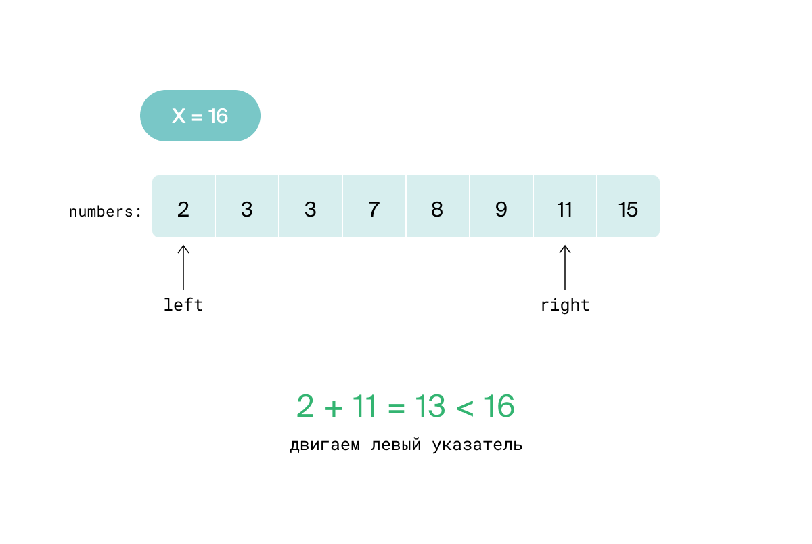

Исключённые при сравнении блины не могут образовать нужную пару, поэтому возвращаться к ним нет смысла. 

Оценить число сравнений в таком алгоритме очень просто: расстояние между указателями на старте равняется $N−1$ и на каждом шаге оно сокращается ровно на $1$. В результате или найдётся искомая пара, или указатели встретятся. Значит, в худшем случае придётся проделать не более чем $N−1$ операций. Это серьёзный выигрыш в сравнении с наивным алгоритмом, который в худшем случае обречён выполнить $\frac {N^2}{2}$  операций.

> [!IMPORTANT]
>
> Правда, чтобы оптимизированный алгоритм заработал, нужно сначала отсортировать исходный массив. А вот наивный алгоритм из прошлого урока упорядоченности не требует. Но даже с учётом сортировки оптимизированный алгоритм будет работать быстрее наивного.

```python
функция twosum_with_sort(numbers, X):
    # Сортируем исходный массив стандартной функцией.
    sort(numbers)

    left = 0
    right = len(numbers) - 1
    пока left < right:
        current_sum = numbers[left] + numbers[right]
        если current_sum == X, то:
            вернуть numbers[left], numbers[right]
        если current_sum < X, то:
            left += 1
        иначе:
            right -= 1
    # Если ничего не нашлось в цикле, значит, нужной пары элементов в массиве нет.
    вернуть None, None        
```

Алгоритмы сортировки и оценка времени их работы — это большая тема, которую мы разберём в рамках основного курса.

#### Второй вариант оптимизации

Если не хочется сортировать тяжёлые блины, можно использовать для решения этой задачи дополнительную память. Например, позвать тренера, который наизусть помнит вес всех блинов в спортзале. В этом случае алгоритм будет такой: можно в любом порядке перебирать блины и, вытащив очередной (допустим, с весом $A$), спрашивать: «А есть ли у вас блин с весом $X−A$?». Когда консультант ответит «Да, есть такой» — можно оставить себе текущий блин, взять тот, что с весом $X−A$, и пойти заниматься.

В этой ситуации важно, чтобы тренер действительно помнил вес блинов на память, а не бегал каждый раз проверять наличие нужного блина — в таком случае скорость не будет отличаться от наивного алгоритма. Метод с «дополнительной памятью» будет работать быстро, но у него есть недостаток: тренер может попросить денег за свои услуги.

В программировании это означает, что для решения задачи можно использовать вспомогательную структуру, которая называется «структура данных поиска». Она умеет быстро наполняться содержимым и эффективно отвечать на вопросы вроде «Есть ли у тебя элемент $Y$?». Вероятно, вы с ней уже встречались: она обычно называется `set`, `map`, `dict` или содержит в своём названии какое-нибудь из этих слов. 

Алгоритм, применяющий структуру данных поиска, может выглядеть так:

```python
функция twosum_extra_ds(numbers, X):
    # Создаём вспомогательную структуру данных с быстрым поиском элемента.
    previous = set()

    для каждого A из numbers:
        Y = X - A
        если Y уже лежит в previous, то:
            вернуть A, Y
        иначе:
            добавить A в previous

    # Если ничего не нашлось в цикле, значит, нужной пары элементов в массиве нет.
    вернуть None, None 
```

Заплатить за хранение элементов в структуре данных поиска придётся, конечно, не деньгами, а оперативной памятью: в этом отличие нового алгоритма от двух предыдущих. Это решение очень быстрое, но не во всех ситуациях оно будет лучшим. 

### Итоги

Итак, для решения задачи **2-SUM** мы нашли наивное решение и два более эффективных алгоритма. Теперь можно примерно оценить время их работы в зависимости от числа элементов $N$ и построить общий график.

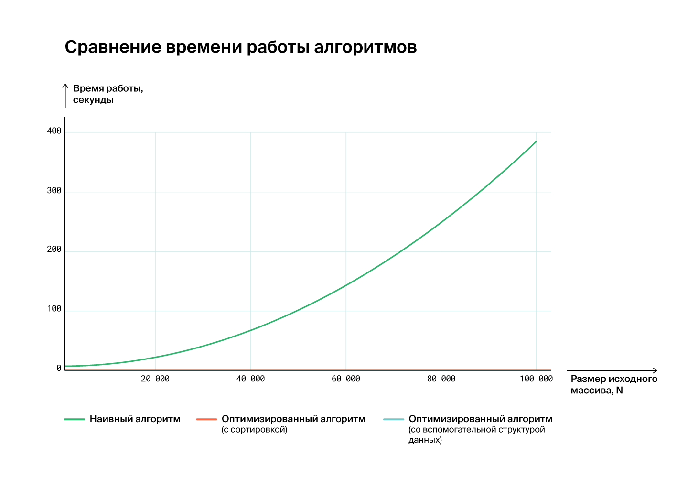

Кажется, что картинка не поменялась от добавления двух алгоритмов, где же время их работы? На самом деле эффективные алгоритмы работают настолько быстрее наивного, что их графики сливаются с осью времени. Даже для $N=100000$ время их работы будет меньше $0.1$ секунды. Так что для сравнения оптимизированных алгоритмов нужно убрать с графика наивный алгоритм и поменять масштаб:

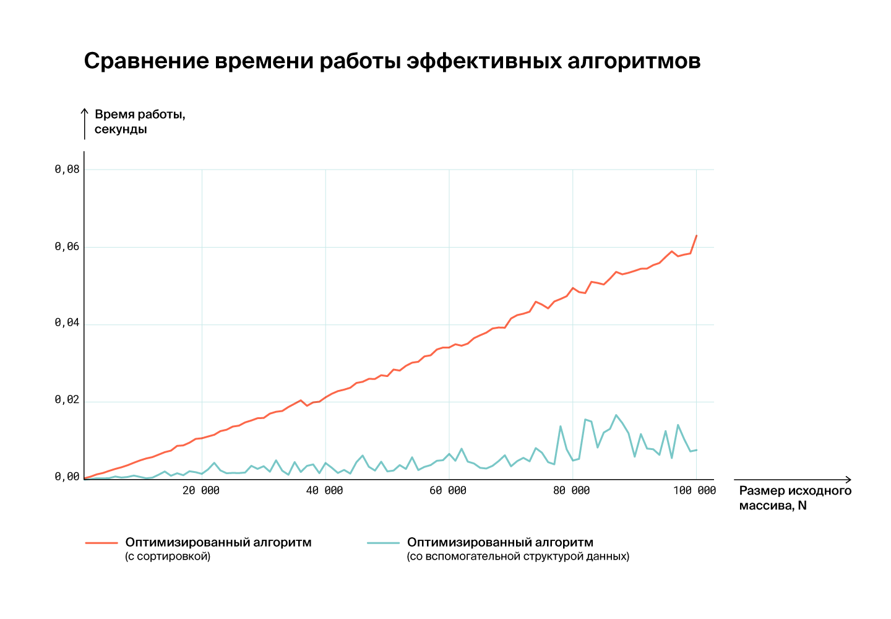

*Обратите внимание на масштаб: вместо сотен секунд здесь десятки миллисекунд*

### 4.2 3-SUM

Только что мы разбирали задачу **2-SUM** — поиск в массиве двух чисел, которые в сумме дают число $A$. Одно из возможных эффективных решений работает за  $O(N)$ от длины массива и потребляет $O(N)$ памяти для промежуточных значений в хеш-таблице.

Теперь решим похожую задачу 3-SUM. Как можно догадаться (по аналогии с 2-SUM), нам надо будет найти по заданному числу $A$ и набору целых чисел $x_0,\cdots,x_{n-1}$  все тройки чисел из данного набора, которые в сумме дают число $A$.

Рассмотрим несколько примеров.

- $A=10,x=[5,2,8,1,1,3,4,4]$. Следующие тройки чисел дадут **10** в сумме:

1. $(2,3,5)$

2. $(1,4,5)$

3. $(2,4,4)$

4. $(1,1,8)$

- $A=16,x=[6,6,4,4,0,8,10]$. Следующие тройки чисел дадут **16** в сумме:

1. $(0,6,10)$

2. $(4,6,6)$

3. $(4,4,8)$

В этом примере мы записали тройку $(4,6,6)$ только один раз, хотя число **4** встречается в массиве дважды.  Мы будем учитывать только уникальные по составу тройки, дубликаты нам не интересны. В том числе будем игнорировать тройки, которые отличаются порядком элементов. При этом в ответе числа внутри одной тройки упорядочены по неубыванию. Сортировка в данном случае позволяет избавиться от дубликатов в смысле состава троек: например, $(4,7,1)$ и $(1,4,7)$ должны считаться одинаковыми.

#### Наивное решение

Сначала рассмотрим простое решение. Переберём все возможные тройки индексов от $0$ до $n−1$ и отберём те, элементы на позициях которых будут давать в сумме $A$.

```python
def naive_solution(A, x):
  n = len(x)
  triples = []
  for i1 in range(n):
    for i2 in range(i1 + 1, n):
      for i3 in range(i2 + 1, n):
        if x[i1] + x[i2] + x[i3] == A:
          triples.append((x[i1], x[i2], x[i3]))
  return triples 
```

Заметим, что при таком подходе мы допускаем дублирование троек в ответе. Избавиться от дублей можно выбором подходящей структуры данных для результата. Будем складывать найденные тройки в контейнер `set` на основе хеш-таблицы, а не в массив.

Ещё нужно учесть дублирующиеся тройки, которые отличаются лишь порядком элементов: например, $(1,9,4)$и $(4,1,9)$. Для этого отсортируем элементы внутри троек перед добавлением в контейнер. Можем считать, что эта сортировка выполняется за константное время, потому что элементов только три.

```python
def naive_solution_with_sort(A, x):
  n = len(x)
  triples = set()
  for i1 in range(n):
    for i2 in range(i1 + 1, n):
      for i3 in range(i2 + 1, n):
        if x[i1] + x[i2] + x[i3] == A:
          # sorted() возвращает массив, который не является хешируемым типом,
          # поэтому мы конвертируем его в неизменяемый tuple.
          triples.add(tuple(sorted((x[i1], x[i2], x[i3]))))
  return triples  
```

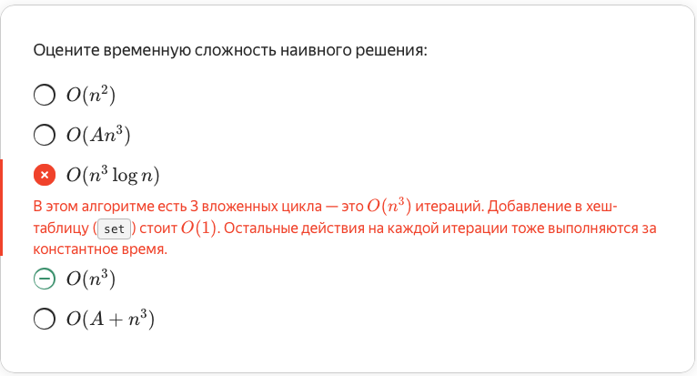

#### Эффективное решение

Решение за $O(n^3)$ работает правильно, но долго. Программы с такой сложностью обычно выполняются за приемлемое время при $n$не больше $1000$.

**Идея оптимизации состоит в том, чтобы двигаться по массиву x слева направо и запоминать информацию о пройденных элементах, а затем эффективно использовать её для поиска новых троек**. Более конкретно — мы будем идти слева направо от $0$ до $n−1$ и перебирать элементы на позициях от $0$ до $n−1$, которые могут стать вторым элементом отсортированной тройки, и элементы, которые могут стать третьим. При этом текущий второй элемент будет условным «[горизонтом событий](https://ru.wikipedia.org/wiki/Горизонт_событий)» — правее него мы пока ничего не знаем, а информацию про элементы левее него мы уже успели сохранить, из этого множества мы будем подбирать первый элемент.

Алгоритм будет иметь следующую структуру:

- Отсортируем исходный массив $x$. В целом это необязательный пункт решения, но далее нам будет удобнее думать именно про упорядоченные тройки чисел.
- Заведём хеш-таблицу, в которой по числу $a$ можно будет определять, есть ли среди всех чисел левее перебираемого второго элемента число, равное a.*a*.
- Будем перебирать в цикле от $0$ до $n−1$ позицию $i$ второго элемента, а во вложенном цикле от $i+1$до $n−1$— позицию $j$ третьего элемента.

- Проверим, есть ли для текущих $x[i]$ и $x[j]$ элементы левее $i$ которые образуют вместе с ними тройку. Для этого обратимся в поддерживаемую хеш-таблицу по ключу $A−x[i]−x[j]$. Если такой ключ есть, то обновим ответ — добавим в множество ответов новую тройку элементов вида $(A−x[i]−x[j],x[i],x[j]).$
- Добавлять тройки значений мы будем в ещё одну хеш-таблицу, чтобы сделать полученные тройки уникальными.

- Когда текущей элемент $i$ обработан, надо добавить его в хеш-таблицу с пройденными элементами.

```python
def effective_solution(A, x):
    history = set()
    n = len(x)
    x.sort()
    triples = set()
    for i in range(n):
        for j in range(i + 1, n):
            target = A - x[i] - x[j]
            if target in history:
                # Заметим, что тут тройка уже отсортирована за счёт предварительной
                # сортировки всего массива.
                triples.add((target, x[i], x[j]))
        history.add(x[i])
    return triples 
```

Такое решение имеет временную сложность $O(n^2)$, так как у нас есть два вложенных цикла, а все манипуляции с хеш-таблицами занимают константное время. Предварительная сортировка элементов занимает $O(nlog⁡n)$ и мы можем не учитывать этот компонент, так как $n^2$ асимптотически больше $nlog⁡n$.

Дополнительная память составит $O(n+R)$:

- $O(n)$ уходит на поддержание хеш-таблицы `history` с пройденными элементами;
- $O(R)$ — на хеш-таблицу `triples` с уникальными тройками, где $R $— размер итогового ответа, в котором содержатся только уникальные тройки.

