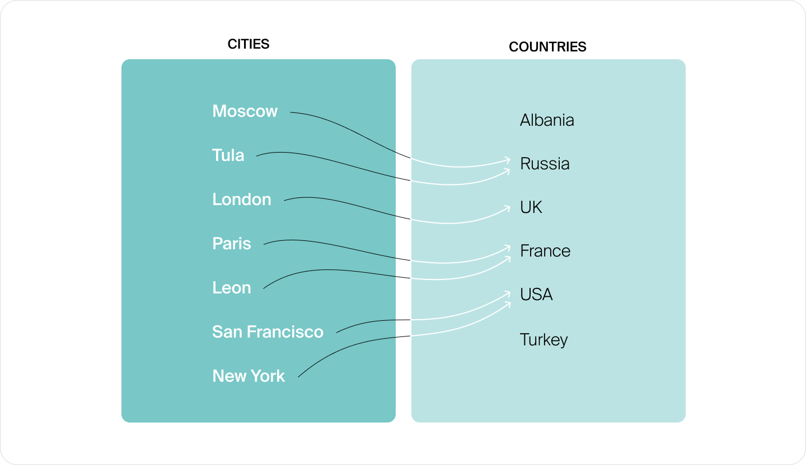
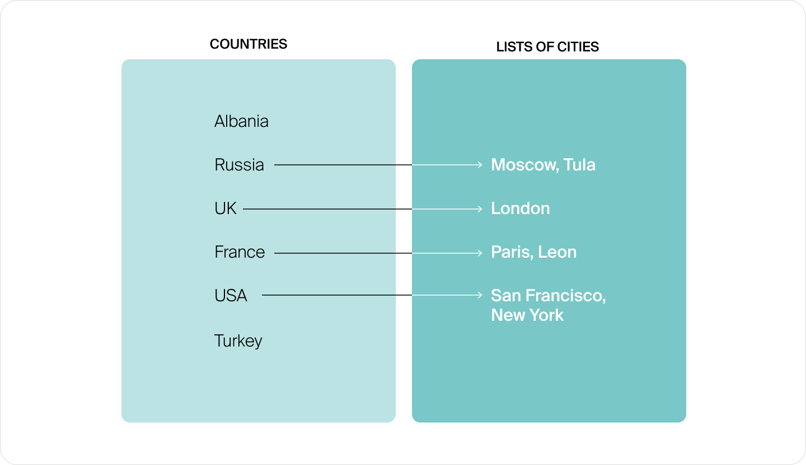

# Хеш-функции

[TOC]

Хеш-таблицы, как и массивы, встроены в большинство языков программирования и применяются в решениях тех задач, где нужно хранить набор произвольных объектов. Но в отличие от массивов они дают возможность быстро искать объекты по какому-либо признаку, взятому в качестве ключа. 

Мы расскажем, как устроены хеш-таблицы и почему они так удобны для создания алгоритмов эффективного поиска по тексту. А ещё мы поговорим о концепции хеширования. Но для начала давайте познакомимся с абстракцией отображения, которая лежит в основе как идеи, так и реализации хеш-таблиц.

## 1. Абстракции отображения

О массивах мы говорили в самом начале курса, и сейчас они нам очень пригодятся. Напомним, что в интерфейсе массива есть две основные операции:

- `get(index: int) -> value` — получить значение `value` из ячейки с индексом `index`;
- `set(index: int, value: ValueType)` — записать значение `value` в ячейку с индексом `index`.

Каждая из этих операций выполняется за $O(1)$. Это очень быстро! **Однако у массивов есть одно серьёзное ограничение: хотя в ячейках массива можно расположить объекты любого типа, индексы этих ячеек могут быть исключительно целыми числами.**

Но в программе часто возникает необходимость получить объект не по его порядковому номеру, то есть индексу ячейки в массиве, а по какому-то другому признаку, например по названию. Или, как говорят программисты, **получить значение (*англ.* value) по ключу (*англ.* key).**

Давайте представим, что у нас есть множество городов и множество стран. Одному городу может быть сопоставлена одна страна — та, в которой этот город находится:



*Каждому городу соответствует ровно одна страна. При этом на некоторые страны указывает несколько городов, а на другие — ни одного*

Нужно написать такую программу-справочник, которая по городу будет узнавать страну, где тот расположен. А ещё нам пригодится функция добавления новой пары «город»: «страна», если справочник будет пополняться.

В этой задаче город является ключом, а страна — значением. Каждому городу сопоставлена ровно одна страна ни больше ни меньше. А вот на страну может указывать любое количество городов.

> [!NOTE]
>
> Такое сопоставление, когда каждому объекту первого множества (множество городов) соответствует ровно один объект второго множества (множество стран), называется «отображением» (*англ.* map).

Давайте немного изменим условие этой задачи. Например, мы будем сопоставлять страны и их столицы. Поскольку у каждой страны есть один и только один столичный город, получившееся сопоставление будет отображением. 

Или можно сделать отображение стран в массивы городов, то есть каждой стране будет соответствовать ровно один массив, содержащий в себе любое количество городов (в том числе — ноль).



*Каждая страна указывает ровно на один объект — массив городов. Количество городов в массиве может быть любым*

> [!IMPORTANT]
>
> На самом деле отображение — это другое название математического термина «функция», или «функциональная зависимость». Чаще всего функции отображают числа (расположенные на оси X) в другие числа (расположенные на оси Y). Для каждого числа из области определения функции можно выписать другое число — значение функции в этой точке.

Массивы — это тоже частный случай отображения: они умеют сопоставлять целому числу любое значение. Например, массив `["яблоко", "груша", "яблоко"]` сопоставляет числам `0` и `2` строку `"яблоко"`, а числу `1` — строку `"груша"`.

Чтобы работать с отображениями, нам требуется похожая на массив структура данных, которая умеет получать и сохранять значения. Но вместо целочисленного индекса она должна допускать ключ произвольного типа:

- `get(key: KeyType) -> ValueType` — получить значение `value` по ключу `key`;
- `set(key: KeyType, value: ValueType)` — записать значение `value` по ключу `key`.

Интерфейс, описывающий две этих операции, называют `Map`. А любую структуру, которая реализует этот интерфейс, называют «ассоциативным массивом» (*англ.* associative array).

### 1.1 Ассоциативные массивы

В большинстве языков программирования ассоциативные массивы встроены в язык.

Чаще всего их называют так же, как интерфейс — `Map`, «отображение», или используют производные от слова «хеш-таблица»: `Hash`, `HashMap`, `HashTable` и даже просто `Table`. Эти названия подчёркивают, каким именно способом был реализован интерфейс отображения. Встречаются и другие наименования. Например, в Python ассоциативные массивы называют «словарями» (*англ.* dictionary).

> [!TIP]
>
> Есть два популярных способа реализовать или, как говорят программисты, имплементировать отображение. Первый способ, хеш-таблицы, мы рассмотрим в этом спринте. Другой способ основан на деревьях поиска, о которых мы будем говорить в следующем спринте. В некоторых языках встречаются сразу обе реализации. Например, в Java отображения имплементированы двумя отдельными классами: `HashMap` и `TreeMap`. В языке C++ им соответствуют классы `std::unordered_map` и `std::map`.

Ассоциативный массив — настолько полезная структура, что во многих языках есть встроенный синтаксис для её создания. К примеру, в Python отображение реализовано типом `dict`, а создать его можно следующим образом:

```python
country_by_city = {
    "Moscow": "Russia",
    "Tula": "Russia",
    "London": "UK",
    "Paris": "France",
    "Leon": "France",
    "San Francisco": "USA",
    "New York": "USA",
}
```

Синтаксис обращения к таким объектам аналогичен обращению к массиву:

```python
# присвоить значение по ключу
country_by_city["Saint Petersburg"] = "Russia"
# получить значение по ключу
country = country_by_city["Tula"]
print(f"Tula is located in {country}")
```

### 1.2 Вложенные структуры данных

Значениями в ассоциативном массиве могут быть данные любого типа: числа, строки, массивы и другие структуры данных. Значением может быть даже другой ассоциативный массив — это позволяет лаконично описывать объекты со сложной внутренней структурой. Например, такие вложенные структуры часто можно встретить в формате хранения данных JSON.

Представьте, что у вас есть несколько сайтов, и вы хотите записывать статистику по посещениям всех страниц на каждом из них. В этом случае удобно использовать такую структуру:

```jsx
pagesVisitStats = {
    "https://timofey.me": {
        "main": 2,
        "contacts": 3
    },
    "https://fruit-shop.ru": {
        "apples": 12,
        "plums": 10,
        "pears": 20,
        "contacts": 15
    }
}
```

Давайте посмотрим, как с этим объектом работать. Как, например, узнать число посещений страницы `"contacts"` на сайте `"https://timofey.me"`?

Наш ассоциативный массив хранится в переменной `pagesVisitStats`. Он даёт нам возможность отображать названия сайтов в другие ассоциативные массивы — с информацией по конкретному сайту.

Для начала нам нужно получить значение по ключу `"https://timofey.me"` и сохранить его в переменную `site_stats`:

```jsx
site_stats = pagesVisitStats["https://timofey.me"] 
```

Полученное значение является ассоциативным массивом:

```jsx
{
    "main": 2,
    "contacts": 3
}
```

В этом ассоциативном массиве ключами являются названия страниц. Поэтому, чтобы узнать интересующую нас информацию, мы можем обратиться к `site_stats["contacts"]` и получить число посещений этой страницы —  `3`.

Такие цепочки обращений часто записывают в одну строку, избегая создания промежуточных переменных: `pagesVisitStats["https://timofey.me"]["contacts"]`.

### 1.3 Подсчёт объектов

- Давайте подсчитаем какие-нибудь объекты с помощью ассоциативного массива. Например, можно узнать, сколько разных фруктов лежит у меня в холодильнике. Для этого выпишем названия всех фруктов и посмотрим, сколько раз встретилось каждое их них.

  Помните, мы делали сортировку подсчётом, когда хотели узнать, какое число сколько раз нам встретилось? Для этого мы использовали массив. Само число было индексом, а в качестве значения мы записывали количество вхождений. 

  Здесь так сделать не получится, потому что название фрукта не может быть индексом массива.

- Но мы можем заменить обычный массив на ассоциативный! Название фрукта будет ключом, а значением станет число — счётчик вхождений. Тимофей, мы ведь можем отображение обновлять?

- Да. Операция `set(key, value)` позволяет не только записать в ассоциативный массив новое соответствие, но и обновить значение по уже имеющемуся ключу.

Можно реализовать подсчёт таким образом:

```python
fruits = ["яблоко", "яблоко", "груша", "яблоко", "слива"]
fruit_count = { }  # создаём пустой ассоциативный массив
for fruit in fruits:
    if not has_key(fruit_count, fruit):  # если в отображении нет такого ключа
        fruit_count[fruit] = 0           # заводим счётчик с таким ключом
    fruit_count[fruit] += 1              # увеличиваем счётчик:
                                         #   set(key, get(key) + 1)
```

После выполнения этого кода `fruit_count` будет содержать `{"яблоко": 3, "груша": 1, "слива": 1}`.

### 1.4 Наивная реализация ассоциативного массива

В этом спринте мы будем изучать универсальные и часто используемые ассоциативные массивы, а именно хеш-таблицы. Узнаем, как они устроены и как ими пользуются разработчики.

Но сначала давайте рассмотрим простейший способ реализации ассоциативного массива. Заведём обыкновенный массив или список, в котором записаны пары `(key, value)`.

Если нужно получить элемент по ключу, достаточно пройти по всем элементам списка, выбрать пару с подходящим значением ключа и вернуть значение, записанное в этой паре. Если значение нужно записать, ищем пару с указанным ключом. Если находим, то изменяем её. А если такая пара не нашлась, создаём её и добавляем в конец массива.

```python
class Map:
    def __init__(self):
        self.pairs = []

    def get(self, key):
        for pair in self.pairs:
            if pair.key == key:
                return pair.value
        return None # Если пара не найдена, вернем null

    def set(self, key, value):
        for pair in self.pairs:
            if pair.key == key:
                pair.value = value
                return
        # Если пара с заданным ключом не найдена, добавим новую пару
        new_pair = Pair(key, value)
        self.pairs.append(new_pair)

class Pair:
    def __init__(self, key, value):
        self.key = key
        self.value = value
```

У нас получилась очень медленная реализация: на поиск элемента в таком массиве в среднем требуется $O(n)$ операций. В следующем уроке мы поговорим о том, как реализовать отображение более эффективным способом — при помощи хеш-таблиц.

## 2. Хеш-таблица и хеш-функция

Заведём массив из трёх элементов. Если встречаем яблоко — увеличиваем счётчик в ячейке `0`, если сливу — увеличиваем ячейку `1`, а груши будем считать в ячейке `2`.

Так работает хеш-таблица.

Хеш-таблица (*англ.* hash table)  — это один из способов реализовать ассоциативный массив, при котором все данные записываются и хранятся в виде пар `(key, value)` в ячейках обыкновенного массива. Эти ячейки называются корзинами (*англ.* bucket). Как и в любом массиве, ячейки-корзины пронумерованы. Индекс, или номер корзины, в которую отправляются данные, зависит от ключа.

Получается, что в нашей задаче название фрукта — это ключ `key`, а число-счётчик— это значение `value`. Итого у нас будет 11 яблок, 20 слив и 8 груш. Яблоки отправятся в нулевую корзину, сливы — в первую, груши — во вторую. Запишем массив, лежащий в основе нашей упрощённой хеш-таблицы: `[("яблоко", 11), ("слива", 20), ("груша", 8)]`.

Можно завести специальную функцию, которая по ключу будет вычислять номер корзины, в которую должен быть добавлен фрукт.

```python
# Функция bucket вычисляет номер корзины для указанного фрукта
def bucket(fruit):
    if fruit == "яблоко":
        return 0
    elif fruit == "слива":
        return 1
    elif fruit == "груша":
        return 2
    else:
        raise ValueError("Неизвестный фрукт")
```

Теперь, если требуется узнать, сколько у нас груш, можно по ключу `"груша"` вычислить номер корзины, в которой следует искать нужную информацию — это будет корзина под номером 2. В этой корзине мы находим пару `("груша", 8)` и извлекаем из неё значение — 8.

