# Спринт №5 - Деревья

[TOC]

------


## Вступление

В прошлом спринте мы говорили о хеш-таблицах, которые помогают искать, добавлять и удалять данные за $O(h)+O(1+α)$, где $h$ — сложность вычисления хеш-функции, а $α$ — коэффициент заполнения хеш-таблицы. Платить за такую привлекательную сложность приходится дополнительной памятью для хранения пустых корзин.

*Но есть задачи, для решения которых необходимо получить высокую скорость поиска информации. Например, когда нужно быстро находить объекты в огромной базе данных. Записей в базе будет так много, что для поддержания $α$ в рекомендуемых границах придётся потратить слишком много дополнительной памяти.* Поэтому при решении подобных задач разработчики используют не хеш-таблицу, а совсем другую, более подходящую для этого структуру данных — она называется **«дерево»**.

------


## 1. Дерево как иерархическая структура

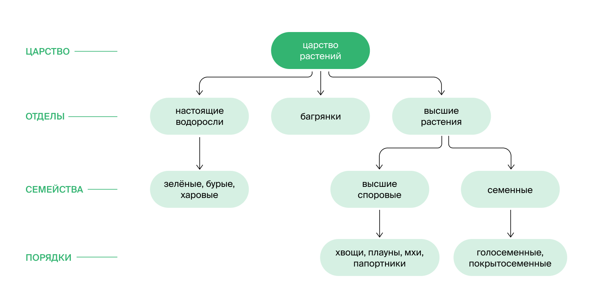

*Элементы на верхнем уровне дерева обобщённо описывают элементы, к которым у них есть стрелки на нижнем уровне. И высшие споровые растения, и семенные растения — это частные случаи растений из отдела высших растений*

> [!NOTE]
>
> Если схема достаточно полная, то мы можем узнать список всех растений определённого семейства. И наоборот, найдя какое-то интересующее нас растение, сможем сказать, к какому роду оно принадлежит. Это очень удобное свойство иерархических структур!

### 1.1. Основные термины

Давайте посмотрим, из чего состоят деревья, на примере иерархии сотрудников:

- **Вершина дерева** — объект, который может хранить информацию и ссылаться на другие вершины. В примере Тимофея вершинами являются все сотрудники.  Синонимы: узел, нода.
- **Ребро дерева** — направленная, то есть иерархическая, связь между двумя вершинами. Посмотрев на направление рёбер дерева, можно однозначно определить, какая из двух связанных вершин выше по иерархии, а какая — ниже.
- **Путь в дереве** — набор вершин, в котором следующие друг за другом узлы соединены рёбрами. Так как рёбра имеют строго одно направление, то и путь возможно проложить только в одну сторону — сверху вниз по иерархии, и никак иначе.
  Синоним: маршрут.
- **Дерево** — совокупность вершин и рёбер без циклов, где у каждой вершины есть не более одного родителя. Если из вершины $X1$ существует путь до вершины $X2$, то гарантируется, что не существует пути от $X2$ к $X1$. В примере Тимофея сотрудник не может быть одновременно и подчинённым, и руководителем для одного и того же человека.

#### Вершина дерева

- Если у вершины нет родителя, она называется **корнем**. В нашем примере родителем является любой руководитель любого сотрудника. А корень — это генеральный директор.

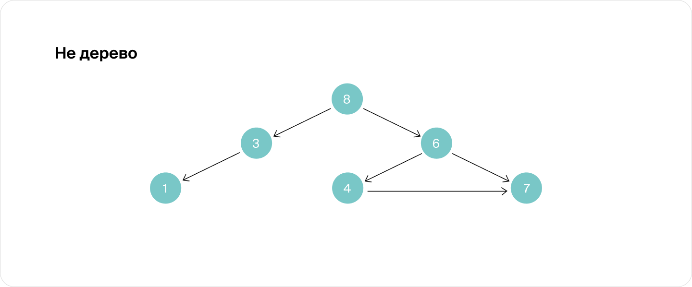

*Эта структура не является деревом, так как у вершины 7 оказалось сразу два родителя*

- Все вершины, через которые сверху вниз проходит путь от корня до вершины $X$, называются **предками** вершины $X$. То есть это родитель, родитель родителя, родитель родителя родителя и так далее. **Непосредственный предок — это родитель**. Генеральный директор в терминологии деревьев является предком для всех сотрудников.
- У вершин могут быть дети в количестве от 0 до бесконечности. В примере Тимофея дети — это подчинённые сотрудника.  Синонимы: ребёнок, дочерние узлы, непосредственные потомки.

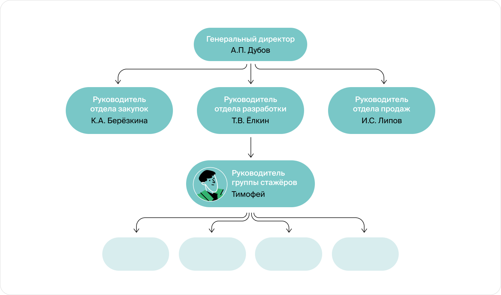

*Вершина дерева «Руководитель отдела разработки Т.В. Ёлкин» ссылается на своего единственного потомка — вершину «Руководитель отдела стажёров Тимофей». Между этими вершинами есть направленное ребро, обозначающее, что Тимофей подчиняется Т.В. Ёлкину. В свою очередь, у Т.В. Ёлкина один родитель — «Генеральный директор А.П. Дубов». Это общий предок и для Т.В. Ёлкина, и для Тимофея.*

- Все дети одного родителя называются по отношению друг к другу **sibling**.
- Все вершины, до которых есть путь от вершины $Y$, называются **потомками **вершины $Y$.
- Если у вершины нет дочерних узлов, она называется **листом**. В примере Тимофея листья — это рядовые сотрудники, у которых нет подчинённых. Синоним: терминальная вершина.
-  **Высота** дерева с корнем — это количество вершин в самом длинном пути от корня до листа

------


## 2. Виды деревьев

В общем случае количество дочерних узлов в дереве может быть произвольным. А если в рамках какой-нибудь задачи мы ограничили максимальное число дочерних узлов, то это число называется **«арностью дерева»**.

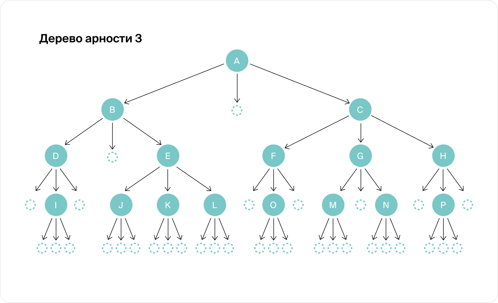

*Несмотря на то, что у некоторых узлов есть только по одному ребёнку, это дерево арности 3, так как 3 — это максимальное количество детей у вершин этого дерева*

Если каждый узел в дереве имеет не более двух потомков, такое дерево называют бинарным, или двоичным.

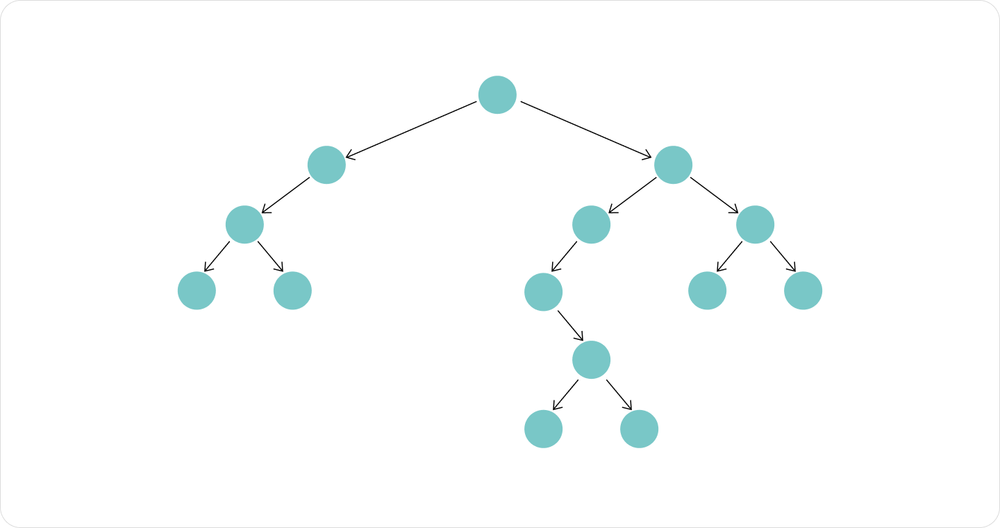

------


## 3.  Представление деревьев в программе


Как и элементы в связных списках, узлы деревьев представляют в виде класса или структуры — в зависимости от языка программирования. 

Отличие в том, что в дереве у вершины может быть сколько угодно детей, для их хранения удобно завести в классе массив `children`:

```python
class Node:
    def __init__(self, obj, children=None):
        self.obj = obj
        if children is not None:
            self.children = children
        else:
            self.children = []
```

Разберём частный случай деревьев — **бинарное дерево**. В случае с бинарным деревом, как мы уже говорили, детей может быть от 0 до 2. Обычно их не объединяют в массив, а объявляют как два отдельных поля:

```python
class Node:
    def __init__(self, obj, left=None, right=None):
        self.obj = obj
        self.left = left
        self.right = right
```

Именно бинарные деревья наиболее популярны в программировании. В этом спринте мы будем говорить только о бинарных деревьях.

### 3.1 Обход двоичного дерева

#### 3.1.1. Рекурсивный обход DFS

> [!NOTE]
>
> Дерево само по себе рекурсивная структура: узел содержит ссылку на левое и правое поддерево, которые сами являются деревьями.  Поэтому «естественный» способ обхода: функция вызывает саму себя для поддеревьев.

```python
# Поиск максимума в двоичном дереве
def find_max(root):
    if root is None:
        return float('-inf')

    left_max = find_max(root.left)
    right_max = find_max(root.right)
    return max(root.value, left_max, right_max)
```

- Базовый случай: дошли до пустой ссылки — возвращаем «очень маленькое» число.
- Рекурсивный случай: максимум в дереве с корнем  `root`  — это максимум из: значения в текущем узле, максимума в левом поддереве, максимума в правом поддереве.

Роль стека в этом подходе берёт на себя стек вызовов Python: каждый рекурсивный вызов «запоминает», где он остановился, и к какому узлу относится.

##### Плюсы

	•	Очень короткий и читаемый код, хорошо совпадающий с математическим определением дерева.
	•	Проще рассуждать о корректности: можно формально доказать по индукции — если функция правильно работает для поддеревьев, правильно отработает и для всего дерева.
	•	Часто удобнее составлять комбинированные операции (например, одновременно считать максимум и глубину) — просто возвращаешь кортеж.

##### Минусы

	•	Ограничение глубины рекурсии: в CPython по умолчанию  recursionlimit  около 1000. Если дерево очень глубокое (по сути, похоже на список), можно получить  RecursionError .
	•	Контроль порядка обхода менее «явный»: он зашит в порядке вызовов (сначала левый, потом правый и т.п.), но нет явной структуры данных в коде.
	•	Нельзя сделать обход в ширину обычной рекурсией «в лоб», там естественнее итеративный подход с очередью.

##### Применение

	•	Классические учебные задачи: сумма, минимум/максимум, высота дерева, проверка на BST, симметричный/обратный обход и т.п.
	•	Когда размер дерева гарантированно умеренный (в учебных задачах это почти всегда так).
	•	Когда важна простота и ясность, а не микрооптимизации.


#### 3.1.2. Итеративный обход (на стеке/очереди)

> [!NOTE]
>
> Итеративный обход — это то же самое, но вместо того чтобы опираться на стек вызовов, ты сам явно создаёшь структуру данных (стек или очередь) и реализуешь алгоритм обхода. Идея: всё то же, что рекурсивный обход в глубину, только стек — не у Python внутри, а у тебя в коде.

##### DFS итеративно (стек)

```python
def find_max(root):
    if root is None:
        return float('-inf')

    stack = [root]
    best = float('-inf')

    while stack:
        node = stack.pop()

        if node.value > best:
            best = node.value

        if node.left is not None:
            stack.append(node.left)
        if node.right is not None:
            stack.append(node.right)

    return best
```

Особенности:

```
	•	 stack.pop()  даёт последний добавленный элемент — это типичный DFS (Last-In, First-Out).
	•	Порядок добавления детей влияет на порядок обхода: если сначала  right , потом  left , то первым обрабатывается левый ребёнок (потому что лежит сверху стека).
	•	Глубина стека = глубине дерева, но это уже твоя структура, не стек интерпретатора — ограничение рекурсии не срабатывает.
```

##### BFS итеративно (очередь)

```python
from collections import deque

def bfs_max(root):
    if root is None:
        return float('-inf')

    q = deque([root])
    best = float('-inf')

    while q:
        node = q.popleft()

        if node.value > best:
            best = node.value

        if node.left is not None:
            q.append(node.left)
        if node.right is not None:
            q.append(node.right)

    return best
```

```
	•	popleft()  берёт первый добавленный узел — получаем обход по уровням (root, его дети, их дети и т.д.).
	•	В отличие от рекурсии, BFS «по определению» удобно делать только итеративно, именно через очередь.
```

##### Плюсы

	•	Нет риска переполнения стека при глубоком дереве.
	•	Порядок обхода контролируется совершенно явно — видно, стек это или очередь, какие дети в каком порядке добавляются.
	•	Иногда проще дебажить: можно посмотреть текущее содержимое стека/очереди, понять порядок, в котором будут посещены узлы.

##### Минусы

	•	Код выглядит более «шумным» по сравнению с лаконичной рекурсией.
	•	Сложнее сразу понять инварианты, особенно когда начинаются хитрые обходы (например, inorder итеративно).
	•	Для новичков часто сложнее для понимания, хотя на курсах алгоритмов это как раз учат, чтобы показать, что любая рекурсия может быть развернута в цикл.

#### Когда какой подход выбирать

| Ситуация / критерий                     | Рекурсия (DFS)                | Итеративный стек / очередь                 |
| --------------------------------------- | ----------------------------- | ------------------------------------------ |
| Учебная задача с небольшим деревом      | Очень удобен, код минимальный | Можно, но громоздко                        |
| Огромное/дегеративное дерево            | Риск  RecursionError          | Предпочтителен, нет ограничений по глубине |
| Нужен обход в ширину по уровням         | Неестественно                 | Очередь — «нативный» способ                |
| Важна читаемость и соответствие теории  | Обычно проще читать           | Больше «технического» кода                 |
| Нужно строго без рекурсии (ограничения) | Нельзя                        | Единственный вариант                       |

------


## 4. Двоичные деревья поиска

> Представьте, что у вас регулярно возникает такая задача: нужно находить должность сотрудника по его фамилии. Чтобы найти необходимую запись в произвольном дереве, надо последовательно обойти все его вершины. Так происходит из-за того, что у нас нет никаких подсказок, где искать нужного сотрудника. Он может оказаться в какой угодно части дерева. Поэтому поиск по произвольному дереву в худшем случае будет работать за $O(n)$. Столько же времени занял бы перебор всех элементов в массиве.

### 4.1. Бинарное дерево поиска

Как мы выяснили, произвольные деревья плохо справляются с задачей поиска: для этого они слишком медленные. Но стоит добавить несколько дополнительных условий, и обычное дерево превратится в дерево поиска(*англ.* binary search tree, BST), а скорость операций резко возрастёт. Вот эти условия:

> [!IMPORTANT]
>
> 1. Если в узле дерева записано значение $Х$, то в левом поддереве располагаются только узлы со значениями, меньшими или равными $Х$.
> 2. Если в узле дерева записано значение $Х$, то в правом поддереве располагаются только узлы со значениями, большими или равными $Х$.
> 3. Левое и правое поддеревья отвечают тем же двум условиям. Это рекурсивное правило. Из него следует, что любое поддерево в дереве поиска будет являться деревом поиска.

Отличить дерево поиска от обычного — непросто. Для этого надо сравнить информацию, записанную в корне, с данными во всех его детях.

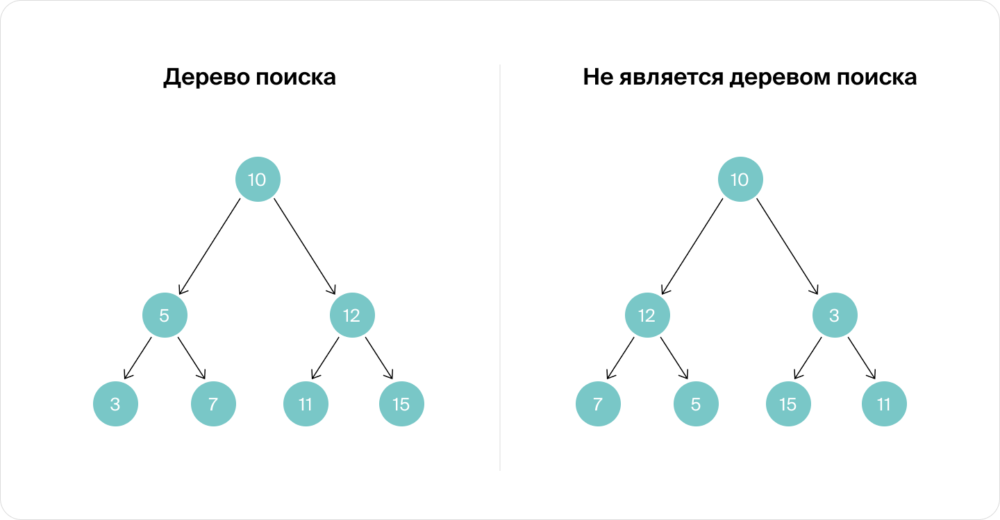

*Только у одного из этих деревьев числа в узлах расположены в том порядке, о котором мы говорили выше*

### 4.2. Деревья поиска и ключи

Быстро узнавать, содержится ли в базе данных элемент с определёнными свойствами — это отличное умение, но одного его недостаточно для решения прикладных задач. Например, таких:

- В большой базе данных в виде дерева поиска представлена информация о самых разных фильмах. Необходимо по названию фильма узнать его жанр и год выпуска.
- Данные о пользователях соцсети хранятся в дереве поиска. Необходимо по числовому ID владельца страницы узнать его возраст и дату регистрации в этой соцсети.

Дерево поиска в таких ситуациях строится по ключу — то есть определённому набору свойств элементов. Для ключей предусмотрен компаратор: в случае с числами это простой оператор сравнения «меньше» (`<`). Мы уже сталкивались с компараторами, когда говорили о сортировках. В задачах, описанных выше, ключами будут название фильма (строка) и ID пользователя (число).

Обратите внимание, что деревья поиска позволяют хранить и повторяющиеся ключи. Например, в базе данных может находиться сразу несколько фильмов с названием «Игра». При этом повторяющиеся ключи не приведут к коллизии, так как расположение вершины в памяти не зафиксировано, а значит, каждый из повторяющихся элементов найдёт своё место.

Во всех дальнейших иллюстрациях числа в вершинах деревьев — это ключи. По ключу мы можем находить элементы (например, конкретный фильм — по его названию) и узнавать  их поля, если они есть (например, год создания этого фильма или жанр).

Возможно построить несколько деревьев из одного и того же набора ключей. Допустим, у нас есть набор из трёх ключей: $1, 2, 3$. В зависимости от того, в каком порядке мы будем добавлять эти ключи, у нас будут получаться разные деревья поиска.

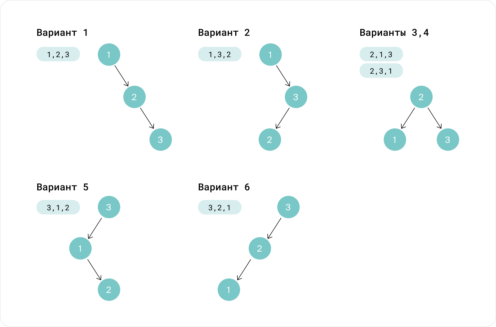

*Для набора из 3 элементов есть 6 вариантов последовательностей добавления ключей в дерево поиска. Но в вариантах 3 и 4 деревья поиска получатся одинаковые*


### 4.3. Поиск по дереву 

Рассмотрим, как работает поиск в случае, если нам надо найти какой-нибудь элемент с заданным ключом.

> [!IMPORTANT]
>
> Каждый раз, когда мы выбираем, в каком поддереве продолжать поиск, у нас есть указатель-подсказка: если элемент, записанный в текущей вершине, больше искомого, то нужно продолжить поиск в левом поддереве, иначе — в правом. А если ключ вершины равен искомому, то поиск успешно завершается.

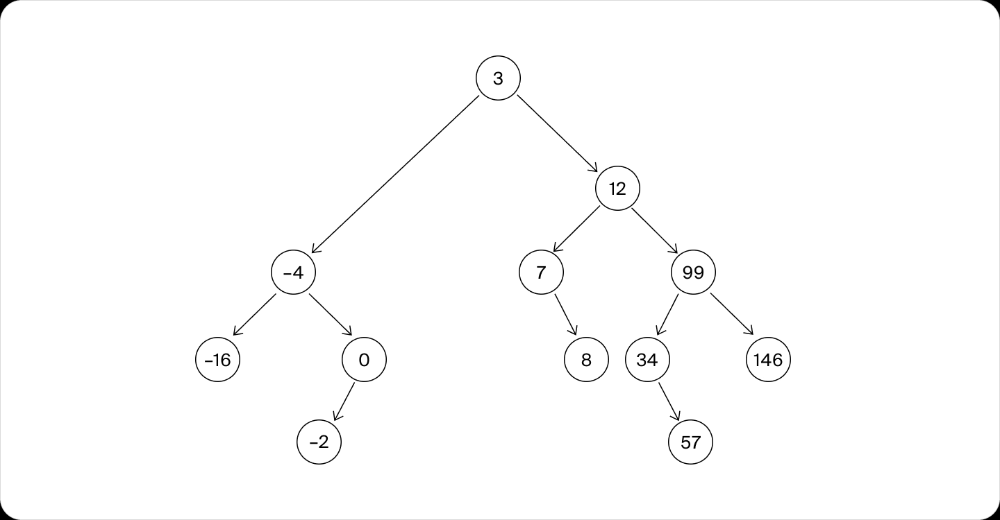

Пусть мы ищем вершину 34. Нам потребуется провести 4 сравнения: 

1. $34 == 3$? Нет. $34 < 3$? Нет, значит, идём в правое поддерево.
2. $34 == 12$? Нет $34 < 12$? Нет, значит, идём в правое поддерево.
3. $34 == 99$? Нет $34 < 99$? Да, значит, идём в левое поддерево.
4. $34 == 34$? Да, мы нашли нужную вершину!

Но как понять, что искомой вершины в дереве поиска нет? Если мы хотим продолжить поиск в одном из поддеревьев, а его нет, и вместо ссылки на него записан None, значит, искомый элемент отсутствует.


Пусть мы ищем вершину 5. Нам потребуется провести 3 сравнения: 

1. $5 == 3$? Нет. $5 < 3$? Нет, значит, идём в правое поддерево.
2. 5 == 12? Нет 5 < 12? Да, значит, идём в левое поддерево.
3. 5 == 7? Нет. 5 < 7? Да, значит, идём в левое поддерево. Ой, его нет! Значит, вершина 5 в дереве отсутствует.

```python
def find_node(root, value):
  # Если мы пришли в поддерево, а его не существует, 
  # значит, нужного элемента в дереве поиска нет
  if root is None: 
    return None
  if value < root.value:
    return find_node(root.left, value)
  if value == root.value:
    return root
  if value > root.value:
    return find_node(root.right, value) 
```

### 4.4. Обход дерева

Как мы уже говорили, деревья удобны для хранения данных с иерархической структурой. Но когда мы храним какой-то элемент, нам важно при необходимости вывести этот элемент на экран и отобразить его место в иерархической структуре. В случае с деревом организации мы можем, например:

- вывести список рабочих номеров телефонов всех сотрудников;
- вывести несколько списков, сгруппировав сотрудников по подразделениям или отделам, в которых они работают.

Но так как, в отличие от массивов и связных списков, из вершины дерева мы можем попасть сразу в несколько других вершин, важно определить порядок обхода элементов. Это необходимо, чтобы:

- посетить каждый элемент ровно один раз,
- не оставить ни один элемент без внимания.

Для решения этой задачи разработчики используют стандартные методы обхода деревьев.

#### Прямой и обратные обходы

Эти два обхода применимы для всех видов деревьев — вне зависимости от их арности и дополнительных ограничений (например, на расположение данных). 

**Прямой обход** описывает порядок, которому интуитивно следует большинство людей: сначала мы смотрим на корень дерева, потом переводим взгляд на поддерево. В поддеревьях рекурсивно повторяем тот же алгоритм: сначала изучаем корень, потом — поддеревья. 

Порядок обхода детей не регламентируется, но так как для европейцев привычно читать текст слева направо, мы рассматриваем поддеревья аналогично — слева направо.

Если у нас есть структура организации, сохранённая в виде дерева, то прямой обход — самый естественный способ вывести её на экран:

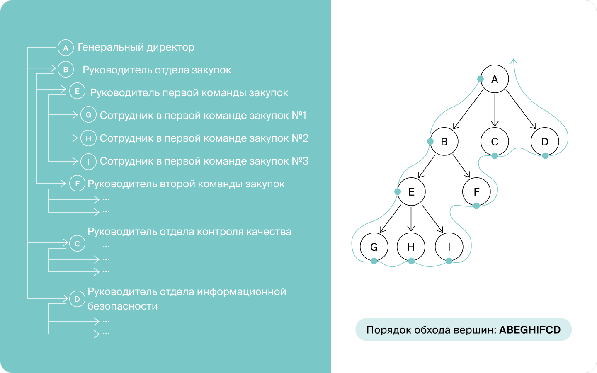

Псевдокод для прямого обхода выглядит так:

```python
def print_forward(vertex):
  print(vertex.value)
  for child in vertex.children:
    print_forward(child)
```

Второй стандартный метод обхода дерева — **обратный обход**. Он очень похож на прямой. Единственное различие между ними в том, что при обратном обходе сначала рассматриваются все поддеревья в любом порядке и только потом — корень поддерева.

С помощью метода обратного обхода можно вывести на экран список задач по проекту в порядке их выполнения. В корне записана главная цель, в детях — подзадачи. Некоторые подзадачи тоже будут составными проектами. При этом метод обратного обхода гарантирует, что можно выполнять текущую задачу, если все задачи, написанные выше, выполнены:

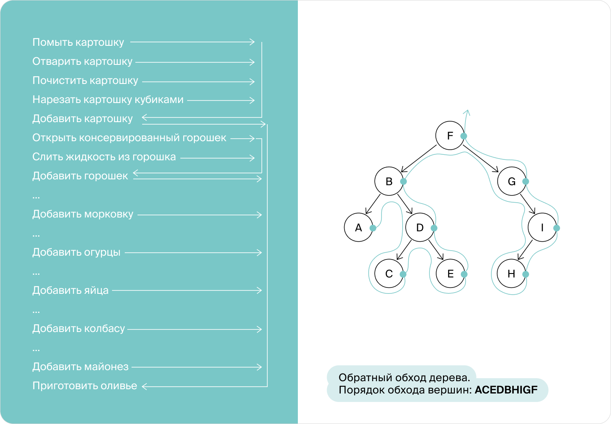

Псевдокод реализации обратного порядка выглядит так:

```python
def print_reversed(vertex):
  for child in vertex.children
    print_reversed(child)
  print(vertex.value)
```

> [!WARNING]
>
> При прямом обходе мы обрабатываем узел, когда приходим в него впервые, а при обратном — когда уходим из него навсегда.

#### Центрированный обход

Центрированный метод обхода подходит только для бинарных деревьев. Поскольку подразумевает, что мы знаем, где находится центральная ось каждого из поддеревьев и всего дерева в целом. Суть метода в том, что мы сначала выводим все элементы одного поддерева. Потом корень. Потом все элементы второго поддерева, если они есть. При этом для каждого поддерева мы производим вывод вершин таким же алгоритмом. То есть рекурсивно. 

В этом методе есть два варианта:

- сначала выводить левое поддерево, потом центр, потом правое: такой обход по сокращению букв называют **LMR** (left-middle-right);
- сначала правое поддерево, потом центр, потом левое — **RML**(right-middle-left).

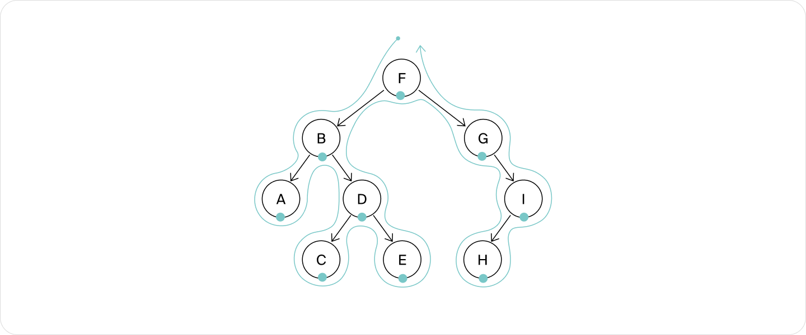

*Центрированный обход дерева: сначала обойдём все элементы левого поддерева в порядке ABCDE, потом корневую вершину F, потом все вершины правого поддерева в порядке GHI*

```python
def print_LMR(vertex):
  if not vertex.left is None:
    print_LMR(vertex.left)
  print(vertex.value)
  if not vertex.right is None:
    return print_LMR(vertex.right)
```

#### Обходы дерева поиска

Обойти и вывести на экран можно любое дерево. Но в случае, когда мы производим обход бинарного дерева поиска, мы получаем полезный бонус.

Так как для каждого поддерева в дереве поиска все вершины в левом поддереве меньше корня и меньше вершин в правом поддереве, центрированный обход дерева выведет все элементы дерева отсортированными:

- при LMR-обходе данные будут отсортированы от меньшего элемента к большему,
- при RML-обходе данные будут отсортированы от большего элемента к меньшему.

#### Онлайн задача поиска

В программировании принято делить алгоритмы на работающие офлайн и онлайн.

Первые получают на вход сразу все данные, один раз их обрабатывают и выдают ответ на какой-то вопрос. Вторые получают данные постепенно, а ответ на один и тот же вопрос запрашивается у них периодически. При этом программа для получения ответа должна опираться на всю информацию, известную ей к этому моменту. Ожидается, что, получив новые данные, программа эффективно дообучается и модифицирует старый ответ для вычисления нового. 

Мы уже рассматривали алгоритм бинарного поиска, который в худшем случае работает за $O(log⁡n)$. Напоминаем, что данные в массиве должны быть отсортированы. Алгоритм двоичного поиска хорошо работает в офлайн-режиме, то есть когда все данные известны заранее. Если мы добавляем в массив новые элементы, нам требуется снова пересортировывать весь массив. 

Бинарное дерево поиска решает ту же задачу, оно позволяет найти элемент среди множества других за $O(H)$, но, в отличие от бинарного поиска, данные в бинарном дереве поиска отсортированы в любой момент времени. И найти ключ в таком дереве можно, не производя дополнительных подготовительных операций. Плата за возможность поиска ключей в онлайн режиме –– более высокая сложность добавления элемента. 

#### Поиск элемента в интервале

Бинарное дерево поиска можно использовать для того, чтобы искать все элементы, у которых ключ располагается в некотором интервале. Допустим, у нас есть дерево поиска товаров в магазине, упорядоченное по их стоимости. Давайте разберёмся, как найти все товары с ценой от 1500 до 1900 рублей.

Например, в нашем дереве будут такие узлы: футбольный мяч — 900 ₽, бумеранг — 1400 ₽, воздушный змей — 1550 ₽, ракетки для игры в бадминтон — 1600 ₽, ракетки для игры в настольный теннис — 1600 ₽, гантели — 1800 ₽, коврик для йоги — 2000 ₽, кроссовки — 2200 ₽.

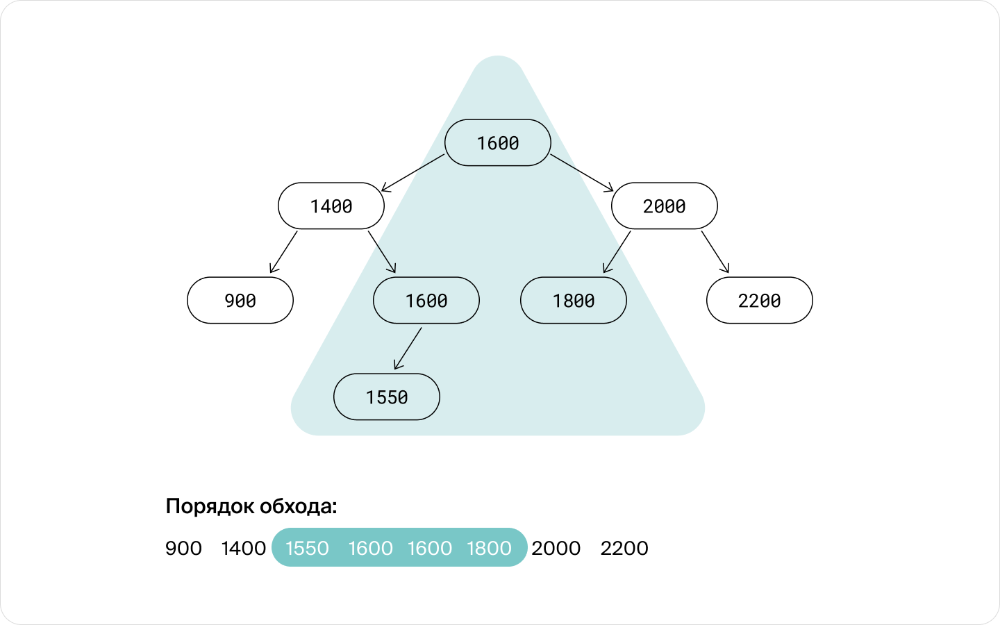

Первым делом нужно среди товаров стоимостью больше 1500 рублей найти самый дешёвый. В нашем случае это воздушный змей — он стоит 1550 рублей. Если бы были ещё товары по 1550, нам следовало бы найти тот из них, который в дереве расположен левее других (так как в порядке обхода самый левый элемент будет посещён раньше всех остальных). Для этого мы применим стандартный алгоритм поиска с небольшими модификациями. 

- Если корень дерева меньше искомого элемента 1500, поиск производится в правом поддереве.
- Если корень дерева больше или равен искомому элементу 1500, мы рекурсивно повторяем процедуру поиска в левой половине.
- Если в левой половине элементов не нашлось, значит, корень дерева является первым элементом, который имеет стоимость больше либо равную 1500.

Может так получиться, что в процессе работы алгоритма мы спустимся до узла, который меньше искомого. Например, в корне дерева значение оказалось больше искомого, а в левом поддереве все элементы, напротив, меньше искомого.

В нашем примере алгоритм спустится до узла, который меньше искомого — до товара со стоимостью 1400. Однако следующий же элемент в порядке LMR-обхода будет иметь стоимость не меньше 1500. Чтобы получить этот элемент, нам потребуется найти в дереве узел, следующий по порядку за данным.

После того как мы нашли первый элемент, который будет правее левой границы — 1550, нам следует обходить все элементы дерева в порядке возрастания, пока они не превзойдут правую границу. Итого в нашем интервале оказалось четыре элемента: 1550, 1600, 1600 и 1800.

Поиск первого элемента занимает $O(H)$ операций. Перебор последующих значений линейно зависит от количества элементов в интервале.

### 4.5. Двоичные деревья поиска. Вставка

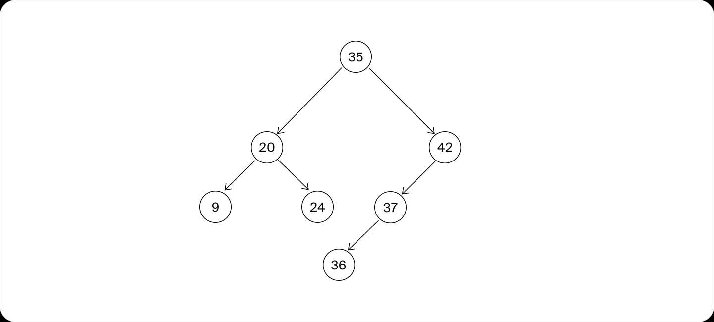

- Начинаем в корне. Там записан ключ 35. Сравниваем 39 с 35 и понимаем, что узел следует добавлять в правое поддерево, ведь именно там мы в дальнейшем будем искать элемент с ключом 39.
- Теперь сравниваем 39 и 42. На этот раз правило поиска говорит, что узел следует искать в левом поддереве, корнем которого является узел 37.
- Добавляемый ключ 39 больше, чем 37, значит, узел должен быть добавлен в правое поддерево. Но правого поддерева пока что не существует, в качестве правой ветви указан `None`. Значит, на этом месте мы и создадим узел, то есть создадим экземпляр класса Node c ключом 39, и запишем его правым ребёнком вершины 37.

> [!IMPORTANT]
>
> По определению, если значение ключа равно значению в корне, то мы его можем расположить как в левом, так и в правом поддеревьях. Но для простоты реализации будем считать, что в левое поддерево мы кладём элементы меньше корня, а в правое — б*о*льшие или равные корню.

Будем спускаться по дереву до тех пор, пока не дойдём до места, в котором отсутствует поддерево, и именно в это место добавим новую вершину с повторяющимся ключом. Давай рассмотрим этот алгоритм на примере:

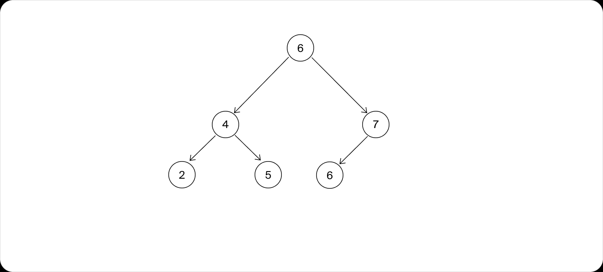

Допустим, нам надо вставить ключ 6 в данное дерево. Наши действия:

- Начинаем в корне. Там записан ключ 6. Добавляемый ключ больше или равен значению в корне, значит, идём в правое поддерево.
- В поддереве корень 7. 7 > 6, продолжаем поиск места под новый ключ в левом поддереве.
- Корень левого поддерева опять 6, значит, мы опять должны пойти в правое поддерево, но его нет: вместо него сейчас записан None. Значит, именно в этом месте надо создать новую вершину.

```python
def insert_node(root, key):
    if root is None:
        return Node(key)

    if key < root.key:
        root.left = insert_node(root.left, key)
    elif key >= root.key:
        root.right = insert_node(root.right, key)

    return root
```

### 4.6 Двоичные деревья поиска. Удаление

 Когда удаляется вершина, каждое ребро, которое в неё входило или из неё исходило, становится невалидным (недопустимым). Оно как бы повисает в воздухе, одним из своих концов указывая на отсутствующий объект. Поэтому такие рёбра удаляются вместе с вершиной.

> [!CAUTION]
>
> У вершины в бинарном дереве может быть до трёх рёбер (одно — от родителя к вершине и два — от вершины к детям). Соответственно, она может объединять собой три отдельные группы вершин. Удаление такой вершины разорвёт связь между этими группами.

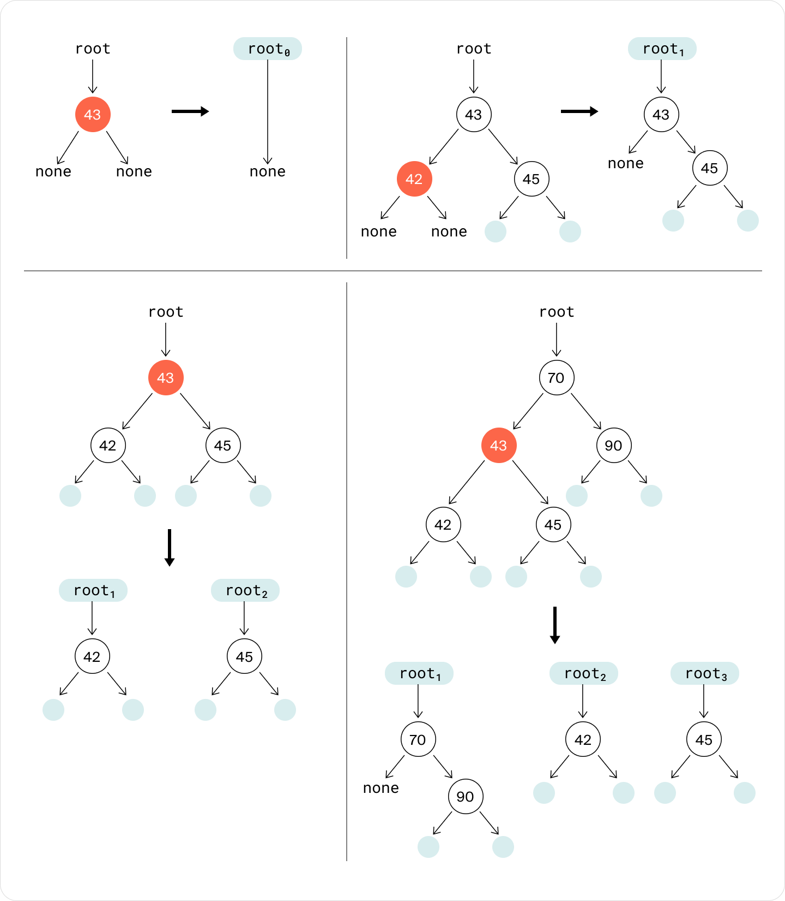

1. Если дерево состояло из одной вершины, то после её удаления дерева не останется.
2. Если мы удаляем лист, то дерево останется одним деревом и не распадётся на части.
3. Если мы удаляем корень, у которого есть оба поддерева, то каждое поддерево станет отдельным деревом.
4. Если мы удаляем вершину, у которой есть оба ребёнка и родитель, то дерево распадётся на родительское и два поддерева.

#### Объединение распадающихся поддеревьев

Для того чтобы дерево осталось деревом поиска, на место удалённой вершины надо поставить какую-то другую вершину. 

Для начала из всех отсоединяющихся вершин дерева поиска надо выбрать такую, чтобы её значение было:

- больше всех значений в левом поддереве удаляемой вершины,
- меньше либо равно всем значениям в правом поддереве.

> [!NOTE]
>
> Где можно найти такую вершину? Для поиска правильного ответа мы рекомендуем нарисовать разные варианты деревьев поиска:
>
> - **Самая левая вершина в правом поддереве** или **самая правая вершина в левом поддереве**: Там лежит самое большое значение из левого поддерева, и оно точно меньше, чем любое значение правого поддерева.

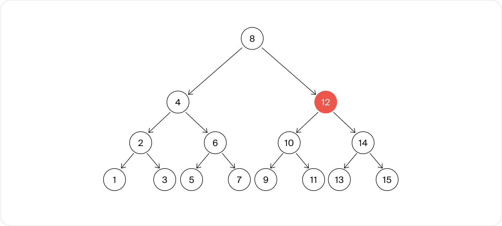

*При удалении вершины 12 её можно заменить узлом с максимальным значением из левого поддерева или с минимальным — из правого. В нашем дереве это вершины со значениями 11 и 13 соответственно. После удаления вершины и замены её на другую подходящую дерево будет выглядеть одним из двух образов — в зависимости от того, будем мы брать вершину на замену из правого или из левого поддерева удалённого элемента*


*В данном случае на место удаляемой вершины мы поставили вершину из её правого поддерева со значением 13*

> [!TIP]
>
> Для простоты повествования мы всегда будем брать самую правую вершину в левом поддереве. При желании вы сможете адаптировать алгоритм, считая, что берётся самая левая вершина в правом поддереве.

Мы нашли вершину $P$, которая объединит распадающиеся поддеревья. Теперь надо переместить её на место удаляемой вершины $D$. Перемещение — это составное действие. Для краткости в этом алгоритме мы будем использовать следующие обозначения: $P.parent$ — родитель вершины $P$, $D.parent$ — родитель вершины $D$. Рассмотрим два варианта удаления:

##### Первый вариант

$P$ — лист дерева, у него нет собственных детей. Это значит, что мы не оставим осиротевших поддеревьев, просто удалив её со старого места (`P.parent.right = None`). После удаления переместим вершину $P$ на новое место.  Алгоритм будет таким:

1. Удаляем вершину со старого места. Для этого удалим ссылку на неё из `P.parent`. При этом мы знаем, что $P$ — самая правая вершина, значит, и у своего родителя она будет правым ребёнком: `P.parent.right = None`.
2. У родителя вершины $D$ меняем ребёнка $D$ на $P$. В этом месте мы не знаем, была ли вершина $D$ правым или левым ребёнком своего родителя. Надо проверить каждого из детей `D.parent`, чтобы узнать, какого ребёнка заменит вершина $P$.
3. Вершине $P$ присваиваем детей $D$: левым ребёнком $P$ станет левый ребёнок $D$ (`P.left = D.left`), а правым — правый (`P.right = D.right`).

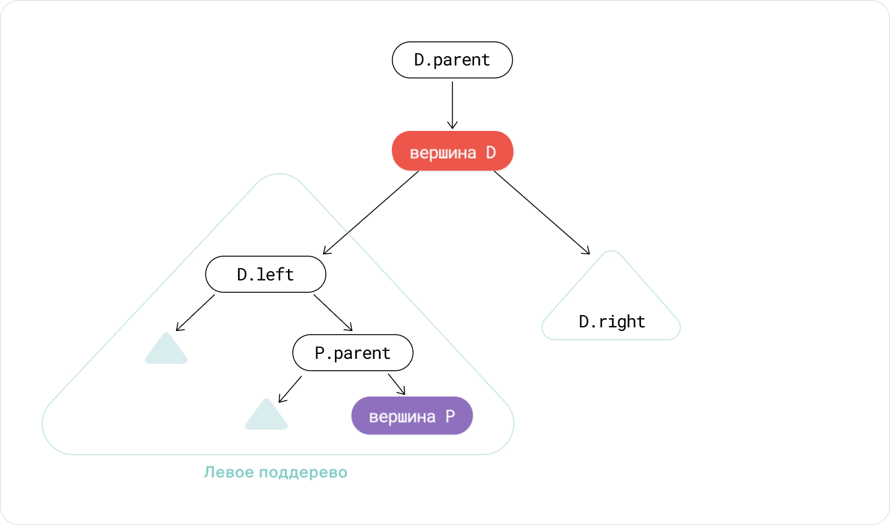

*После удаления вершины D дерево поиска будет содержать на одну вершину меньше, но останется единым*

##### Второй вариант

Если у вершины $P$ есть потомки, значит, у неё есть только левый ребёнок и нет правого, так как $P$ — самая правая вершина в своём поддереве.

Алгоритм действий:

1. Чтобы не оставить `P.left` осиротевшим после переноса $P$, надо чтобы `P.parent`(прародитель `P.left`, родитель P) усыновил `P.left` в качестве правого ребенка вместо $P$.
2. Теперь у вершины $P$ нет детей, и её можно удалить, следуя алгоритму из первого варианта.

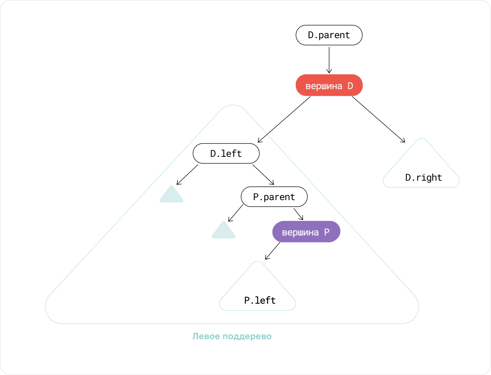

*Вершина P.left стала правым ребёнком вершины P.parent. Никаких изменений с детьми вершины P.left проводить не требуется*

## 5. Сбалансированные деревья поиска

В этом спринте мы много говорили про деревья поиска. Рассмотрели, как происходят операции поиска, вставки и удаления. Напоминаем, что время выполнения операций в дереве поиска пропорционально его высоте $H$.

Если разработчик не умеет контролировать высоту дерева, она полностью зависит от того, в каком порядке добавляются вершины. Посмотрите на примеры неудачных деревьев поиска:

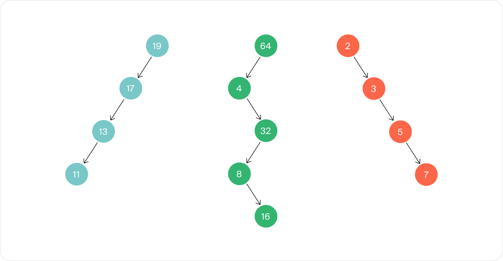

*Высота каждого из этих деревьев равна количеству вершин в нём*

Такие деревья поиска практически бесполезны, так как время выполнения основных операций в них $O(H)=O(N)$ С тем же успехом можно решать задачи с помощью связных списков.

### 5.1. Сбалансированность

Для того чтобы деревья давали ощутимый выигрыш по скорости, нужно минимизировать высоту дерева. В лучшем случае мы всегда будем добавлять новый элемент на минимально возможном удалении от корня. 

> [!IMPORTANT]
>
> Три вершины можно уместить на двух слоях бинарного дерева, семь — на трёх, а пятнадцать — на четырёх. Общая формула такая: если в дереве $N$ вершин, то его высота будет не меньше $⌈log⁡_2(N+1)⌉$, где специальные скобки $⌈...⌉$ обозначают округление вверх до ближайшего целого числа.

Представим, что мы ищем ключ в бинарном дереве поиска: рассматриваем каждый элемент, сравниваем его с искомым ключом и продолжаем поиск в левом либо в правом поддереве. Если после рассмотрения каждого из этих элементов оставшееся поддерево для поиска уменьшается примерно вдвое, то такое дерево поиска называется «сбалансированным» (*англ.* balanced binary search tree).

Сложность операции поиска по такому дереву равна $O(log⁡_2N)$, потому что на каждом шаге задача упрощается примерно в два раза. Соответственно, и высота сбалансированного бинарного дерева поиска $H≈log⁡_2N$.

> [!IMPORTANT]
>
> В действительности необязательно требовать того, чтобы количество элементов уменьшалось именно в два раза (хотя это и является идеальной ситуацией). Вместо этого можно выбрать любое фиксированное число. Например, если на каждом шаге остаётся не больше, чем 9/109/10 элементов, то дерево будет иметь высоту $log⁡_{10/9}N$, что в несколько раз выше, чем $log⁡_2N$. Но эта высота всё равно будет логарифмически зависеть от числа элементов. Поскольку логарифмы с различным основанием отличаются в константное число раз, в асимптотической сложности алгоритма основание можно не указывать, таким образом $H=O(log⁡N)$.

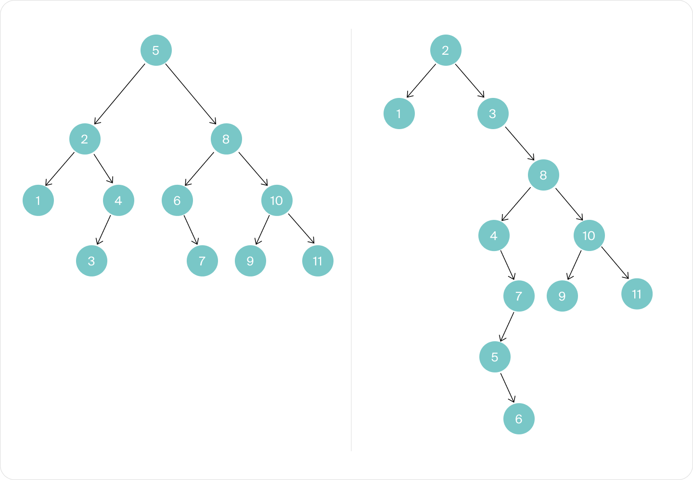

*В сбалансированном дереве любую вершину можно найти не более, чем за 4 сравнения. В несбалансированном — худший случай потребует 7 сравнений*

### 5.2. Критерии сбалансированности дерева

Существует несколько критериев, по которым можно проверить, сбалансировано дерево или нет. Увы, не все из них интуитивно понятны. Мы рассмотрим два основных критерия. Однако приводить доказательства, почему любой из них обеспечивает скорость поиска $O(log⁡N)$, в рамках этого курса мы не будем.

При оценке сложности операций в деревьях поиска важно помнить про амортизированную сложность. Она состоит из двух частей:

1. Сложность операций в сбалансированном дереве поиска. По определению она равна $O(log⁡N)$.
2. Сложность перебалансировки дерева, помноженная на частоту разбалансировки дерева.

Теперь давайте посмотрим на разные критерии сбалансированности. Как мы уже говорили, чтобы быть сбалансированным, дереву достаточно соответствовать хотя бы одному из них.

#### 5.2.1. Критерий по количеству вершин

Чтобы скорость поиска в двоичном дереве поиска была $O(log⁡N)$ каждый переход в правое или левое поддерево должен уменьшать количество вершин, среди которых мы ищем, примерно вдвое. 

Это условие будет выполняться, если для каждого поддерева в бинарном дереве количество вершин в правом и левом детях будет равно с точностью $+-1$ вершина. Такое дерево будет называться «идеально сбалансированным двоичным деревом поиска».

> [!IMPORTANT]
>
> **Критерий 1.** У любой вершины количество потомков в правом и левом детях различается не более, чем на единицу.

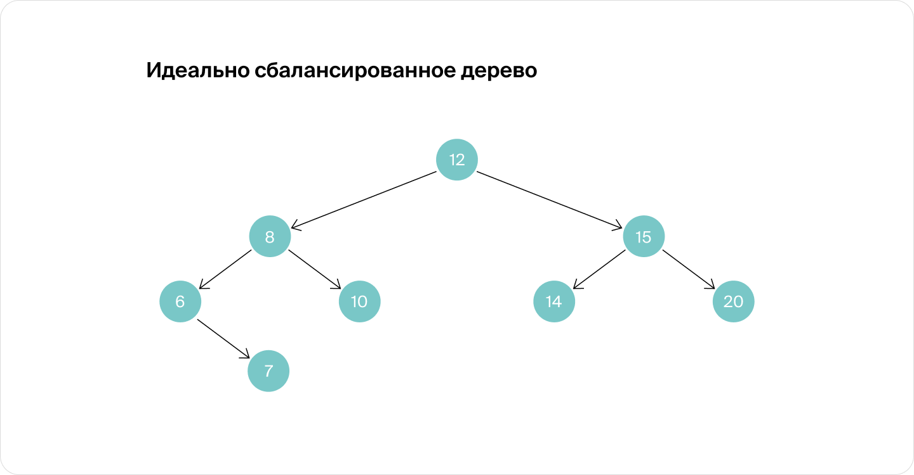

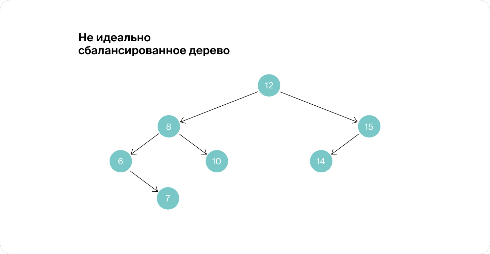

Поддерживать дерево в идеально сбалансированном состоянии слишком трудоёмко. Потому что при любой модифицирующей операции оно может утратить свою идеальную сбалансированность. 

Посмотрите на пример. В этом дереве поиска есть 7 позиций, куда можно добавить новые данные. Но только одна из них подходит для вставки, которая не повредит идеальной сбалансированности дерева.

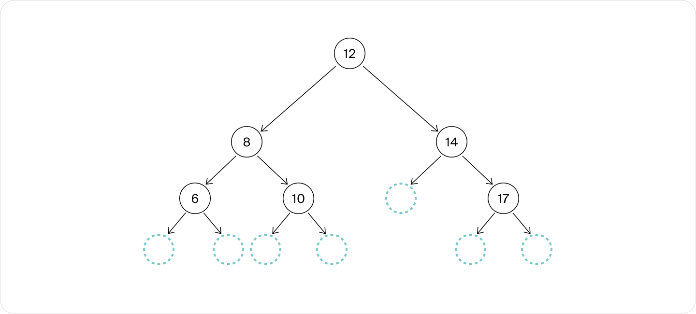

*Ключ в выделенной вершине должен быть меньше ключа родителя (14), так как это левое поддерево родителя. Но не меньше ключа прародителя (12), так как для прародителя мы находимся в правом поддереве. Поэтому подходят только числа 12 и 13*

Данные, попадающие на вход программе, редко способствуют поддержанию сбалансированности. Чем строже критерий сбалансированности, тем чаще дерево придётся перестраивать, чтобы оно продолжало ему соответствовать.

#### 5.2.2. Критерий по высоте дерева

Критерий сбалансированности по количеству вершин, который мы разобрали выше, кажется интуитивно понятным. Но всё-таки большая часть сбалансированных деревьев поиска опирается на другой критерий — по высоте поддеревьев. Его понять сложнее.

> [!IMPORTANT]
>
> **Критерий 2.** У любой вершины высота правого и левого поддеревьев различается не более, чем на единицу.

Дерево, которое удовлетворяет такому критерию, называют АВЛ-деревом.

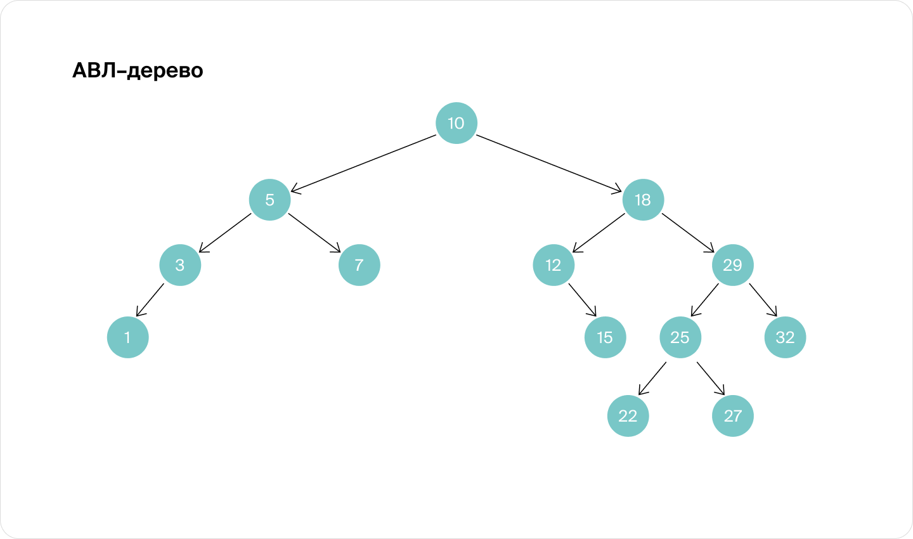

*Рассмотрим корень: высота левого поддерева 3, высота правого поддерева 4. Изучив все вершины, можно убедиться, что это сбалансированное дерево*

Мы разобрали только два критерия, но есть и другие. Например, [красно-чёрные деревья](https://ru.wikipedia.org/wiki/Красно-чёрное_дерево), [Splay-деревья](https://ru.wikipedia.org/wiki/Splay-дерево) и проч.

Различные механизмы ребалансировки деревьев довольно сложны на практике, и рассказ о них выходит за рамки нашего курса. Большинству разработчиков не придётся писать код для ребалансировки даже при решении алгоритмических задач.

### 5.3. Балансировка АВЛ-дерева

Мы говорили, что в рамках этого курса не будем рассматривать, как балансировать деревья, потому что это непросто. Однако наверняка среди наших студентов найдутся те, кому всё-таки захочется в этом разобраться! Поэтому мы решили добавить этот бонусный урок — про алгоритмы балансировки в АВЛ-деревьях. 

Выбрав любой из критериев, о которых мы рассказали в прошлом уроке, можно проверить, является ли дерево в данный момент сбалансированным или нет. Если да, то всё замечательно. Но что делать, если дерево оказалось несбалансированным? 

> [!WARNING]
>
> На практике информация о сбалансированности дерева обновляется при совершении каждой модифицирующей операции. И если после вставки или удаления элемента дерево разбалансировалось, то надо перебалансировать не всё дерево поиска, а только сломавшиеся поддеревья.

Для того чтобы понять, нужна ли перебалансировка в АВЛ-дереве, надо знать высоту всех поддеревьев. Вычисление высоты — операция долгая, поэтому в корне каждого поддерева хранится актуальное значение его высоты.

```python
class Node:
    def __init__(self, key, height=1, left=None, right=None):
        self.key = key
        self.left = left
        self.right = right
        self.height = height 
```

Высота любого поддерева пересчитывается при каждом изменении числа его потомков. Однако есть оптимизация: если после операции высота какого-то поддерева не изменилась, то не изменилась и высота его предков.

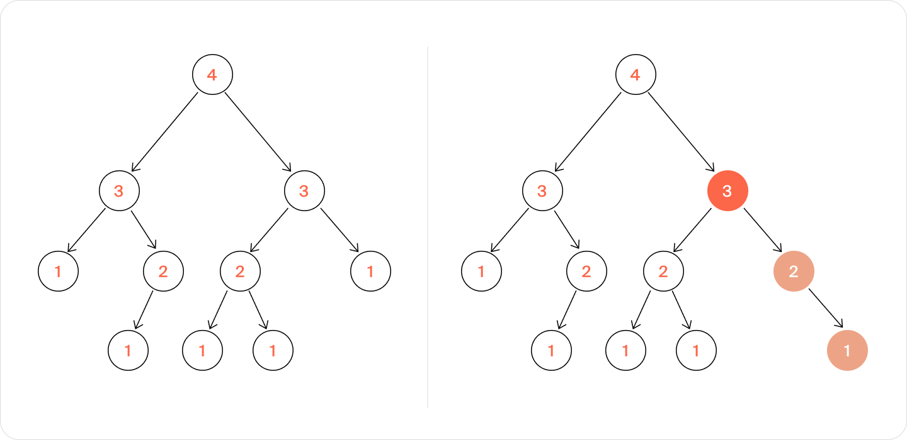

*Мы добавили лист в самое правое поддерево. Высота поддерева увеличилась на 1. Высота родителя поддерева не изменилась, так как высота его левого ребёнка и раньше была 2*

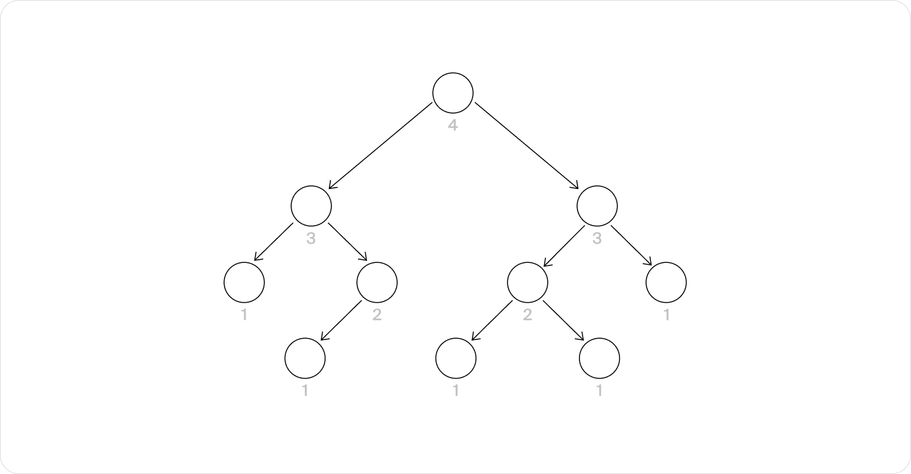

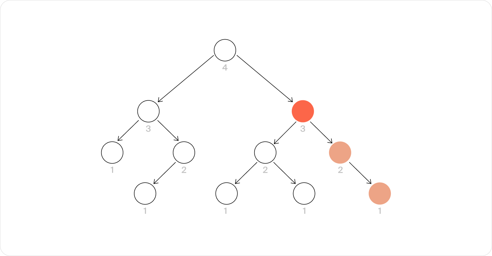

Как мы уже говорили, АВЛ-дерево сбалансировано, если высоты двух его поддеревьев отличаются не больше чем на единицу. После любой модифицирующей операции и обновления значений высот мы можем обнаружить, что для какой-то вершины разница в высотах её поддеревьев равна 2. В этом случае поддерево надо перебалансировать. 

Для АВЛ-деревьев операция балансировки происходит при помощи так называемых вращений. В процессе вращения поддеревья, как в танце, меняются местами: у балансируемого дерева может поменяться корень, а у некоторых поддеревьев — родители. 

Выделяют 4 типа ситуаций, при которых нужны вращения. И для каждой из них есть свой вид вращения.

#### Малое левое вращение

Первый вид вращений применяется, когда выполняются два условия:

- высота поддерева $b$ больше высоты поддерева $L$ на 2,
- высота поддерева $C$ не больше высоты поддерева $R$. То есть разница между высотами $C$ и $R$ либо 0, либо 1.

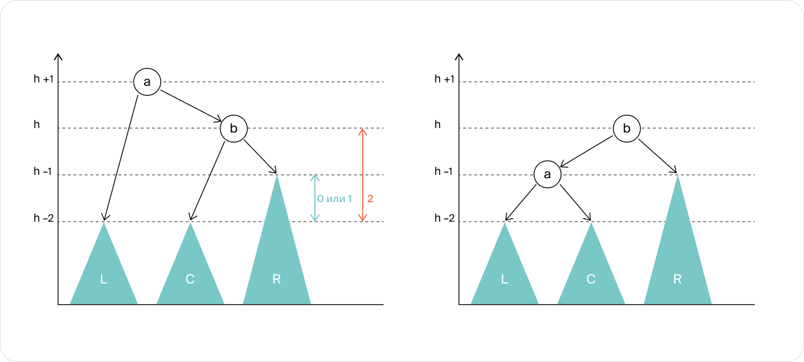

*У вершины a два поддерева: L и поддерево с корнем в вершине b. У вершины b два поддерева: C и R. При балансировке корнем становится вершина b*

В рамках малого левого вращения важно выполнить следующие действия:

1. Новым корнем становится вершина $b$.
2. По свойствам дерева поиска, $a≤b$, значит, $a$ станет левым ребёнком $b$.
3. Раньше левым ребёнком вершины $b$ было поддерево $C$. По свойству дерева поиска, все ключи в $C$ меньше либо равны $b$, но больше либо равны $a$. Значит, $C$ должно стать правым ребёнком вершины $a$. Так как раньше её правым ребёнком была вершина $b$ на освободившееся место можно усыновить $C$.
4. Осталось скорректировать высоты поддеревьев.

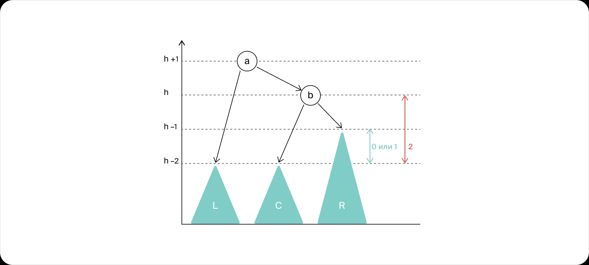

> Тоже правильный ответ
>
> Если высота поддерева $C$ меньше высоты поддерева $R$, то высота поддерева с корнем в a*a* уменьшится на 2, высоты деревьев $L$, $C$, $R$, $b$ не изменятся. Если высоты поддеревьев $C$ и $R$ равны, то высота поддерева с корнем в $a$ уменьшится на 1, высота поддерева с корнем в $b$ увеличится на 1, а высоты деревьев $L$, $C$, $R$ не изменятся.


```python
def small_left_rotation(a):
  # Задаём обозначения.
  b = a.right
  C = b.left

  # Переусыновляем вершины.
  a.right = C
  b.left = a

  # Корректируем высоты в зависимости от того, равны ли высоты C и R.
  if C.height == R.height:
    a.height -= 1
    b.height += 1
  else:
    a.height -= 2

  # Возвращаем новый корень.
  return b
```

#### Малое правое вращение

Малое правое вращение аналогично малому левому. Фактически это малое левое вращение в обратную сторону. Оно применяется, когда выполняются два условия:

- высота поддерева $B$ больше высоты поддерева $R$ на 2,
- высота поддерева $C$ не больше высоты поддерева $L$.

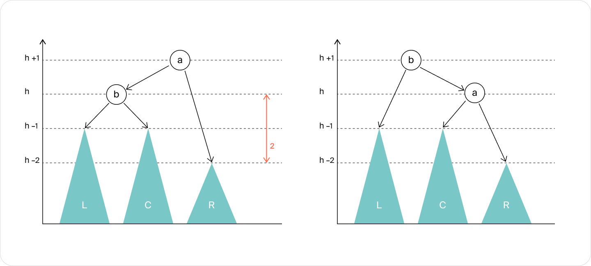

*У вершины a два поддерева: B и R. Корнем левого поддерева является вершина b. У вершины b два поддерева: L и C. При балансировке корнем становится вершина b*

Для того чтобы при малом правом вращении дерево осталось деревом поиска, важно выполнить следующие действия:

1. Новым корнем становится вершина $b$.
2. По свойствам дерева поиска, $b≤a$, значит, $a$ станет правым ребёнком $b$.
3. Раньше правым ребёнком вершины $b$ было поддерево $C$. По свойствам дерева поиска, все ключи в $C$ больше либо равны $b$, но меньше либо равны $a$. Значит, $C$ должно стать левым ребёнком вершины $a$. Так как раньше её левым ребёнком была вершина $b$, на освободившееся место можно усыновить $C$.
4. Корректируем высоты поддеревьев.

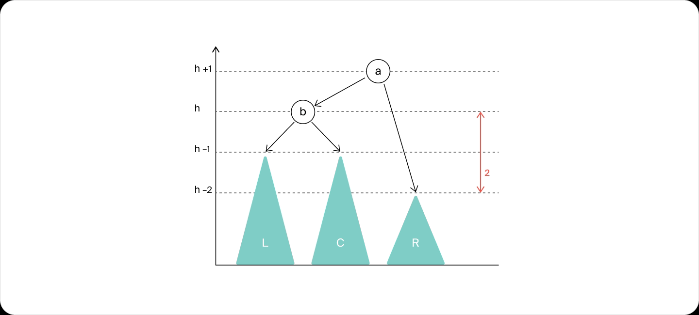

#### Большое левое вращение

Бывают ситуации, когда малых вращений не достаточно, так как высоты поддеревьев не удовлетворяют нужным условиям. Тогда на помощь приходят большие вращения.

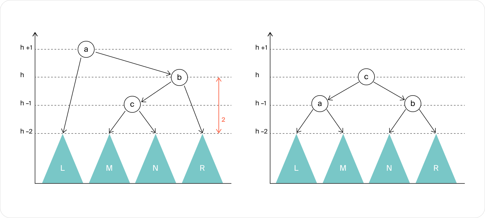

Большое левое вращение применяется, когда дерево обладает следующими свойствами:

- высота поддерева с корнем в $b$ больше высоты поддерева $L$ на 2,
- высота поддерева с корнем в $c$ больше высоты поддерева $R$.

В этом случае последовательность действий при балансировке будет такая:

1. Корнем дерева становится вершина $c$.
2. Левым поддеревом корня $c$ становится вершина $a$. Правым — $b$. После этого у нас образуется два осиротевших поддерева: $M$ и $N$.
3. По свойствам дерева поиска, все ключи в $M$ меньше либо равны ключу $c$, следовательно, должны располагаться в его левом поддереве. Кроме того, все ключи в $M$ больше либо равны $a,$ так как раньше они были её правыми потомками. Получается, поддерево $M$ должно стать правым ребёнком вершины $a$.
4. Проведём аналогичные рассуждения о поддереве $N$. Ключи в $N$ больше либо равны $c$ и меньше либо равны $b$. Следовательно, поддерево $N$ должно стать левым ребёнком вершины $b.$
5. Осталось скорректировать высоты поддеревьев: $L$, $R$, $M$, $N$ не менялись. Вершина $a$ — ниже на 2, вершина $b$ — ниже на 1, вершина $c$ стала выше на 1.

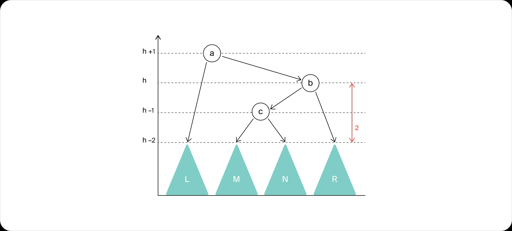

```python
def big_left_rotation(a):
  # Задаём обозначения.
  b = a.right
  c = b.left
  M = c.left
  N = c.right

  # Переусыновляем вершины.
  a.right = M
  b.left = N
  c.left = a
  c.right = b

  # Корректируем высоты. 
  a.height -= 2
  b.height -= 1
  c.height += 1

  # Возвращаем новый корень.
  return c
```

- В этом алгоритме легко ошибиться, особенно с корректировкой высот. Но есть один секрет — большое вращение можно представить как комбинацию двух малых вращений.

  Давайте посмотрим, как будет выглядеть комбинация малого правого вращения правого поддерева и малого левого вращения относительно корня.

```python
def big_left_rotation(v):
    # Правым ребёнком становится новый корень правого поддерева.
    v.right = small_right_rotation(v.right)
    # Возвращаем новый корень поддерева.
    return small_left rotation(v) 
```

#### Большое правое вращение

Этот вид вращений применяется, когда дерево обладает следующими свойствами:

- высота поддерева $B$ больше высоты поддерева $R$ на 2,
- высота поддерева $С$ больше высоты поддерева $L$.

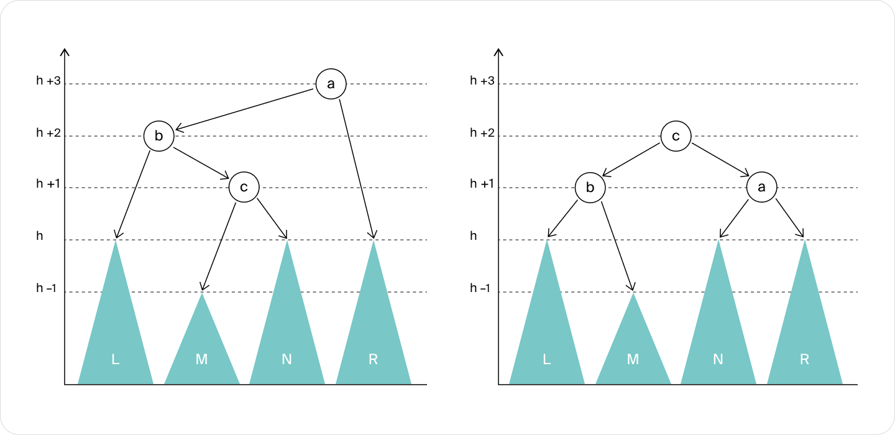

*При большом правом вращении высота поддерева с вершиной b больше высоты поддерева R*

Последовательность действий при балансировке симметрична большому левому вращению. Сразу рассмотрим сокращённый алгоритм, так как в нём корректировка высот происходит одновременно с малыми поворотами, а значит, меньше вероятность ошибиться:

1. Делаем малое левое вращение левого поддерева.
2. Делаем малое правое вращение дерева.

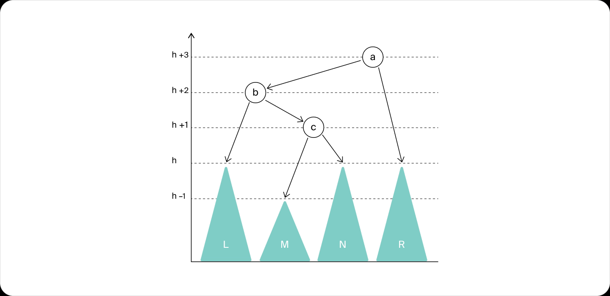

#### Дерево решений

Гарантируется, что эти четыре вида вращений покрывают все возможные ситуации перебалансировки деревьев. Мы подготовили для вас дерево решений, которое поможет определить, какое вращение необходимо сделать в том или ином случае:

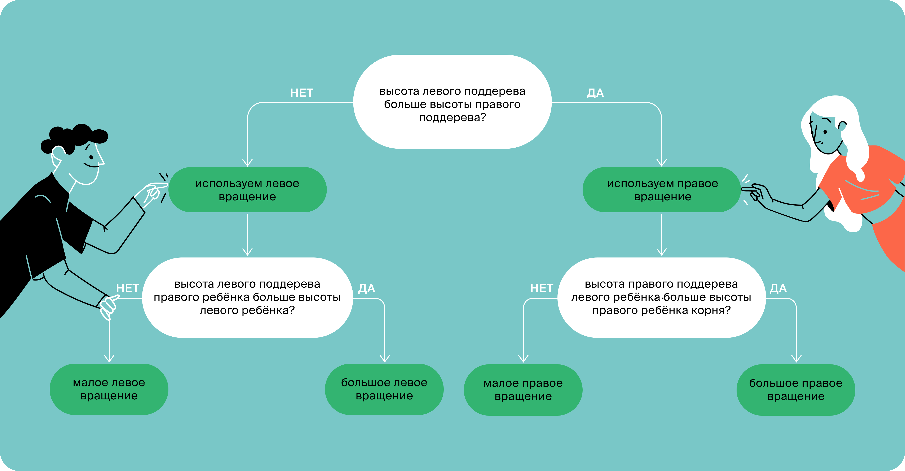

```python
# Функция возвращает новый корень поддерева.
def rotate(vertex):
    if abs(vertex.left.height - vertex.right.height) < 2:
        # Вращать не надо, поддерево с вершиной vertex и так сбалансировано.    
        return vertex
    if (vertex.left.height - vertex.right.height == -2):
        # Нам нужны левые вращения.
        b = vertex.right
        R = b.right
        C = b.left
        
        if C.height <= R.height:
            # Нужно малое левое вращение.
            return small_left_rotation(vertex)
        else:
            # Нужно большое левое вращение.
            return big_left_rotation(vertex)

    if (vertex.left.height - vertex.right.height == 2):
        # Нам нужны правые вращения.
        b = vertex.left
        C = b.right
        L = b.left

        if C.height <= L.height:
            # Нужно малое правое вращение.
            return small_right_rotation(vertex)
        else:
            # Нужно большое правое вращение.
            return big_right_rotation(vertex)
```


#### Повторяющиеся ключи

Когда мы вводили определение дерева поиска, мы говорили, что если вершина имеет ключ, равный ключу корня, то она должна оказаться в правом поддереве. Это было удобное упрощение, но теперь нам придётся от него отказаться, поскольку оно не позволяет сбалансировать некоторые деревья. Например, если во всех узлах расположены одинаковые ключи, такое дерево будет вынуждено выстроиться в одну линию.

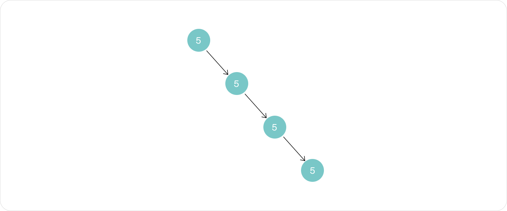

*Если есть договорённость, что в левом поддереве ключи строго меньше, чем в корне, то дерево поиска, состоящее только из одинаковых ключей, будет невозможно сбалансировать*

Чтобы была возможность сбалансировать любое дерево, мы разрешим ключам, равным ключу корня, находиться в любом из поддеревьев. Это потребует немного модифицировать алгоритм поиска вершины. 

Теперь, если вершина равна искомой, надо продолжить поиск и в правом, и в левом поддеревьях. Только так мы сможем найти все вершины с искомым ключом. При добавлении вершины с повторяющимся ключом необходимо опираться на высоты поддеревьев и добавлять новую вершину в поддерево с наименьшей высотой.

Но есть вариант проще — установить ограничение, при котором ключи в узлах дерева не будут повторяться. При попытке добавления повторяющегося ключа, такой ключ не будет добавлен в дерево.

Теперь, если вы захотите написать своё дерево поиска, вы сможете сделать его таким, чтобы все операции выполнялись за $O(log⁡n)$ — вне зависимости от порядка добавления и удаления вершин.

## 6 Приоритетная очередь

Узлы дерева, как и элементы связного списка, обычно хранятся в произвольных местах памяти. Благодаря этому их можно эффективно добавлять и удалять. Но есть и другой способ представления деревьев — в виде массива. 

### 6.1 Дерево на массиве

Чтобы записать дерево в виде массива, используют следующие договорённости: 

- индекс корня дерева всегда равен 1,
- детей и родителя вершины можно вычислить по специальным формулам.

Нумерация, при которой корень имеет индекс 1, отличается от стандартной нумерации массивов, в которых индексация начинается с 0. Но такой подход упрощает формулы поиска остальных элементов. Рассмотрим их:

- индекс родителя узла $i$ равен $[\frac {i}{2}]$, где $[x]$ означает отбрасывание дробной части x;
- индекс левого потомка узла $i$ равен $2i$;
- индекс правого потомка узла $i$ равен $2i+1$

Благодаря такой структуре хранения дерева, по номеру дочернего узла можно определить номер его родителя, а по номеру родителя — индексы его потомков, если они существуют.

Посмотрим на примере:

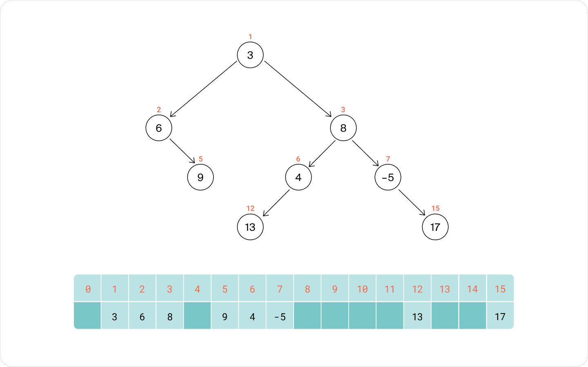

*Вершины дерева и ячейки массива сопоставляются: у корня с ключом 3 — индекс 1, у корня левого поддерева — индекс 2, а правого — 3*

Возьмём корень дерева: вершину, которая лежит в массиве по индексу 1 и имеет значение 3. Определим индексы её потомков:

- Индекс левого потомка $i$ равен $2i$, то есть 2. Возьмём элемент массива с индексом 2 и получим значение 6.
- Индекс правого потомка $i$ равен $2i+1$, то есть 3. Элемент в массиве с индексом 3 имеет значение 8.

Всё совпало!

Теперь проделаем обратную операцию: определим родителя для узла с номером 5 и значением 9.

- Индекс родителя узла $i$равен $[i2]$, то есть $[2,5]$. Возьмём целую часть от $2,5$ и получим индекс 2. В массиве по этому индексу лежит значение 6.

Верно! Мы убедились в корректности формул.

> [!NOTE]
>
> У такой формы записи есть два существенных плюса. Во-первых, не тратится место для хранения ссылок на детей. И детей, и родителя вершины мы можем вычислить, просто зная индекс. Во-вторых, переход между вершинами по индексу происходит быстрее, чем по ссылке.

> [!CAUTION]
>
> Хранить дерево в виде массива удобно, если это бинарное полное или почти полное дерево.Дерево называют полным, если в нём глубина расположения всех листьев одинаковая. При этом у всех узлов дерева, которые не являются листьями, есть и правый, и левый потомок. Дерево почти полное, если у всех вершин по два ребёнка, кроме листьев и вершин, удалённых от корня на $H-1$ уровней.

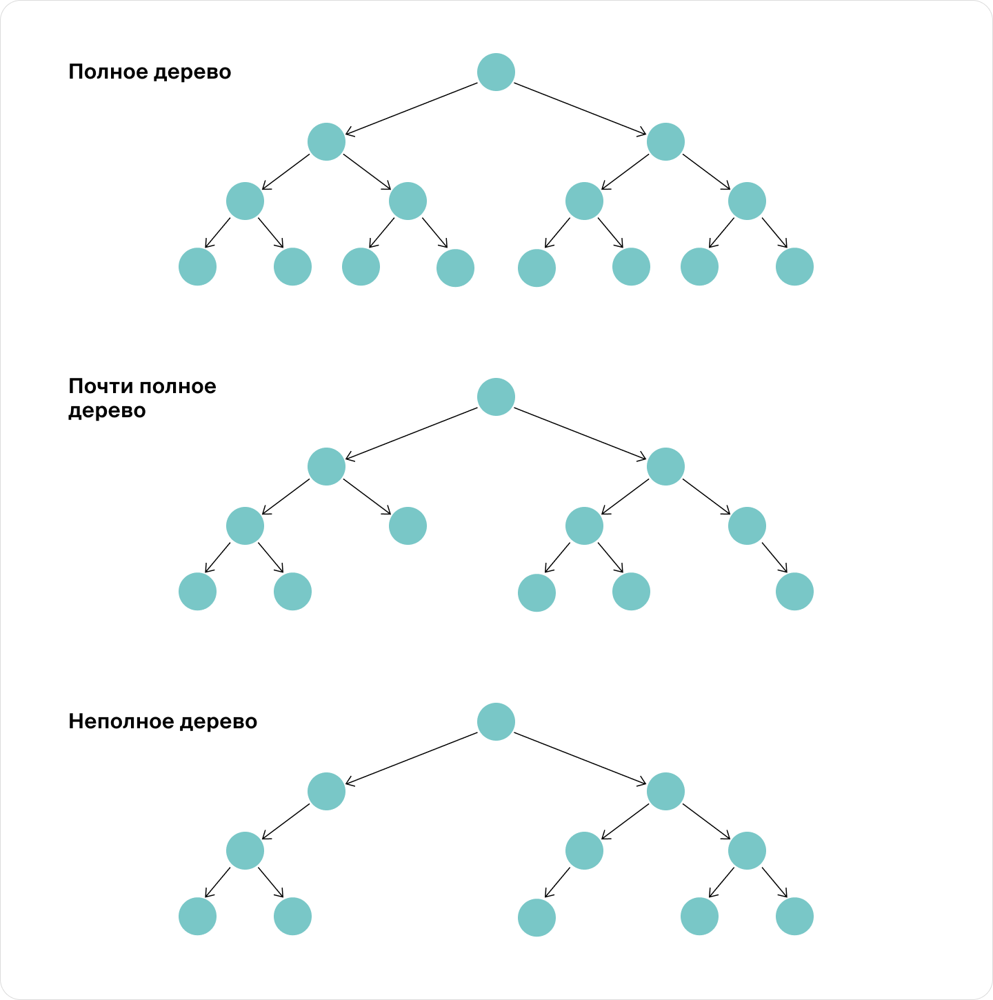

- А для чего был придуман такой способ хранения? Полнота дерева — это ведь очень строгое ограничение, оно не для любой задачи подойдёт.
- Правильный вопрос! Действительно, в большинстве случаев удобнее хранить дерево в виде ссылочной структуры. Но не всегда.Хранение дерева в виде массива используется при реализации структуры данных, которая называется **«приоритетная очередь»**. О ней мы сейчас и поговорим.

### 6.2 Очередь с приоритетом

Помните, мы рассказывали вам про очереди? Это было в уроке «Структуры данных: очередь и дек» в спринте 2 «Основные структуры данных». Они работают по принципу **FIFO** — “**f**irst **i**n **f**irst **o**ut”. То есть первый добавленный элемент извлекают первым, а последний добавленный — последним.

Так вот, приоритетная очередь(*англ*. priority queue) — это очередь, элементы которой имеют приоритет.

При посадке в самолёт сначала проходят пассажиры бизнес-класса, участники программы Sky Priority и пассажиры с детьми. Затем — все остальные. То есть некоторые пассажиры имеют приоритет.

> [!IMPORTANT]
>
> - Приоритет может быть как по убыванию, так и по возрастанию. В зависимости от задачи, самым приоритетным может считаться как элемент с минимальным, так и с максимальным ключом.
>
> - Важное свойство приоритетной очереди — после вставки или удаления элемента она остаётся в упорядоченном состоянии.
>
> - Первым из очереди всегда извлекается наиболее приоритетный элемент.

Бинарная куча — двоичное дерево, которое соответствует следующим условиям:

- Ключ в любой вершине не меньше (если куча для максимума), чем значения её потомков. Это свойство гарантирует, что в вершине находится самый приоритетный элемент.  Посмотрим на поддерево с ключом 14: 14 ≥ 6 и 14 ≥ 10.
- На i-ом слое $2i$ вершин, кроме последнего. Для последнего слоя это условие может не выполняться. Слои нумеруются с нуля. Это свойство соответствует почти полноте. Так как, чтобы на $i+1$ слое было $2^{i+1}$ вершин, у каждой из вершин i-го слоя должно быть ровно 2 ребёнка: $2^{i+1}=2^i \cdot 2$ . На втором уровне 4 вершины. А на третьем может быть 8, но дерево почти полное и сейчас на третьем слое только 2 вершины.
- Все слои, кроме последнего, уже заполнены полностью, в них вообще нет дыр. Последний слой заполняется элементами слева направо. Поэтому все элементы лежат в массиве плотно от начала до конца.

Другое название этой структуры данных — «пирамида».

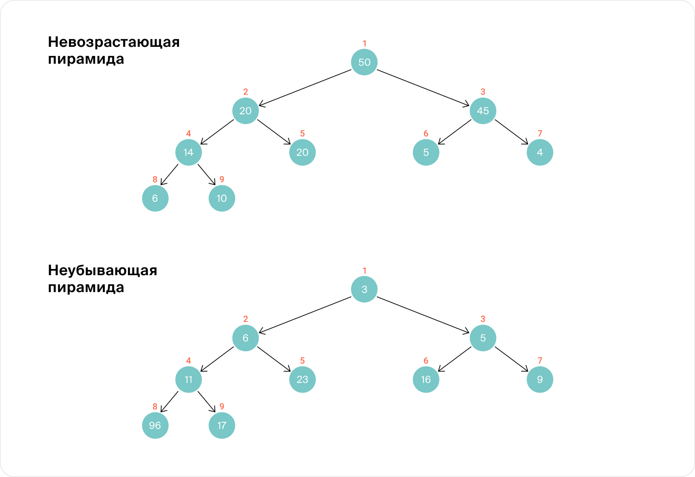

*В невозрастающей пирамиде самый большой элемент 50 находится на вершине, в неубывающей — самый маленький элемент 3*

Невозрастающая пирамида также называется *max-heap*, потому что в своём корне содержит *максимальный* элемент. И наоборот, неубывающая пирамида — это *min-heap*, у неё в корне *минимум*.

Как следует из свойств кучи, самый приоритетный элемент всегда находится на вершине, и его можно получить из массива по индексу 1. 

Но, как мы уже видели на примере деревьев поиска, при изменении структур данных с особыми свойствами важно поддерживать соответствие тем условиям, которые обеспечивают высокую скорость операций. В следующем уроке мы разберём, как работают операции вставки и удаления в очереди с приоритетом.

Для того чтобы поддерживать свойства бинарной кучи, надо понимать в каких ситуациях они могут нарушиться. В случае с пирамидой есть два модифицирующих действия, которые могут испортить структуру:

- вставка элемента в кучу,
- извлечение с удалением элемента из кучи.

#### Вставка элемента

Давайте добавим элемент в конец кучи, то есть просто допишем его в первую свободную ячейку массива:

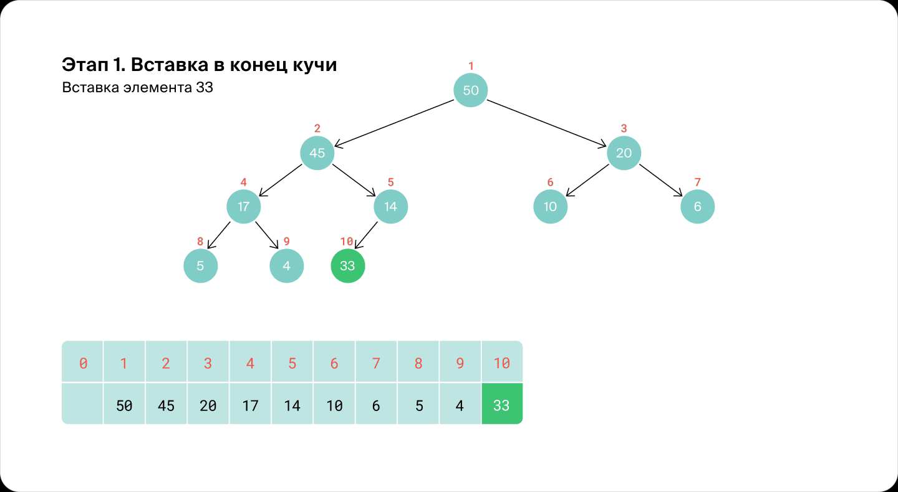

После добавления элемента куча осталась бинарным почти полным деревом. Но она больше не удовлетворяет свойству, по которому значения дочерних узлов не больше значений родительских, ведь $33 > 14$.

Посмотрим, как это исправить. Если дочерний узел больше родительского, поменяем их местами:

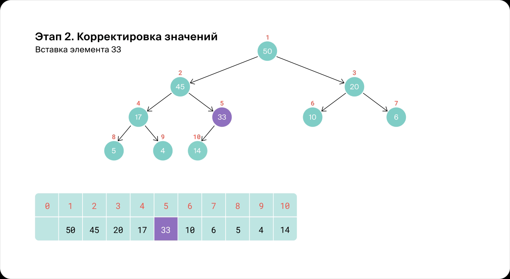

Итак, в этом примере достаточно одной итерации — и куча снова удовлетворяет своим свойствам.

Вставляя любой другой элемент, нужно проделывать операцию обмена до тех пор, пока куча не станет упорядоченной. В худшем случае новый элемент встанет на вершину пирамиды. 

Операцию восстановления свойств кучи при вставке нового элемента называют «просеивание вверх», или `sift_up`. 

Так как при вставке мы на каждом уровне проводим только одно сравнение элемента, а куча у нас имеет высоту $log⁡2N$, то вставка происходит за $O(log⁡N)$.

Запишем алгоритм добавления элемента в кучу псевдокодом:

```python
def sift_up(heap, index):
    if index == 1:
        return

    parent_index = index // 2
    if heap[index] > heap[parent_index]:
        heap[index], heap[parent_index] = heap[parent_index], heap[index]
        sift_up(heap, parent_index) 


def heap_add(heap, key):
    heap.append(key)
    index = len(heap)-1
    sift_up(heap, index)

```


#### Удаление элемента

Теперь заберём самый приоритетный элемент из пирамиды. Для того чтобы в ней не появились дыры, на место извлечённого элемента поставим последний элемент из кучи:

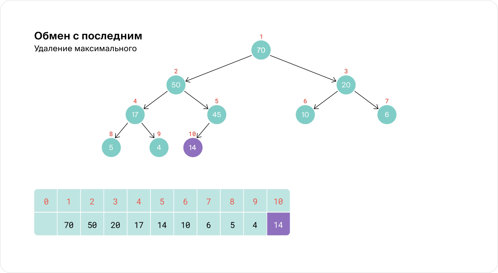

Удаление элемента нарушило свойство упорядоченности бинарной кучи. Восстановим его при помощи функции `sift_down`, или «просеивания вниз».

Рассмотрим текущий узел и его дочерние элементы. Если текущий элемент — самый приоритетный из них, ничего не меняем. Иначе меняем текущий элемент с максимальным приоритетным — он должен оказаться выше. В нашем примере сравниваем значение 14 со значениями потомков: 50 и 20. Так как 50 выше по приоритету, меняем местами вершины 14 и 50:

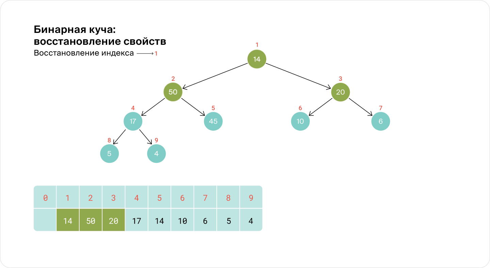

Мы поменяли местами вершину с её левым потомком. Правую часть дерева не трогали, поэтому на следующем шаге рассматривать её не нужно. Проверим свойство упорядоченности в левом поддереве. Если нужно, скорректируем его тем же алгоритмом.

Три элемента: 14, 17 и 45 расположены в неправильном порядке. 14 меньше 17 и 45.

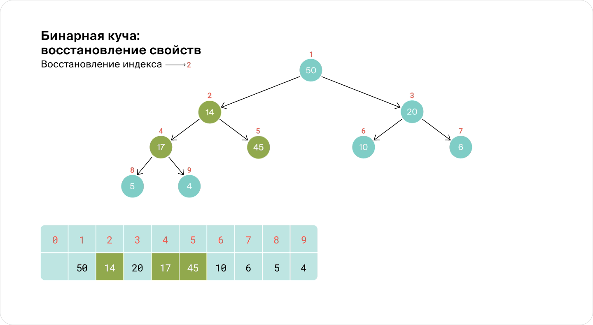

Снова поменяем местами элемент в текущей вершине с максимальным:

У текущего элемента нет дочерних узлов. Значит, мы восстановили свойство бинарной кучи.

Таким образом, есть два критерия завершения процедуры восстановления:

1. Если значение текущего узла больше, чем значение его потомков.
2. Если у текущего узла отсутствуют потомки.

Так как при удалении мы на каждом уровне дерева проводим не более двух сравнений элемента, а куча у нас имеет высоту $log⁡_2N$, то удаление происходит за $O(log⁡N)$.

```python
def sift_down(heap, index):
    heap_max_index = len(heap)-1
    left = index*2
    right = index*2+1

    # нет дочерних узлов
    if left > heap_max_index:
        return

    # проверяем, что есть оба дочерних узла
    if right <= heap_max_index and heap[right] > heap[left]:
        index_largest = right
    else:
        index_largest = left
    # отправляем максимум на вершину кучи и рекурсивно завпускаем просеивание в ребенке
    if heap[index_largest] > heap[index]:
        heap[index_largest], heap[index] = heap[index], heap[index_largest]
        sift_down(heap, index_largest)


def pop_max(heap):
    result = heap[1]
    heap[1] = heap[len(heap) - 1]
    heap.pop()
    sift_down(heap, 1)
    return result
```

- Классная структура! Мы можем добавлять и удалять элементы, восстанавливая свойство упорядоченности. При добавлении мы поднимаем элемент по пирамиде вверх. А при удалении — передвигаем его вниз.
- В такой структуре данных можно хранить, например, список задач. Благодаря свойству бинарной кучи мы всегда сможем быстро узнать, какая задача самая важная.

## 7 Пирамидальная сортировка

Массив, который является представлением бинарной кучи, не обязан быть отсортированным. Выполнение свойства, при котором значение в родителе более приоритетно, чем значения в дочерних узлах, не гарантирует отсортированность.

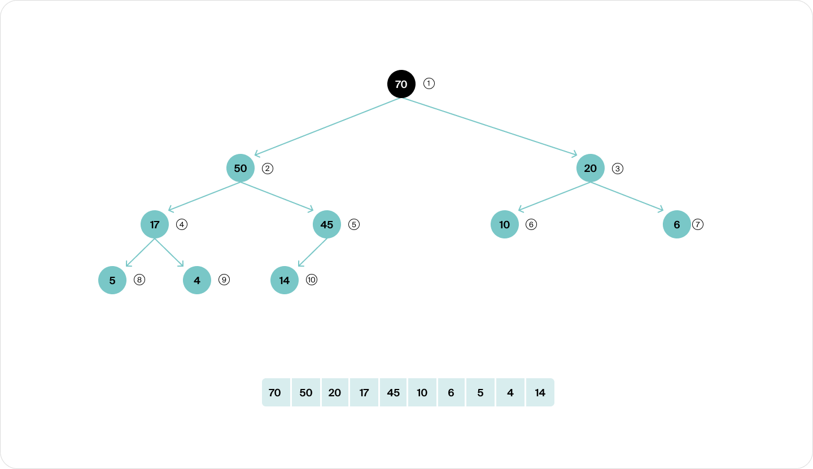

Например, на схеме неотсортированный массив представляет бинарную невозрастающую кучу (max-heap).

Допустим, дан массив:

```
arr = [3, 5, 1, 6, 9, 2]  
```

Общий алгоритм такой:

1. Создадим пустую бинарную неубывающую кучу (min-heap).
2. Вставим в неё по одному все элементы массива, сохраняя свойства кучи. Так как нам нужна сортировка от меньшего к большему, на вершине пирамиды должен оказаться самый маленький элемент. Если бы мы захотели реализовать сортировку по убыванию — на вершине был бы самый большой элемент.
3. Будем извлекать из неё наиболее приоритетные элементы (с самым маленьким значением), удаляя их из кучи.

Рассмотрим алгоритм на примере, приведённом выше. Так выглядит вставка элементов из массива в бинарную кучу:

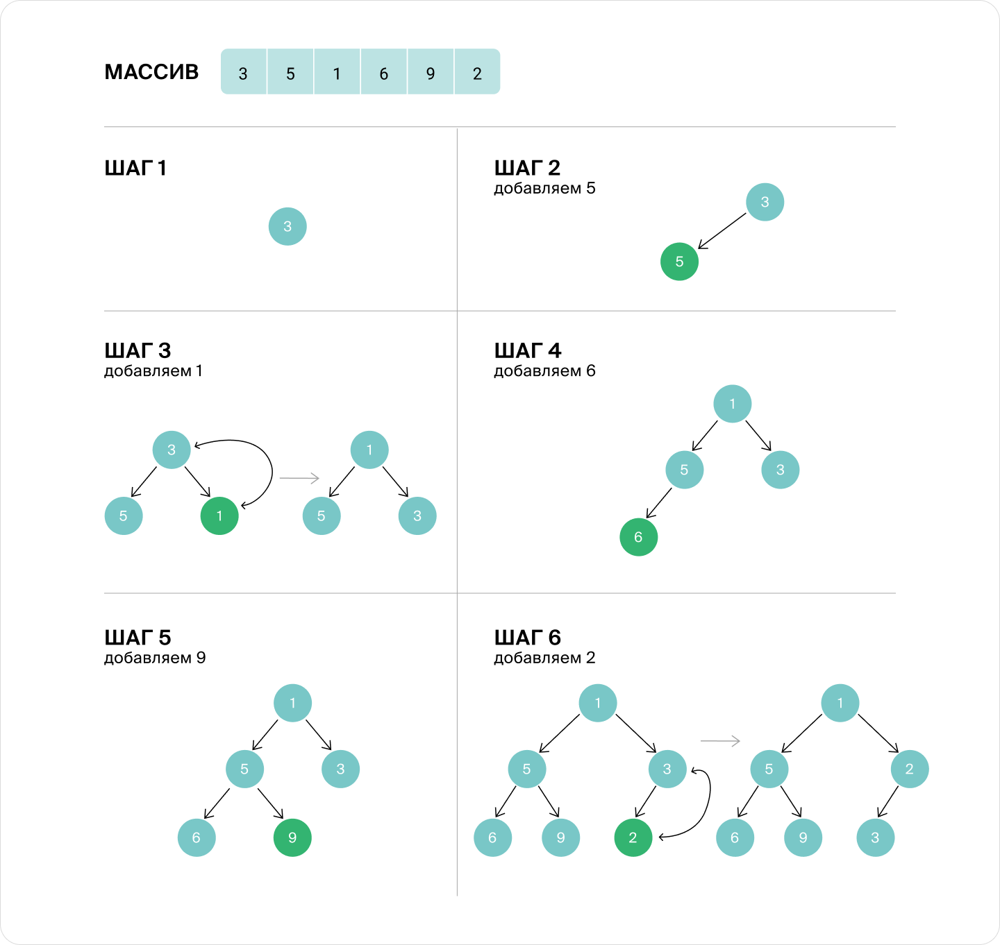

На следующем шаге извлечём наиболее приоритетный элемент из кучи. Самый приоритетный элемент пирамиды находится на её вершине. Поэтому извлечём элемент из вершины и удалим его из кучи. Для задачи сортировки по возрастанию приоритетным является минимальный элемент.

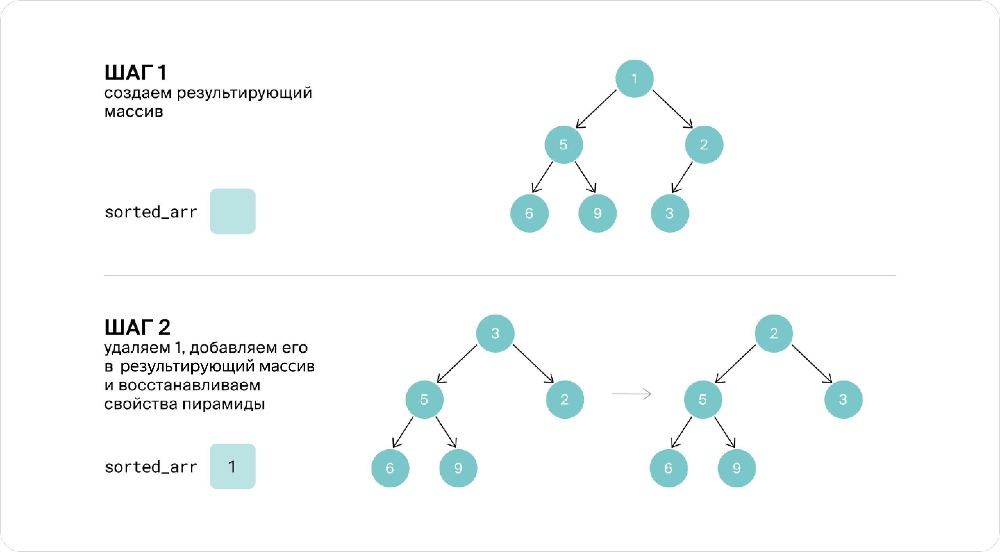

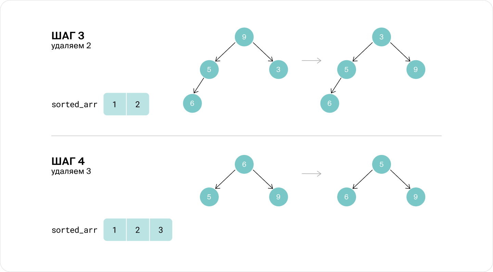

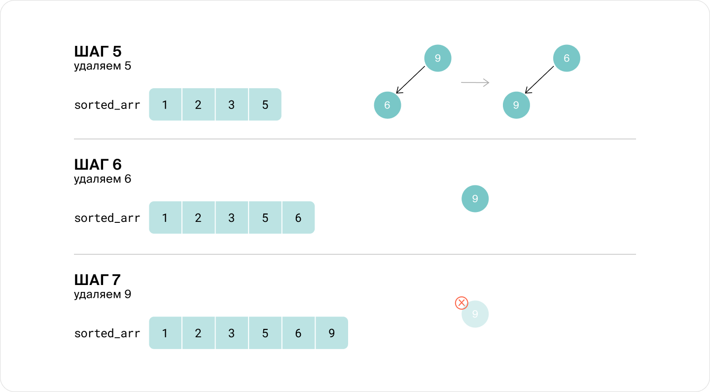

Таким образом, мы получили отсортированный массив.

Псевдокод для этого алгоритма выглядит так:

```python
def heapsort(array):
    # Создадим пустую бинарную кучу.
    heap = [None]

    # Вставим в неё по одному все элементы массива, сохраняя свойства кучи.
    for item in array:
        heap_add(heap, item)   # код для heap_add можно посмотреть в прошлом уроке

    # Будем извлекать из неё наиболее приоритетные элементы, удаляя их из кучи.
    sortedArray = []
    while len(heap) > 1:
        max_val = pop_max(heap) 
        sortedArray.append(max_val)

    return sortedArray
```

- Первый шаг — создание бинарной кучи. Сложность этой операции — $O(1)$. Нам просто нужно выделить память под массив из $n$ элементов.
- Далее вставим $n$ элементов подряд в бинарную кучу.

Сложность этого этапа:

$O(log⁡1)+O(log⁡2)+...+O(log⁡n)$

Считать точное значение этого выражения мы не будем, оценим его сложность сверху. Для этого заменим каждое слагаемое тем, которое не меньше текущего, но удобнее в формуле.

$O(log⁡n)+O(log⁡n)+...+O(log⁡n)=O(nlog⁡n)$

- Последним шагом извлекаем n*n* элементов. Сложность этой операции также не больше, чем O(nlog⁡n)*O*(*n*log*n*).

$O(log⁡n)+...+O(log⁡2)+O(log⁡1)<O(log⁡n)+...+O(log⁡n)+O(log⁡n)=O(nlog⁡n)$

Получим:

$T=O(1)+O(nlog⁡n)+O(nlog⁡n)=O(nlog⁡n)$

Это сложность алгоритма пирамидальной сортировки, которая в худшем случае работает не дольше, чем за $O(nlog⁡n)$.

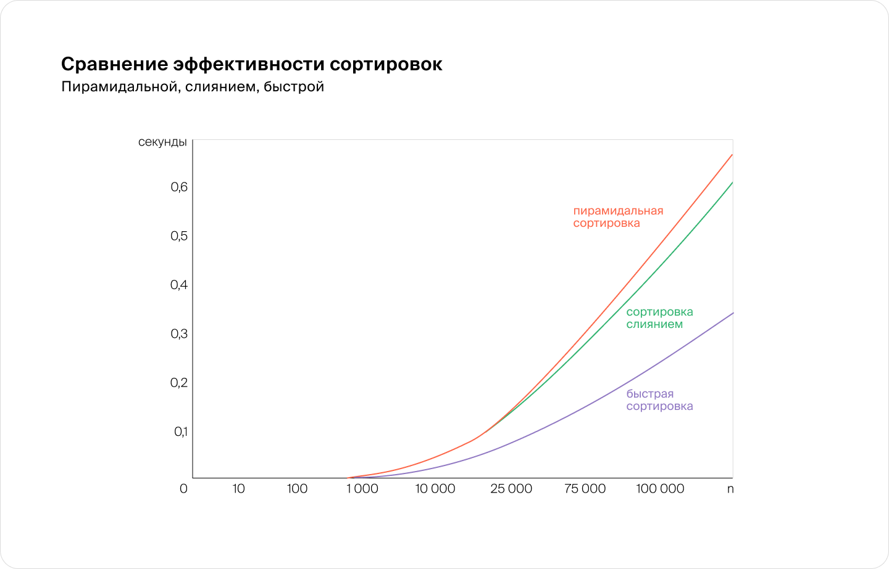

## Поиск k-й порядковой статистики в BST

Вы уже научились искать в бинарном дереве поиска элемент с определённым значением, находить ближайшие к заданному числу меньший или больший элементы. В некоторых случаях нам было бы интересно узнать, например, какой элемент является медианным. Или вычислить значение определённого перцентиля в наборе элементов. Если 95% элементов из набора меньше либо равны данному элементу, то его перцентиль будет равен 95%.

Подсчёт подобных статистик на меняющихся данных представляет достаточно большой интерес. Например, у нас есть сервер, на котором мы отслеживаем время ответа на запросы с окном в 1 час. И мы хотим в любом таком окне знать 95-й перцентиль по времени ответа. Если это значение внезапно вырастет, значит, в нашей системе что-то пошло не так.

> [!IMPORTANT]
>
> Заметим, что для одного фиксированного перцентиля задача решается очень элегантно другим способом — с помощью кучи. Подумайте как!

Разберёмся, как решать такую задачу с помощью бинарного дерева поиска. Будем считать, что при добавлениях и удалениях элементов дерево остаётся сбалансированным (например, AVL-дерево или декартово дерево).

Формальная постановка: дано сбалансированное BST. После каждой вставки и удаления необходимо определять k-й по величине элемент в данном дереве. Пусть гарантируется, что k строго меньше размера дерева, а $k=0$ соответствует минимальному элементу в дереве.

> [!IMPORTANT]
>
> k-й по величине элемент ещё называют k-й порядковой статистикой.

### Вспомогательные данные о дереве

В первом спринте вы изучили бинарный поиск. В его основе лежала идея, что в отсортированном массиве легко искать запрашиваемый элемент правее или левее опорного. Эта задача опирается на ту же идею, но реализованную на бинарном дереве поиска. Если мы знаем, сколько вершин в левом поддереве, можем быстро принять решение искать k-й по возрастанию элемент в левом поддереве, правом поддереве, или он является корнем.

Таким образом для эффективного решения задачи понадобится добавить в каждый узел информацию о размере его поддерева. Поддерживать эту информацию при изменениях в дереве достаточно просто. 

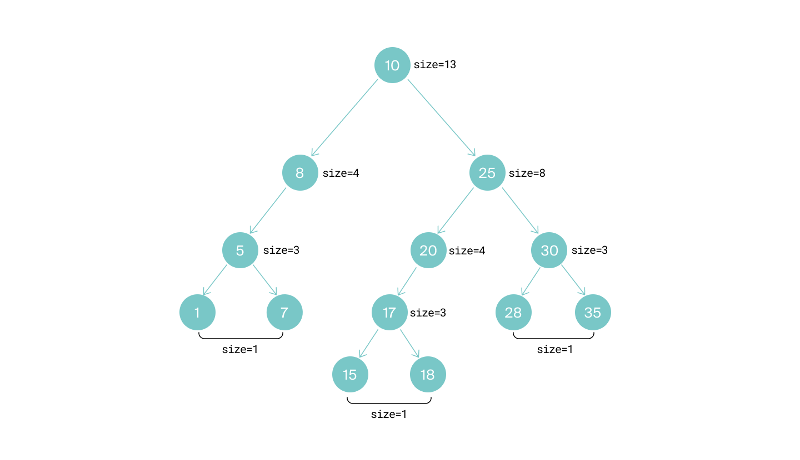

*На рисунке показаны размеры поддеревьев всех вершин данного дерева*

В качестве примера приведём код подсчёта размеров поддеревьев для всего дерева целиком. Размер поддерева будет храниться в поле `size` для каждой вершины:

```python
def calculateSizes(root):
    # Базовый случай рекурсии – это пустое дерево из нуля вершин.
    if root is None:
        return 0
    # Иначе суммируем размеры левого и правого поддерева
    # и прибавляем саму вершину root.
    root.size = 1 + calculateSizes(root.left) + calculateSizes(root.right)
    return root.size 
```

При вставке будут обновлены поля `size` у всех вершин на пути от добавленной вершины до корня. При удалении обновятся все вершины на пути от удалённой вершины до корня или от вершины, которую поставили на место удалённой, до корня.

Однако основная формула для подсчёта размера поддерева остаётся неизменной. В предположении, что размеры левого и правого поддеревьев уже определены корректно, размер поддерева вершины v равен `v.left.size + v.right.size + 1`.

### Эффективное решение

> [!CAUTION]
>
> Будьте внимательны: по условиям задачи нумерация вершин идёт с 0.

Важно понимать, что «левее» искомого k-го по величине элемента находится ровно k элементов. Идея эффективного решения состоит в том, чтобы спускаться от корня дерева вниз, каждый раз из размеров поддеревьев определяя, в каком из них лежит искомый элемент.

Пусть мы находимся в корне дерева, где левое поддерево имеет размер 4, а правое — 8. Если мы ищем 2-й по величине элемент, то он точно находится в левом поддереве, так как в левом поддереве содержатся все элементы с 0 по 3 по величине. Если же надо найти 4-й элемент, то мы уже нашли его — это корень дерева. А если мы ищем элемент с номером 12, то поиск надо продолжить в правом поддереве. 

Однако этот случай отличается от ситуации с левым поддеревом. При переходе в правое поддерево мы должны «забыть» про оставленные слева вершины. В рамках правого поддерева мы будем искать уже не 12-й, а (12 – 4 – 1 =) 7-й элемент (нумерация по-прежнему начинается с нуля). С этой поправкой можно продолжать поиск рекурсивно в правом поддереве.

```python
def findKth(root, k):
    # Вычисляем размер левого поддерева с учётом того,
    # что оно может быть пустым.
    leftSize = 0 if root.left is None else root.left.size
    # Если слева ровно k вершин, то искомая вершина - корень.
    if leftSize == k:
        return root.value
    # Если левое поддерево слишком мало, то продолжим
    # поиск в правом поддереве.
    if leftSize < k:
        return findKth(root.right, k - leftSize - 1)
    # Иначе продолжим поиск в левом поддереве.
    return findKth(root.left, k) 
```

### Разбиение дерева

Теперь рассмотрим похожую задачу — необходимо «отрезать» от BST поддерево размера k слева. То есть надо отделить k наименьших по значению ключа вершин в отдельное корректное BST. Обозначим его $BST_1$. Оставшиеся $n−k$ вершин надо отделить во второе корректное дерево поиска $BST_2$.

Наивное решение состоит в том, чтобы обойти дерево в порядке LMR и остановиться, пройдя k самых левых вершин. Затем сформировать два дерева из k первых вершин и $n−k$ последних (например, обычными вставками сначала в $BST_1$, потом в $BST_2$). Однако раз мы знаем как найти k-ую по величине вершину за $O(h),$ мы можем попробовать сделать и разбиение с той же асимптотикой. Для этого нам придётся на лету менять структуру дерева и делать переподвешивания.

Предположим, что для вершин подсчитаны размеры поддеревьев, как и в предыдущей задаче. Тогда для каждой вершины можно определить, в каком дереве поиска текущая вершина. Удобнее всего будет реализовать решение рекурсивно. 

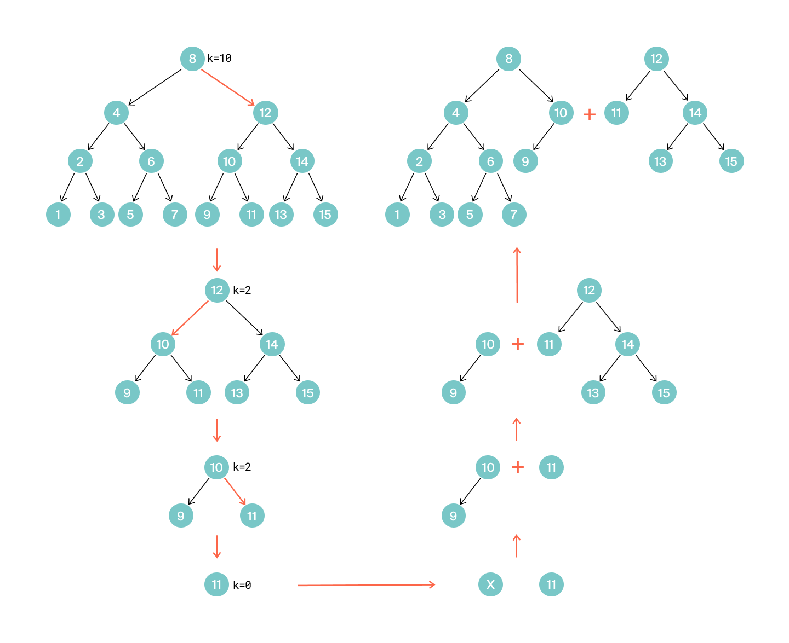

*На рисунке показан прямой (слева) и обратный (справа) ход рекурсивного алгоритма. На прямом ходу от дерева отщепляются поддеревья меньшего размера, а на обратном — на каждом шаге собираются в нужную конфигурацию из двух деревьев*

Пусть для исходного дерева с корнем $v_0(8)$ надо отрезать $k=11$ вершин слева и вернуть корни $v_1,v_2$ двух полученных деревьев. Через v будем обозначать корень рассматриваемого поддерева.

Так как размер левого поддерева `v.left.size=7` меньше k=10, значит, все вершины поддерева `v.left` и сам кореньv*v* окажутся в $BST_1$. При этом корень v станет корнем левого поддерева $v_1$. 

Теперь надо запустить поиск точки разделения в правом поддереве `v.right`. Однако, как и в прошлой задаче, важно вычислить новое значение k с учётом вершин, которые точно будут в левом дереве поиска. `k=k−v.left.size−1=2`.

На новом шаге `v.left.size=3`. Это значение больше, чем обновленный `k=2`. Следовательно способ разделения необходимо рекурсивно искать в левом поддереве. Все вершины правого поддерева при этом гарантированно будут в $BST_2$, а текущий корень v станет корнем $v_2$. 

В результате выполнения рекурсивной функции вернутся корни левого и правого поддеревьев. Подумайте, куда надо удочерить каждый из полученных корней? Также обратите внимание, что будет базовым случаем рекурсии. 
