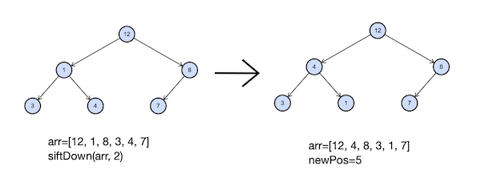

# Задача №9 - "Просеивание вниз"

Напишите функцию, совершающую просеивание вниз в куче на максимум. Гарантируется, что порядок элементов в куче может быть нарушен только элементом, от которого запускается просеивание.

Функция принимает в качестве аргументов массив, в котором хранятся элементы кучи, и индекс элемента, от которого надо сделать просеивание вниз. Функция должна вернуть индекс, на котором элемент оказался после просеивания. Также необходимо изменить порядок элементов в переданном в функцию массиве.

Индексация в массиве, содержащем кучу, начинается с единицы. Таким образом, сыновья вершины на позиции `2v+1`. 
Обратите внимание, что нулевой элемент в передаваемом массиве фиктивный, вершина кучи соответствует 1-му элементу.

## Формат ввода

Элементы кучи —– целые числа, лежащие в диапазоне от $-10^9$ до $10^9$.
Все элементы кучи уникальны. Передаваемый в функцию индекс лежит в диапазоне от 1 до размера передаваемого массива. В куче содержится от 
1 до $10^5$ элементов.

## Идея 

В куче на максимум:

- Родитель всегда ≥ детей
- Для элемента с индексом  `i`:
  
  - Левый ребёнок:  `2 * i` 
  - Правый ребёнок:  `2 * i + 1`
  - Родитель:  `i // 2 `
  
Просеивание вниз: если элемент меньше своих детей, меняем его с максимальным ребёнком и продолжаем рекурсивно/итеративно.

1.	Индексация с 1:  heap[0]  не используется, реальная куча начинается с  heap[1] 
2.	Дети:  2*i  (левый),  2*i+1  (правый)
3.	Границы: проверяем  left <= n  и  right <= n  перед доступом
4.	Выбор максимального: сначала сравниваем с левым, потом с правым
5.	Условие остановки: когда элемент ≥ обоих детей (или нет детей)

Характеристики:

- Временная сложность: $O(log n)$ — в худшем случае просеиваем от корня до листа
- Пространственная сложность: $O(1)$ для итеративной версии, $O(log n)$ для рекурсивной
- Модификация: изменяет массив in-place