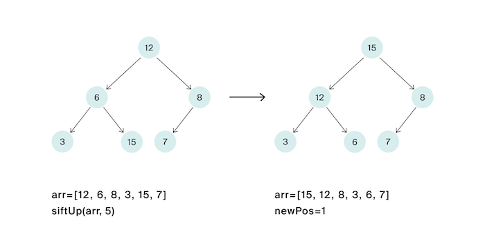

# Задача №10 - "Просеивание вверх"

Напишите функцию, совершающую просеивание вверх в куче на максимум. Гарантируется, что порядок элементов в куче может быть нарушен только элементом, от которого запускается просеивание.

Функция принимает в качестве аргументов массив, в котором хранятся элементы кучи, и индекс элемента, от которого надо сделать просеивание вверх. Функция должна вернуть индекс, на котором элемент оказался после просеивания. Также необходимо изменить порядок элементов в переданном в функцию массиве.

Индексация в массиве, содержащем кучу, начинается с единицы. Таким образом, сыновья вершины на позиции `2v+1`. 
Обратите внимание, что нулевой элемент в передаваемом массиве фиктивный, вершина кучи соответствует 1-му элементу.

## Формат ввода

Элементы кучи —– целые числа, лежащие в диапазоне от $-10^9$ до $10^9$.
Все элементы кучи уникальны. Передаваемый в функцию индекс лежит в диапазоне от 1 до размера передаваемого массива. В куче содержится от 
1 до $10^5$ элементов.

## Идея 

Просеивание вверх: если элемент больше родителя, меняем их местами и продолжаем вверх по дереву, пока элемент не станет ≤ родителя или не достигнет корня.
Для элемента с индексом  i:

- Родитель:  `i // 2`

Ключевые моменты
1.	Простота: `sift_up` проще `sift_down` (только один родитель, не два ребёнка)
2.	Условие:  `heap[idx] > heap[parent]`  (в max-heap)
3.	Остановка: когда  `idx=1`  (корень) или $элемент ≤ родителя$
4.	Направление: всегда вверх по дереву

Характеристики
- Временная сложность: $O(logn)$ — в худшем случае от листа до корня
- Пространственная сложность: $O(1)$ для итеративной, $O(log n)$ для рекурсивной
- Модификация: изменяет массив in-place