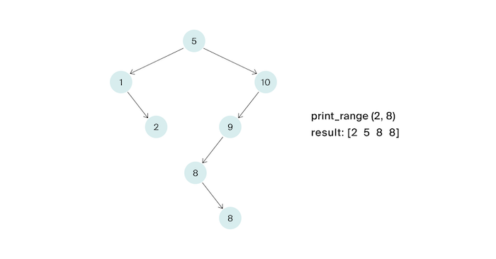

# Задача №5 - "Выведи диапазон"

Напишите функцию, которая будет выводить по неубыванию все ключи от `L` до `R` включительно в заданном бинарном дереве поиска.

Ключи в дереве могут повторяться. Решение должно иметь сложность O(h+k), где 
h –— глубина дерева, k — число элементов в ответе.

В данной задаче если в узле содержится ключ x, то другие ключи, равные x, могут быть как в правом, так и в левом поддереве данного узла. (Дерево строил стажёр, так что ничего страшного).

## Формат ввода

На вход функции подаётся корень дерева и искомый ключ. Число вершин в дереве не превосходит $10^5$.
Ключи – натуральные числа, не превосходящие $10^9$. Гарантируется, что $L ≤ R$.

В итоговом решении не надо определять свою структуру / свой класс, описывающий вершину дерева.

## Формат вывода

Функция должна напечатать по неубыванию все ключи от `L` до `R` по одному в строке.

## Идея 
Используем модифицированный инфиксный обход (LMR) с отсечением ненужных поддеревьев:
1.	Не заходим в левое поддерево, если  `root.value < L`  (там все значения меньше L)
2.	Не заходим в правое поддерево, если  `root.value > R`  (там все значения больше R)
3.	Выводим текущий узел, если  `L <= root.value <= R` 
Поскольку дубликаты могут быть где угодно, нужно проверять оба поддерева для значений в диапазоне.