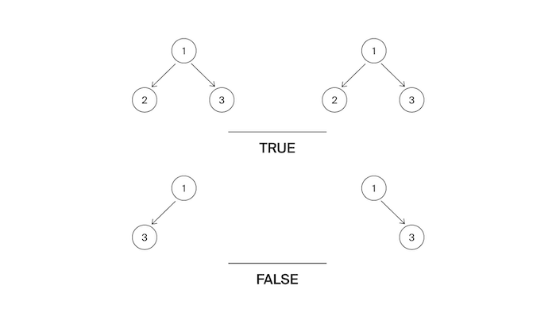

# Задача №6 - "Одинаковые деревья"

Гоше на день рождения подарили два дерева. Тимофей сказал, что они совершенно одинаковые. Но, по мнению Гоши, они отличаются.
Помогите разрешить этот философский спор!

## Формат ввода

На вход подаются корни двух деревьев

## Формат вывода

Функция должна вернуть True если деревья являются близнецами. Иначе - False.

## Идея 

Рекурсивно сравниваем деревья:
1.	Оба узла `None` → `True` (оба пустые)
2.	Один `None`, другой нет → `False` (разная структура)
3.	Значения различаются → `False`
4.	Рекурсивно проверяем левые и правые поддеревья → `True` если оба совпадают