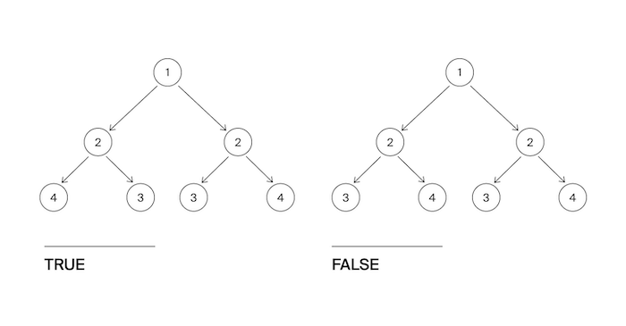

# Задача №7 - "Дерево-анаграмма"

Гоша и Алла играют в игру «Удивительные деревья». Помогите ребятам определить, является ли дерево, которое им встретилось, деревом-анаграммой?

Дерево называется анаграммой, если оно симметрично относительно своего центра.

## Формат ввода

Напишите функцию, которая определяет, является ли дерево анаграммой.
На вход подаётся корень дерева.

## Формат вывода

Функция должна вернуть True если дерево является анаграммой. Иначе - False.

## Идея 

Дерево симметрично, если:

1.	Левое и правое поддеревья корня — зеркальные копии друг друга
2.	Рекурсивно: узлы зеркальны, если:

-	Их значения равны
-	Левое поддерево первого = правому поддереву второго
-	Правое поддерево первого = левому поддереву второго