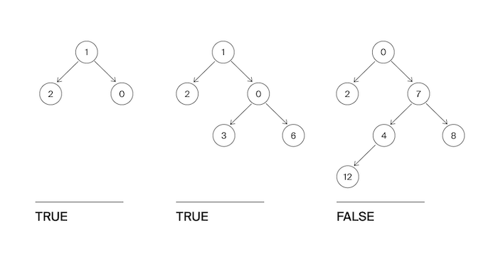

# Задача №8 - "Сбалансированное дерево"

Гоше очень понравилось слушать рассказ Тимофея про деревья. Особенно часть про сбалансированные деревья. Он решил написать функцию, которая определяет, сбалансировано ли дерево.
Дерево считается сбалансированным, если левое и правое поддеревья каждой вершины отличаются по высоте не больше, чем на единицу.

Реализуйте функцию, определяющую, является ли дерево сбалансированным.

## Формат ввода

На вход функции подаётся корень бинарного дерева.

## Формат вывода

Функция должна вернуть True, если дерево сбалансировано в соответствии с критерием из условия, иначе - False.

## Идея 

Дерево сбалансировано, если для каждого узла:

1.	Высоты левого и правого поддеревьев отличаются не более чем на 1
2.	Оба поддерева также сбалансированы (рекурсивно)

Нужно одновременно:

-	Вычислять высоту поддеревьев
-	Проверять условие балансировки