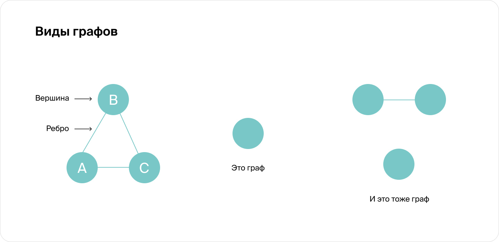
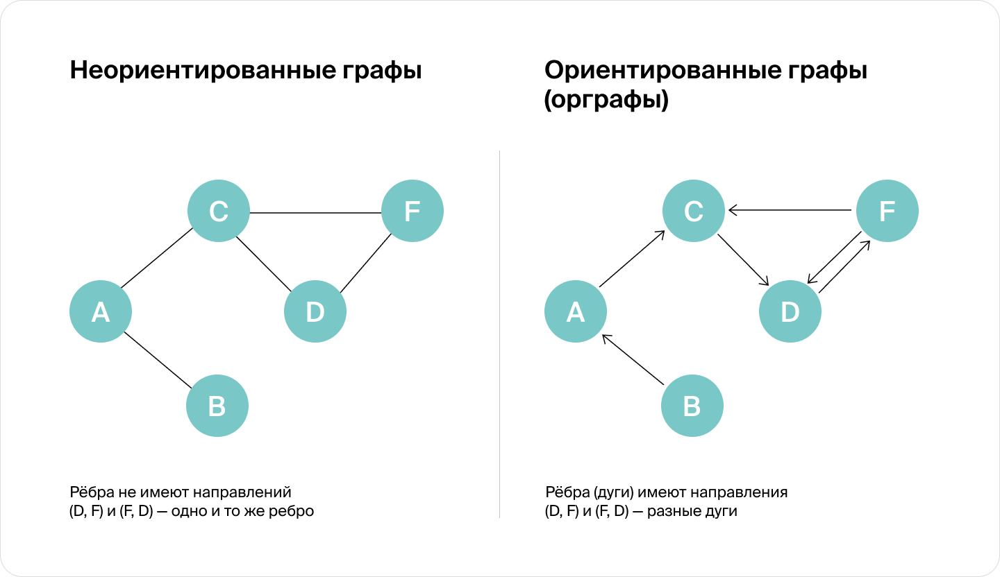

# Спринт №6 - Графы

[TOC]

## 1 Введение

> Граф — это математический объект, что-то вроде рисунка, в котором объекты соединены линиями. Если говорить формально, граф (англ. graph) — множество вершин (англ. vertex; мн. ч. vertices), некоторые из которых могут быть соединены рёбрами (англ. edge). В данном контексте ребро — это абстрактная связь между парой вершин, а не геометрическое понятие. На рисунках вершины обозначаются точками или кружочками, а рёбра — линиями. Форма и длина этих линий никакого значения не имеет. На рисунках рёбра могут даже пересекаться, но это ничего не значит: важно только то, какие вершины они соединяют.

На самом деле вы уже работали с графами. В предыдущем спринте мы говорили об особом виде графов — деревьях. В дереве файловой системы папки и файлы являются вершинами, а рёбра проводятся между вершиной и вершиной её родительской папки.

Работать с деревьями проще, чем с произвольными графами. Однако некоторые алгоритмы на графах, возможно, будут напоминать вам алгоритмы обхода деревьев — но с некоторыми модификациями.

> [!NOTE]
>
> В графе должна быть хотя бы одна вершина. А вот рёбер может вообще не быть. Например, десяток несвязанных между собой вершин тоже является графом.

*Вершины графа не всегда бывают соединены рёбрами: они могут состоять из нескольких компонент и быть несвязными. Но мы всё равно трактуем их как единый граф*

### 1.1 Примеры графов

С помощью графов можно описывать любые наборы объектов, между которыми есть парные связи. Систем, которые описываются такими связями, — огромное множество. Вот несколько популярных применений графов:

- Граф дорожной сети. Вершинами такого графа могут быть города или, на более мелком масштабе, перекрёстки. В качестве рёбер выступают дороги между ними. Чаще всего на рёбрах пишут расстояния между соединяемыми вершинами: они выступают в роли весов. Дорожные графы используют для того, чтобы прокладывать оптимальный маршрут.
- В социальном графе можно записывать отношения между людьми. Например, соцсети хранят граф знакомств. Каждый человек представляется вершиной, а рёбра соединяют знакомых между собой людей. С помощью этого графа можно проверять теорию шести рукопожатий или искать новых друзей.
- Граф зависимостей используется, чтобы решить, в каком порядке следует выполнять задачи. Вершинами могут быть темы учебного курса, а рёбра между ними будут указывать на порядок изучения. Аналогичную задачу часто приходится решать компиляторам, чтобы определить порядок сборки файлов в проекте.
- В задачах планирования встречаются графы предпочтений. Например, руководство таксопарка может нарисовать граф, в котором вершинами будут таксисты и их потенциальные клиенты. Рёбра соединят таксистов с теми клиентами, до которых они могут доехать. На ребре будет указано, насколько быстро таксист может домчаться до пассажира. С помощью графа предпочтений можно легко определить, кого из водителей назначить на тот или иной заказ, чтобы пассажирам при этом не пришлось долго ждать.
- Ещё один тип графов называется конечный автомат. Вершинами в нём могут быть состояния некоторого устройства или программы. Например, кофейный автомат может находиться в состояниях «выбор напитка», «ожидание оплаты», «выдача сдачи» и «напиток готовится». А рёбра будут указывать, какие действия переводят машину из одного состояния в другое. Конечные автоматы активно используются при работе с текстами. Например, при поиске по шаблону с помощью регулярных выражений.

### 1.2 Виды графов

Рёбра некоторых графов имеют направление, задаваемое стрелочкой. Такие графы называются «ориентированными» (или сокращённо «орграфы», *англ.* directed graph). В ориентированном графе направление должно быть указано на каждом ребре. Рёбра ориентированного графа ещё называют «дугами».

- Приведу пример. В дорожной сети направленными рёбрами обозначаются дороги с односторонним движением.Можно считать, что дорога с двусторонним движением — это две отдельные односторонние дороги. Например, мы можем провести одно ребро от Москвы до Петербурга, а второе — от Петербурга до Москвы.
- Получается, любой неориентированный граф можно превратить в ориентированный, просто удвоив количество рёбер?
- Да, в вершинах и на рёбрах графа можно записывать информацию. Это называется разметкой графа. Самый распространённый тип такой разметки — числа, проставленные на рёбрах. Их называют «весами рёбер». А граф, у которого на рёбрах указаны веса, называется «взвешенным» (англ. weighted graph).

*Пример взвешенного графа*

- Если мы граф без стрелок смогли превратить в граф со стрелками, удвоив рёбра, то, наверное, и граф без весов тоже легко можно превратить в граф с весами?
- Да, есть простой способ это сделать. Можно написать на каждом ребре одинаковый вес, например 1.

## 2 Основные понятия теории графов

Задолго до появления компьютеров графы уже изучались как математический объект. Язык математики и сейчас очень полезен для того, чтобы компактно записывать алгоритмы, работающие с графами, и доказывать их корректность. Прежде чем углубляться в терминологию самой теории графов, давайте немного поговорим про теорию множеств.

### 2.1 Основные понятия теории множеств

Множество — это некоторый набор объектов. Например, ваша записная книжка — это множество из нескольких десятков или сотен записей. Каждая запись — один объект этого множества. 

В самих множествах нет ничего хитрого, вы сталкиваетесь с ними каждый день, а вот обозначения могут оказаться для вас новыми.

Множество всех вершин графа обозначают V, а множество всех рёбер — E. Размеры этих множеств мы будем обозначать при помощи знака модуля: $∣V∣$ — число вершин, а $∣E∣$ — число рёбер.

Мы будем оценивать время обработки заданного графа $G=(V,E)$в зависимости от числа его вершин: $∣V∣$  и рёбер $∣E∣$ . В оценках мы будем иногда для краткости писать $O(V)$ и $O(E)$вместо $O(∣V∣)$ и $O(∣E∣)$ как делал [Т. Кормен](https://ru.wikipedia.org/wiki/Кормен,_Томас) в своих книгах.

В описании алгоритмов мы будем использовать несколько обозначений из теории множеств. 

- $v∈V$— Если переводить с языка теории множеств дословно, то это значит, что «объект v принадлежит множеству V». Поскольку V — множество вершин, запись $v∈V$означает, что v является вершиной.

    Аналогично $e∈E$ говорит о том, что $e$ — ребро.

- $e=(u,v)$ — Ребро e*e* описывается парой вершин u и v. Обычно при помощи круглых скобок обозначают не просто пару вершин, а **упорядоченную пару**. В упорядоченной паре важно, какой элемент идёт первым, а какой вторым. Поэтому пара $(u,v)$ не эквивалентна паре $(v,u).$ 

   Такое различие требуется для работы с ориентированными графами. Пара $(u,v)$ будет обозначать ребро из вершины u в вершину v, а пара $(v,u)$— наоборот.

- $e={u,v}$ — Фигурными скобками обозначаются множества из нескольких элементов, перечисленных через запятую. Для множества порядок элементов не важен, поэтому можно сказать, что ${u,v}$ — **неупорядоченная пара** вершин. Пара ${u,v}$ эквивалентна паре ${v,u}$.

   Мы будем использовать такие неупорядоченные пары вершин для обозначения рёбер неориентированного графа, ведь у таких рёбер нет различия между стартовой вершиной и конечной.

### 2.2 Основные понятия теории графов

